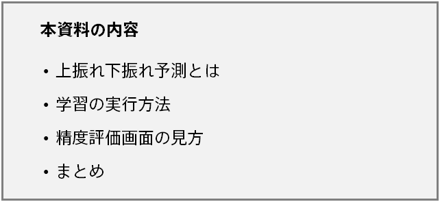
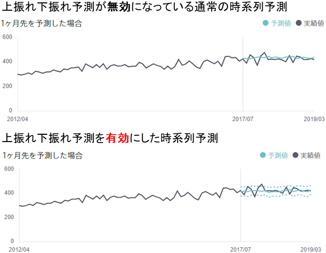
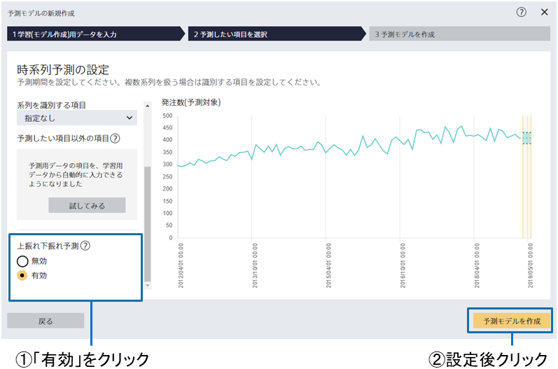
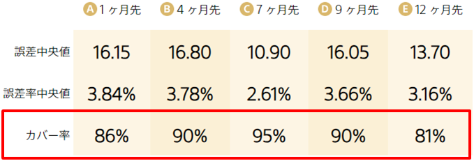
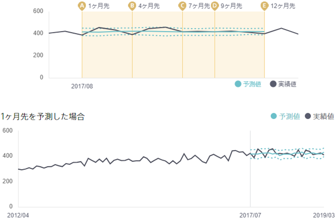

---
title: "上振れ下振れ予測"
date: 2023-06-02T11:00:00+06:00
lastmod: 2023-06-02T11:00:00+06:00
weight: 21
draft: false
# metaタグのパラメータ
meta:
  description: ""
# クラウド・デスクトップ限定ページの場合は片方のみtrueにする
visible:
  is_cloud_only: false
  is_desktop_only: false
# 検索でヒットする文字列の指定
keywords: ["上振れ下振れ予測", "予測区間"]
---

{}
Prediction One には時系列予測を行う機能が実装されています。これまでの時系列予測ではある1 点の時刻に対して1 つの将来の予測結果を出力していました。実際の業務で予測結果を活用する際に、その値がどのくらいの自信をもって出力されたのか、またその値がどの程度ぶれる可能性があるのか、といった情報が意思決定に役立つ場合があると考えられます。

本資料では、時系列予測を行う際にある時刻に対する値の予測に加えて、上下にどのくらいぶれる可能性があるのかも併せて出力する、上振れ下振れ予測についてご説明します。

上振れ下振れ予測機能のチュートリアルもありますので、具体例としてご参照ください。
{}

{}

{}
上振れ下振れ予測とは、時系列予測をする際に最もとりうる可能性の高い値（予測値）に加え、何らかの原因で予測値から上下にぶれるときのぶれ幅を予測することです。上振れ下振れ予測の予測イメージを下図に示します。

通常の時系列予測モードの場合は1 時刻に対して1 つの予測値が出されているのに対し、上振れ下振れ予測を用いる場合には上振れ・下振れという予測値が2 つ追加されているのが分かります。この機能で出力される上振れ・下振れは、両者が囲む範囲に実績値が含まれる確率が90%に近くなるように学習されます。そのため上振れ・下振れの予測結果の基本的な意味は、両者の間に将来の実績値が収まる確率が90%になる、ということになります。

{}

{}
こちらでは上振れ下振れ予測の学習と予測の方法について説明します。上振れ下振れ予測は時系列予測モードの中で使用できるオプションの1 つなので、データ準備や学習の設定方法は基本的に時系列予測モードと同様です。詳細は{}をご参照ください。ここでは上振れ下振れ予測を有効にする方法、精度評価画面の見方、予測結果の見方を注文数予測を題材として順にご説明します。

予測モデルの新規作成時に「時系列予測モードを使用する」を選択すると、下図のような「時系列予測の設定」画面が表示されます。この画面の左側に「上振れ下振れ予測」という項目があります。上振れ下振れ予測を用いる場合にはそちらの項目で「有効」をクリックしてください。他の設定に関しては、通常の時系列予測と同様に設定してください。設定が完了した後「予測モデルを作成」ボタンをクリックすると学習が開始されます。

上振れ下振れ予測の有効・無効設定は前回学習時の設定が引き継がれます。一度上振れ下振れ予測を使用したけれども次は通常の時系列予測を使用したいという場合には、先程の「時系列予測の設定」画面で「上振れ下振れ予測」欄の「無効」をクリックしてください。

{}

{}
モデルの学習が完了した後「精度」タブを開くと、「精度評価値」と「予測と実績」という項目があります。通常の時系列予測モードとほぼ同様の画面になっていますが、２点違いがあります。

まずは「カバー率」という指標が追加されています。これは上振れ下振れ予測の間に実績値が収まる確率を示しています。詳細な計算方法については「{}」をご参照ください。この指標は上振れ下振れ予測の良さを測る目安とすることができます。Prediction One ではカバー率が90%になるよう学習を行いますので、90%に近いほど良いモデルが作られている可能性が高いです。下図に精度評価値の例を挙げます。下図の例ですと１カ月先、４カ月先、７カ月先、９カ月先、１２カ月先、の５パターンで精度評価値が計算されています。

次に実績値と予測値のグラフをご覧になると青の実線で記された予測値だけでなく、点線で上振れ・下振れ予測値が描画されていることが分かります。通常の時系列予測値と同様、これらも「どれくらい先の予測か」によって異なるモデルから出力されているため、予測対象時期ごとに異なる上振れ下振れ予測が出力されます。

{}

{}
通常の時系列予測モード（上振れ下振れ予測無効）から設定を変更し上振れ下振れ予測を有効にすると、上振れ下振れ予測という２つの予測値が追加で出力されるだけでなく、同じデータを入力したとしても真ん中の予測値が元の時系列予測モードが出力する予測値から変化します。それは上振れ下振れ予測の有効・無効によって使用するモデルが異なるためです。上振れ下振れ予測を有効・無効にした時系列予測モデルを併用する場合はこの点をご留意ください。

{}

{}
上振れ下振れ予測は時系列予測のオプションとして使用することができる機能になります。需要や売り上げ等といったビジネス上重要になる数値をピンポイントに予測をし、完全なモデルを作成することは難しいですが、上振れ下振れ予測を使用することで予測値がどのくらい正確そうか、どのくらい変動する可能性があるのかを知ることができ、より多角的に予測結果を応用することが可能になります。

本資料を参考に、ぜひ上振れ下振れ予測をビジネスでご活用ください。
{}