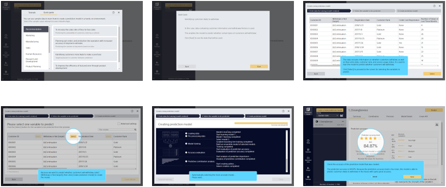

{}
The Quick Guide is a function that enables you to experience prediction model creation in Prediction One when using it for the first time or when you do not have your own data.

By selecting your industry type, you can display relevant sample cases.
Click a case that is close to your own work or any other case you would like to see to start the prediction model creation guide.
If you are not sure what to choose, start by selecting [Recommended].

When the guide starts, you can learn about what kind of data is needed to create a prediction model, and what operations to perform on the screen.

When you have finished creating a prediction model, you will have an understanding of what things the prediction model will enable you to predict. Please give it a try.

For information on using the Quick Guide, refer to "{}."
{}

