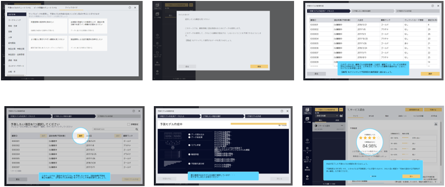

{}
クイックガイドは、初めて Prediction One を使う場合や、ご自身のデータがない場合でも Predication One の予測モデル作成を体験できる機能です。

ご自身の職種を選択すると、それに基づいた課題（サンプルケース）が表示されます。
ご自身の課題に近いケースや、確認したいケースをクリックすると予測モデル作成のガイドが始まります。
職種に迷った場合は「おすすめ」を選択して開始してください。

ガイドが開始されると、予測モデルを作成するには「どういったデータが必要なのか」「どういうことをこの画面でしなければならないか」などの説明を見ながら学ぶことができます。

予測モデルの作成が終了すると、「その予測モデルを使って実際にどういうことが予測できるようになるのか」を理解できるようになっていますので、是非最初の一歩としてご活用ください。

ご利用方法については、{}をご参照ください。
{}

