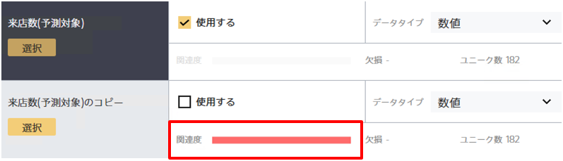

{}

From version 3.1, you can now check a score for the relevance between items on the screen for creating a new prediction model.

By selecting the item you want to predict, you can visually check the relevance of that item.
This enables you to remove items with low relevance to the item you want to predict, or check for items that are too highly relevant.


This page describes how the relevance score can be utilized when creating a prediction model.
For details on the method for calculating the relevance score, refer to "{}."


The relevance score is **calculated for numeric value items and string items when binary classification, multiclass classification, or numeric classification is selected**.
The relevance score is not calculated for text items or date/time items, or when using the time series prediction mode.

{}

{}

The relevance score can be used to eliminate items with a low relevance to the item you want to predict.
The relevance score is close to zero when there is almost no trend or correlation between the item and the item you want to predict.

For example, you can confirm that the relevance score is close to zero by comparing the customer ID (column A) and unsubscribe record (column B) in the above data.

This is because no trend was found between the customer ID and unsubscribe record.

Prediction One can be made to have high accuracy even when items unrelated to the item you want to predict, such as customer ID and name, are included.
However, unintuitive predictions may be made when there is a low data count, such as relationships being found between the customer ID and the item you want to predict.
For example, it may make predictions such as "Members with an ID lower than 10 are more likely to unsubscribe."
By removing items unrelated to the item you want to predict based on a relevance score in advance, you can create a prediction model with higher accuracy.

{}

{}
The relevance score can be used to avoid unintentionally including items identical to the item that you want to predict in the correct data.

For example, the above data includes a copy of the [Visits (prediction target)] item. When such data is read in Prediction One, an alert is displayed because the relevance is extremely high.

It is highly likely that items with close to a maximum relevance score are copies of the item you want to predict.
If items with an extremely high relevance score are included, it is recommended that you check whether it is suitable to perform prediction using those items.

{}

{}

It is rare for an item to have close to a maximum relevance score in actual data. As seen in the image above, it is more common to see moderate relevance.
Because the relevance score is only calculated for **the item you want to predict and one other item**, an item that contributes to prediction in combination with another item may not be displayed with high relevance.

Conversely,an item that contributes to prediction in combination with another item will be displayed with a high degree of contribution.
You can also identify individual item values that are contributing to the prediction results.
Therefore, although the relevance score is used to check the correlation between two items, the degree of contribution is used to check the impact that an item has on prediction.
{}

{}
The relevance score visualizes how much of a trend or correlation is found by comparing the item to predict and another item.

 
 

- It is at maximum for the relevance between two identical items or items with a correlation coefficient of 1.
- The relevance score will be low for items with little relevance, such as the ID or name.
- It is useful for identifying items that should not be included in prediction or items unnecessary for prediction.
- Although the relevance score is used to check the correlation between two items, the degree of contribution is used to check the impact that an item has on prediction.
- The relevance score is not calculated for text items or date/time items, or when using the time series prediction mode.

{}
