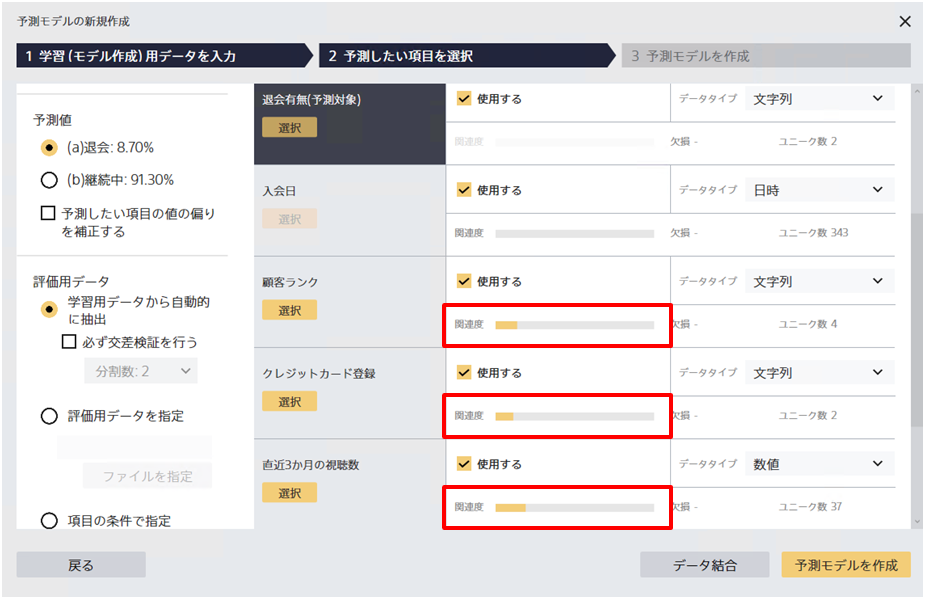
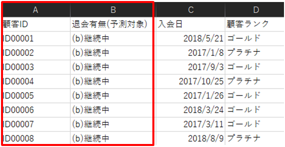
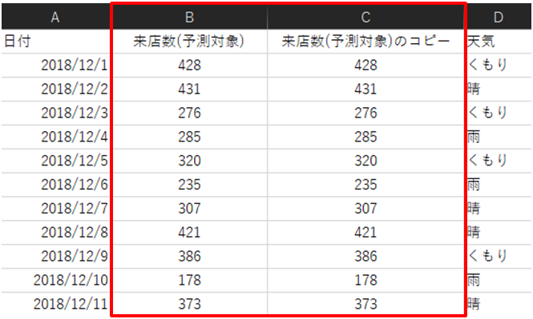
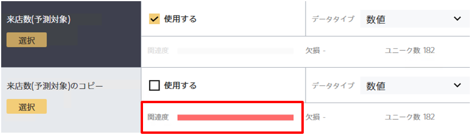
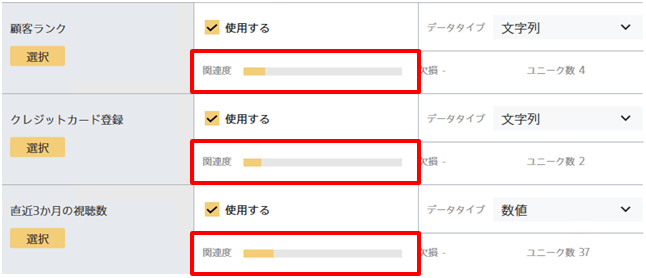

{}

v3.1から、予測モデルの新規作成画面で項目の間の関連度スコアを確認することができるようになりました。

予測したい項目を選択すると、その項目との関連度が高いかどうかを視覚的に確認することができるようになります。
この機能を使うことで、予測したい項目とは関連度が低い項目を取り除いたり、逆に関連度が高すぎる項目の存在を確認することができるようになります。


このページでは、予測モデル作成時に関連度スコアをどのように活用できるかについて説明します。
関連度スコアの計算方法の詳細について知りたい方は{}をご確認ください。


関連度スコアは**二値分類・多値分類・数値予測を選択している場合に数値項目と文字列項目に対して計算されます**。
時系列予測モードを使用する場合やテキスト項目や日時項目に対しては関連度スコアは計算されません。

{}

{}

予測したい項目との関連度が低い項目を取り除くために関連度スコアを活用できます。
予測したい項目と比較したとき、傾向や対応関係がほとんど見られない場合は関連度スコアが0に近くなります。

たとえば、上記データにあるような顧客ID（A列）と退会記録（B列）を比較してみると関連度スコアが0になることが確認できます。

これは、顧客IDと退会記録の間に傾向が見つけられなかったためです。

Prediction Oneは「顧客ID」や「氏名」のような予測したい項目と関係のない項目が含まれていたとしても精度高くできます。
しかし、とくにデータ数が少ない場合、「顧客ID」と予測したい項目との関係を見出して直感的でない予測をする可能性があります。
たとえば、『IDが10以下ならば退会しやすい』といったルールを見出して予測をするかもしれません。
関連度スコアをもとに予測したい項目とは関係のない項目を事前に取り除くことで、より精度が高い予測モデルを作りやすくなります。

{}

{}
誤って予測したい項目とまったく同じ項目が含まれている場合など、意図せずに正解データを含んでしまうこと避けるために関連度スコアを活用できます。

たとえば、上のデータには「来店数（予測対象）」をコピーした項目が含まれています。このようなデータをPrediction Oneに読み込むと、関連度が非常に高いためにアラートを表示します。

関連度スコアが最大に近い項目は予測したい項目をコピーしたものである可能性が高いです。
関連度スコアが非常に高い項目が含まれている場合は、その項目を使って予測をすることが正しい問題設定であるか確認することをおすすめします。

{}

{}

実際のデータでは、関連度スコアが最大に近い値を取ることは多くありません。上の画像のように、ある程度の関連度が見られるケースが多いです。
関連度スコアはあくまで**予測したい項目とその項目だけを見て計算している**ため、他の項目との組合せにより予測に寄与する項目であっても関連度が高く表示されるとは限りません。

一方で、他の項目との組合せによって予測をすることができる項目の場合は、寄与度は高く表示されます。
また、項目の中のどの値が予測結果に寄与しているかも個別に知ることができます。
そのため、関連度スコアはふたつの項目の間の対応関係の度合いを見るために活用できる一方、寄与度はその項目が予測にどれくらい影響を与えるかを見るために活用できます。
{}

{}
関連度スコアは、予測したい項目とその項目を比較した時にどれくらい傾向や対応関係があるかを可視化したものです。

 
 

- 完全に同じ項目との間の関連度や相関係数が1となる項目の場合は関連度スコアは最大になります
- 逆に、IDや氏名のような、関係性が見られない項目は関連度スコアは最低になります
- 関連度スコアは予測に本来含むべきでない項目や予測に不要な項目を見つけるために活用できます
- 関連度スコアはふたつの項目の間の対応関係の度合いを見るために活用できる一方、寄与度はその項目が予測にどれくらい影響を与えるかを見るために活用できます
- 時系列予測モードを使用する場合、またテキスト項目や日時項目に対しては関連度スコアは計算されません

{}
