{}

Prediction One provides an easy way to predict time series.
It can be used in many situations such as demand predicting, sales predicting, visitor predicting and incoming call predicting. This document explains time series prediction.

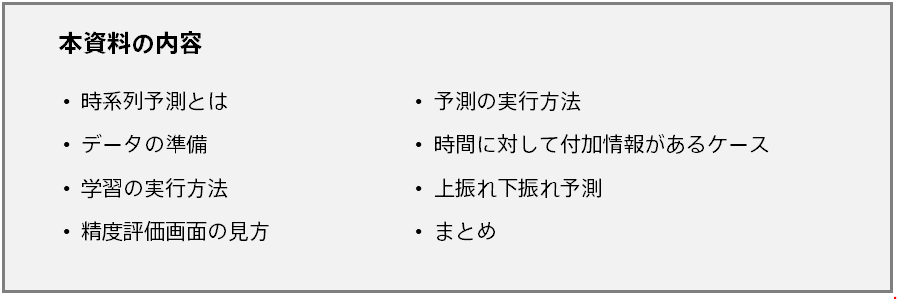

There is also a tutorial on time series prediction, so please refer to it as a specific example.{}: `C:/Program Files/Sony/Prediction One/ja-JP/doc/sample_dataset/use_case`{}

- {}
- {}
- {}

{}

{}
Time series prediction is a prediction of future values for a series of values over time (time series). Examples include:

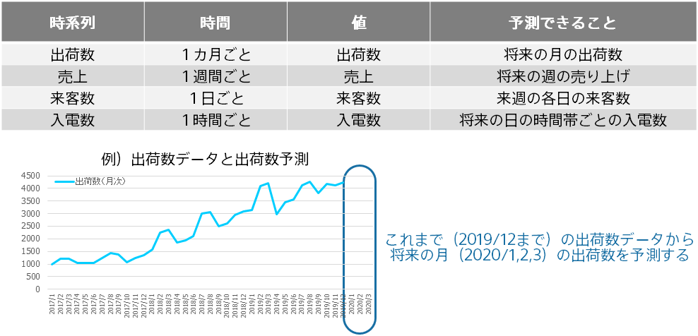
{}

{}
Time series prediction requires a file that contains time series data about past performance. 
For the shipping example on the previous page, the data csv file would look like this: 

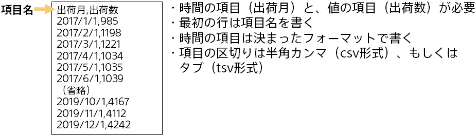

The case of adding information to time is discussed later.
{}

{}
Time series prediction involves two steps: learning and predicting. The following is an example of predicting the number of shipments from the number of shipments data.

{}

{}
This method for performing time series prediction in Prediction One is described here. Perform the following procedure in order on the [Model Settings] screen (the screen after loading the data).

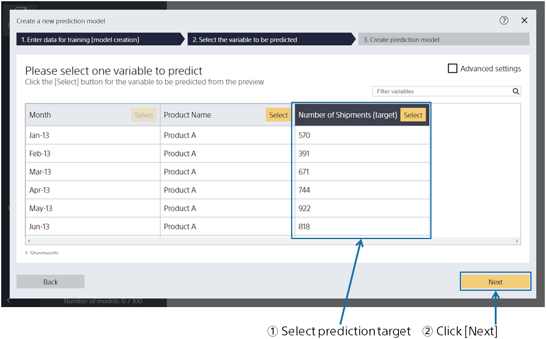

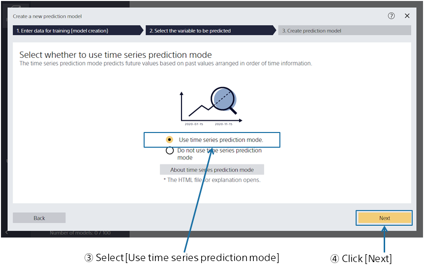

{}

{}
In the Set Time Series Prediction screen, specify the time period you want to predict. Create a prediction model for this setting.
After the prediction model is created, the prediction accuracy is evaluated.

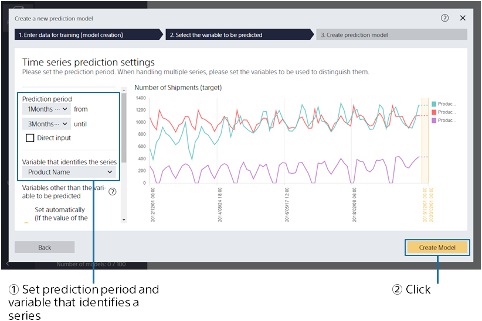
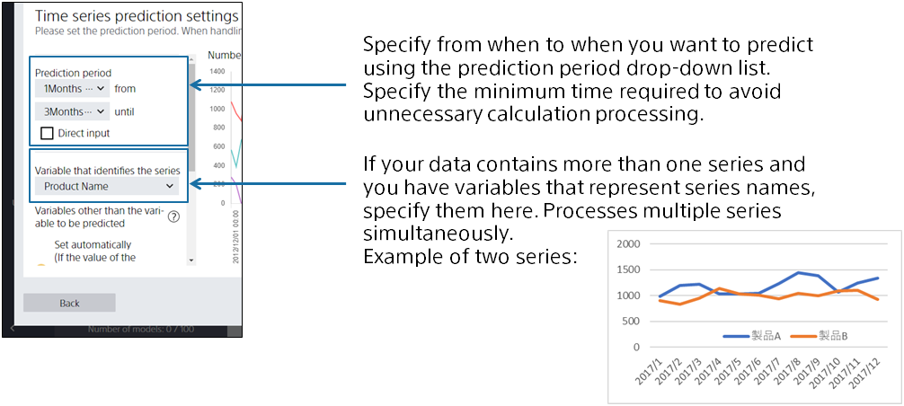
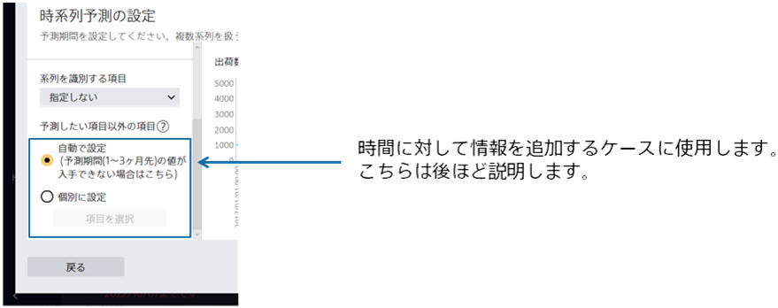
{}
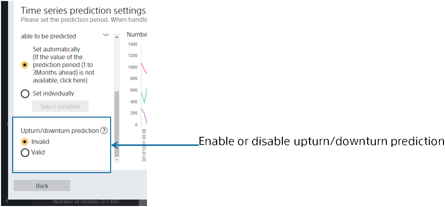

Details on the procedure when up/down deviation prediction is enabled are described in "{}". Refer to that page in addition to this document. This document describes the use of the regular time series prediction mode with up/down deviation prediction disabled.
{}
Next, we will look at prediction accuracy evaluation.

{}

{}
Time series prediction evaluates prediction accuracy as follows:

1. Set Evaluation Period
2. Predict values for the evaluation period from a time series prior to the evaluation period (without using values for the evaluation period)
3. Compare predicted and actual values in the evaluation period

{}

{}
Prediction One allows you to set multiple accuracy evaluation periods, make predictions at each setting, and compare actual values with predicted values.

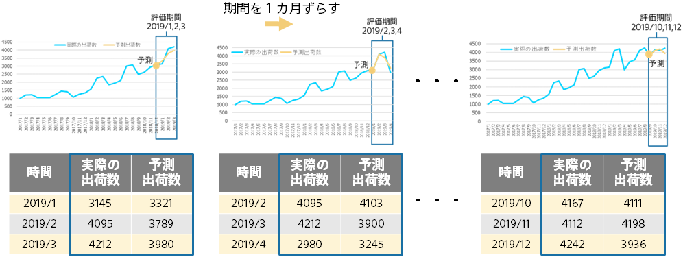

By providing multiple evaluation periods, many pairs of actual and predicted values can be obtained, and accuracy evaluation can be statistically stable. Accuracy evaluation values are calculated and graphed by comparing and aggregating actual values and predicted values.
{}

{}
In the case of time series prediction, the accuracy of prediction decreases as the time of prediction increases.
For example, with a shipment prediction for one month ahead and a shipment prediction for three months ahead, it is more difficult to predict a shipment prediction for three months ahead than for one month ahead.
Prediction One calculates the prediction accuracy for each time period to be predicted. The following is an example of a shipment prediction.

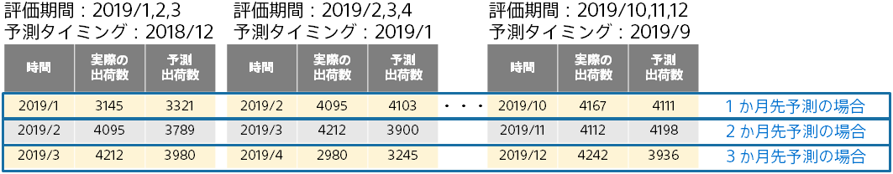

As shown in the figure above, you can calculate the accuracy of a one-month ahead prediction, a two-month ahead prediction, and a three-month ahead prediction.
Prediction One calculates the prediction accuracy for each case using the median absolute error and the median absolute error ratio.
In addition, a graph is created for each case to show the prediction.

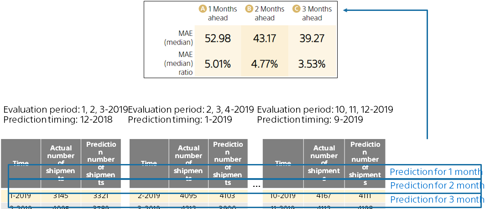

Prediction One displays the prediction accuracy (median absolute error ratio and error ratio) separately based on how far into the future the prediction is. 
The shipment prediction example displays the prediction accuracy for the following cases: 1 month ahead, 2 months ahead, and 3 months ahead.

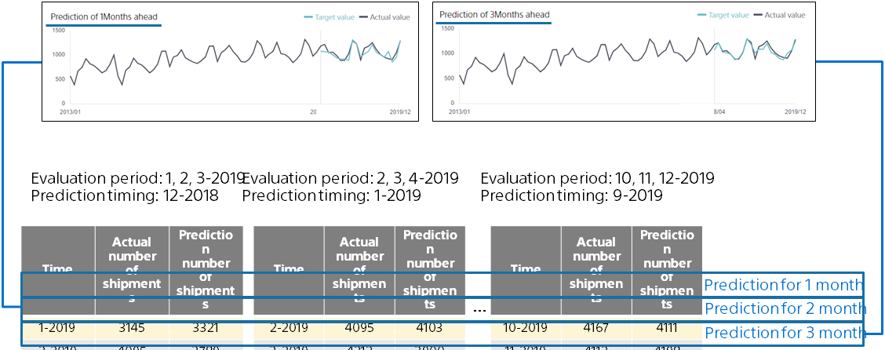

It also displays a graph plotting the predicted and actual values for each case (One month ahead, two months ahead, three months ahead). It gives you an intuitive idea of how far you can predict and how accurate your prediction will be.
{}

{}
In a time series prediction, you can see the contribution of the prediction in the same way as in regression.
In "Contribution details", you can see how the value of each variable affects the increase or decrease of prediction.
For information on reading the contribution, also refer to the "{}" page.

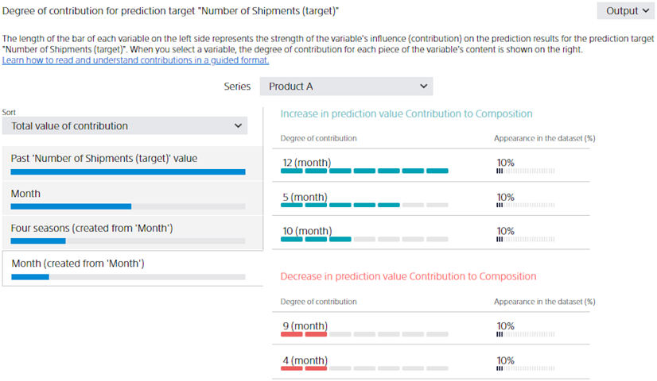

In the time series mode, "past value of the variable to be predicted" is automatically added when the prediction model is created.
This item is created based on the past values of the variables to be predicted so that people can refer to past results when making a future prediction.
Past values of the variables to be predicted are created by combining values at various points in time, such as the day before, 7 days before, 14 days before, several months before, and 1 year before the predicted timing.
Therefore, it is not possible to display the detailed contribution of the "past value of the variable to be predicted".

{}

{}
Prediction One allows you to make predictions that take into account any additional information you have about time.
In this case, additional information is added as a variable to the time series data.

For details, refer to the "{}" page.

{}

{}
{}
With the time series prediction mode, you can also perform up/down deviation prediction. Up/down deviation prediction outputs an up/down deviation prediction value indicating how much a value has increased or decreased in addition to a single prediction value for each time in the future.

For details, refer to the "{}" page.
{}
{}

{}
The time series prediction determines the predictable period based on the most recent time in the training data and the prediction period you set.
You can run a prediction only within a predictable period.

For the shipping prediction case, the predictable period would be from "1 month in the future" to "3 months in the future" for "2019/12/1" (assuming such a setup).
This would be from 2020/1/1 to 2020/3/1. In other words, you can predict the three months of 2020/1, 2020/2, and 2020/3.

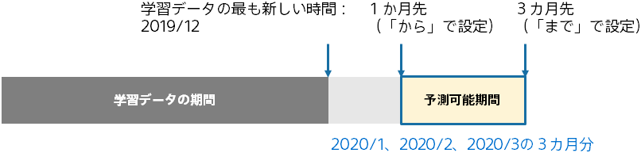
{}

{}
Time series prediction mode enables you to make a prediction using past shipments and time information (such as time of the year, season, day of the week, and morning and afternoon information).
If the data is arranged along time and there is a temporal relation between the variable you want to predict, use the time series prediction mode.

{}

{}
Time series prediction can be used in many aspects of business.
Demand, sales, number of customers and incoming calls can be predicted objectively with high accuracy based on data. Currently, these predictions are often made by experience and intuition, but by introducing predictive analytics, you can improve the prediction accuracy and lower the prediction cost. 

On the other hand, time series prediction requires sophisticated analysis techniques. Upward trends, downward trends, periodic movements, etc. must be considered.
Prediction One makes it easy to make time series predictions that take these into account. 

Make use of time series prediction in your business by referring to this document.{}
