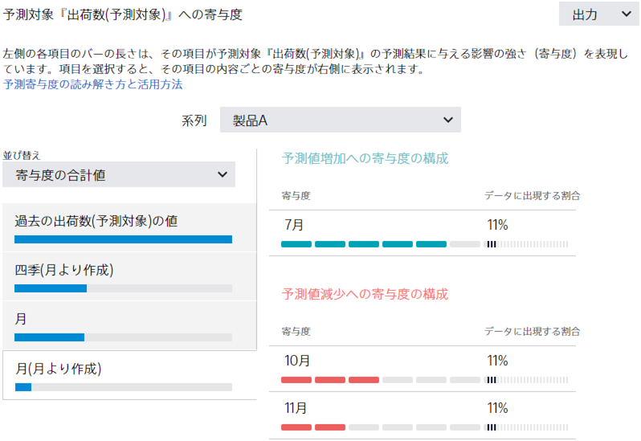

{}

Prediction One では、時系列予測を簡単に行う機能があります。
需要予測、売上予測、来店数予測や入電数予測など、数多くの場面で利用できます。本資料では、時系列予測についてご説明します。

時系列予測のチュートリアルもありますので、具体例としてご参照ください。{}：`C:/Program Files/Sony/Prediction One/ja-JP/doc/sample_dataset/use_case`{}

- {}
- {}
- {}

{}

{}
時系列予測とは、時間に対する値の系列（時系列）について、将来の値を予測することです。以下の例が挙げられます。

{}

{}
時系列予測には、過去の実績についての時系列データを記載したファイルが必要です。 
前のページの出荷数の例の場合、データの csv ファイルは以下のようになります。 

時間に対して情報を追加するケースについては、後ほど説明します。
{}

{}
時系列予測では、学習と予測という２つのステップがあります。以下は出荷数データから出荷数予測を行う例です。

{}

{}
Prediction One で時系列予測を行う方法について説明します。「モデル設定」の画面（データ読み込み後の画面）で、以下の手順を順番に行ってください。

{}

{}
「時系列予測の設定」の画面では、予測したい期間を指定してください。この設定に合わせて予測モデルを作成します。
予測モデル作成後、予測精度の評価を行います。

{}

上振れ下振れ予測を有効にした場合については「{}」で詳細に説明しています。あわせてご参照ください。本資料では上振れ下振れ予測を無効にした、通常の時系列予測モードを使用した場合についての説明になります。
{}
次から予測精度評価について説明します。

{}

{}
時系列予測では次のように予測精度を評価します

1. 評価期間を設定
2. 評価期間より前の時系列から、評価期間の値を予測（評価期間の値は使わずに）
3. 評価期間で、予測値と実際の値を比較

{}

{}
Prediction One では、精度評価期間を複数設定し、それぞれの設定で予測を行い、実際の値と予測値の比較を行います。

評価期間を複数用意することで、実際の値と予測値のペアを多数得ることができ、統計的に安定して精度評価ができます。 実際の値と予測値を比較集計することで、精度評価値算出やグラフ作成を行います。
{}

{}
時系列予測では、予測対象の時期が先であればあるほど予測精度は下がっていきます。
たとえば、1 カ月先の出荷数予測と 3 カ月先の出荷数予測では、3 カ月先の出荷数予測の方が先の未来の予測になるので、予測はより難しいです。
Prediction One では、予測対象の時期ごとに予測精度を算出します。以下、出荷数予測の例で説明します。

上の図のように集計すると、１カ月先予測をした場合の予測精度、２カ月先予測をした場合の予測精度、３カ月先予測をした場合の予測精度をそれぞれ計算できます。
Prediction One では、各ケースの予測精度を誤差中央値、誤差率中央値で算出します。
さらに、各ケースに対してグラフを作成し、予測の様子を見えるようにしています。

Prediction One では「どれくらい先の予測か」によって、予測精度（誤差率中央値と誤差率）を分けて表示します。 
出荷数予測の例では、１カ月先予測、２カ月先予測、３カ月先予測のそれぞれのケースについて予測精度を表示します。

各ケース（１カ月先予測をした場合、２カ月先予測をした場合、３カ月先予測をした場合）の予測値と実際の値をプロットしたグラフも表示します。どれくらい先を予測すると、どれくらいの予測精度になるか直感的に掴むことができます。
{}

{}
時系列予測では、数値予測の時と同じように予測寄与度を確認できます。
「寄与度」ではそれぞれの項目の値が予測を増やす方・減らす方へどのように影響しているかを確認することができます。
寄与度の詳細の見方は「{}」のページもご確認ください。

時系列モードでは予測モデル作成時に「過去の予測したい項目の値」という項目が自動的に追加されます。
これは、人間が将来の予測を行う際に過去の実績を参考にするように、過去の予測したい項目の値を元に作成した項目です。
「過去の予測したい項目の値」は予測するタイミングの前日・7 日前・14 日前・数カ月前・1 年前などさまざまな時点の値を組合わせて作成されます。
そのため、「過去の予測したい項目の値」に関する詳細な寄与度を表示することはできません。

{}

{}
Prediction One では、時間に対して付加的な情報がある場合、それを加味した予測を行うことができます。
この場合付加的な情報を時系列データに項目として追加します。

詳細は{}のページをご確認ください。

{}

{}
時系列予測モードでは上振れ下振れ予測を行うこともできます。上振れ下振れ予測とは、未来の各時刻に対する1 つの予測値に加えて、その値がどの程度増減し得るのかを示す上振れ・下振れ予測値も出力します。

詳細は{}のページをご確認ください。
{}

{}
時系列予測では、学習データのもっとも新しい時間と、設定した予測期間に基づき、予測可能期間が決まります。
予測可能期間内に対してしか予測は実行できません。

出荷数予測のケースでは、予測可能期間は、「2019/12/1」の「１か月先」から「３カ月先」までなので（このように設定したとします）、
2020/1/1 から 2020/3/1 までになります。つまり、2020/1、2020/2、2020/3 の３カ月分が予測できることになります。

{}

{}
時系列予測モードを使用すると、過去の出荷数や時間情報（季節・曜日・午前や午後などの時間からわかる情報）を利用した予測をするようになります。
データを時間に沿って並べてみたとき、予測したい項目の並びに時間的な関係がある場合、時系列予測モードをご利用ください。

{}

{}
時系列予測は、ビジネスの多くの場面で利用できます。
需要、売上、来店数や入電数などをデータに基づいて高い精度で客観的に予測できます。現状これらの予測は経験と勘で行われることが多いと思いますが、予測分析を導入することで、予測精度を上げ、予測コストを下ることが可能になります。 

一方、時系列予測は高度な分析技術が必要になります。上昇トレンド、下降トレンド、周期的な動きなどの考慮などが必要です。
Prediction One では、これらを考慮した時系列予測を簡単に実行できます。 

本資料を参考に、ぜひ時系列予測をビジネスでご活用ください。{}
