{}

For users who have been using Prediction One since before v3.1 (October 2022): The specifications have been changed such that you will need to **select all** of the "Set Individually" content
in order to create prediction models as before. 
Please be aware of this if you wish to create a prediction model in the same way as before.

{}

{}

For users who have been using Prediction One since before v1.8 (March 2023): The specifications have been changed such that you will need to **select all** of the "Set Individually" content
in order to create prediction models as before. 
Please be aware of this if you wish to create a prediction model in the same way as before.

{}

{}
 - The "Variables other than the variable to be predicted" feature is used when using variables outside the prediction scope in time series prediction mode.
 - In cases where there are no available future values at the prediction stage, past versions would require processing and training data to take that lack into account. Using the new feature, you can take care of those steps automatically from the training settings screen.
 - By specifying variables for which you can obtain future values for the prediction period (holiday flags, weather information, etc.) and variables for which you cannot obtain future values for the prediction period (website access counts, stock prices, etc.), you can perform the necessary processing automatically.


 For detailed examples of this process, refer to the {} on individually setting variables other than the variable to be predicted in a time series prediction.


{}

{}
Prediction One allows you to make predictions that take into account any additional information you have about time.
In this case, additional information is added as a variable to the time series data.

For example, in {}, because the number of shipments varies between the months in which the campaign was run and the months in which it was not run,
you might want to use information about whether or not a campaign has been run to make a prediction. In this case, by adding "campaign"—**a variable other than the variable to be predicted**—as follows,
you can factor this information into the prediction.

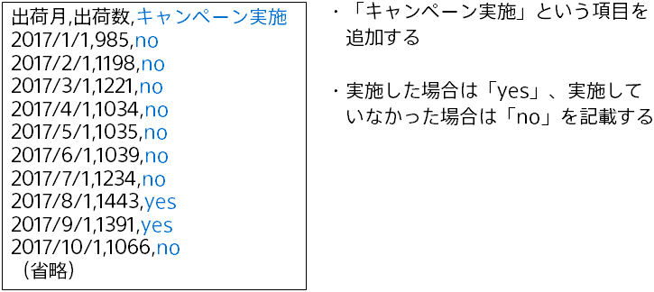

Imagine you want to predict the number of shipments for a given product, but the shipment status of a separate, related product could have an impact on that target prediction number. When you do your prediction, you might want to use information on the number of shipments for that related product.
In this case, you can add "number of shipments of the related product" as a **variable other than the variable to be predicted** to factor this information into the prediction. The procedure is as follows.

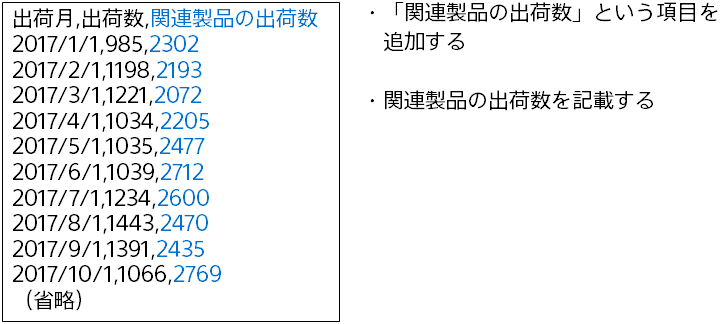

{}

{}
When you have additional information about time, the training and prediction methods depend on whether or not you can obtain additional information for the prediction period. 
Suppose that it is currently December 2019 (the present time) and you want to do a prediction for the period from January to March 2020 (the prediction period) based on data through December 2019.

Ideally, you would factor the number of shipments of a related product into the prediction. At the present time (December 2019), however, you cannot obtain a corresponding shipment number for the prediction period (January-March 2020), as there is no way to know an actual value like the number of shipments that is still to be determined. 
In this case, at the training stage, you would choose "Set Automatically" for variables other than the variable to be predicted. 
Training would then take place in a way optimized for situations where you cannot obtain the number of shipments of the related product current as of the target prediction time. 
Since there is no additional data at the prediction stage, the prediction data is auto-generated. 

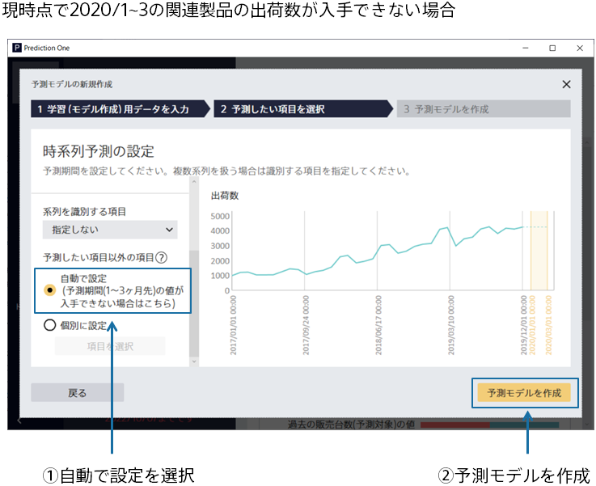
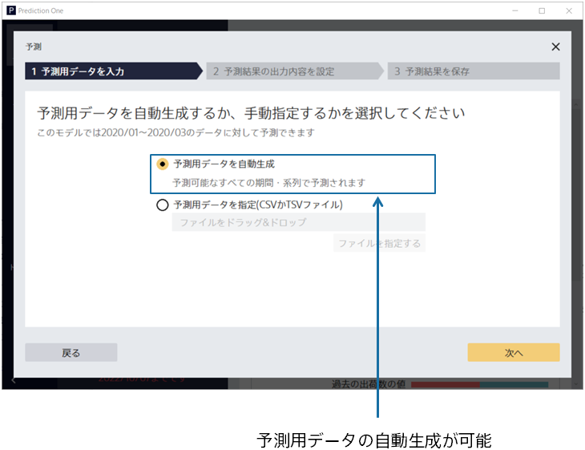

On the other hand, suppose that you want to predict the status of a campaign. At the present time (December 2019), you already have information on campaign status (the schedule for the campaign, etc.) for the prediction period (January-March 2020).
In this case, at the training stage, you would individually set variables other than the variable to be predicted. 
That lets you perform a prediction based on the actual campaign conditions during the prediction periods. The training process will operate on the assumption that the prediction will  refer to campaign conditions during the prediction period. 
If you can obtain additional information for the prediction period, you can improve the accuracy of the prediction model by setting the information individually.
That means that if you can obtain additional information for the prediction period, it may be a good idea to try setting the variables individually instead of automatically. 
To do a prediction via that approach, you need to input data containing the variables that you choose to set individually.
You also need to prepare data for a predetermined predictable period (which you can find on the screen where you read prediction data; see **About Predictable Periods** in {} for more information). 

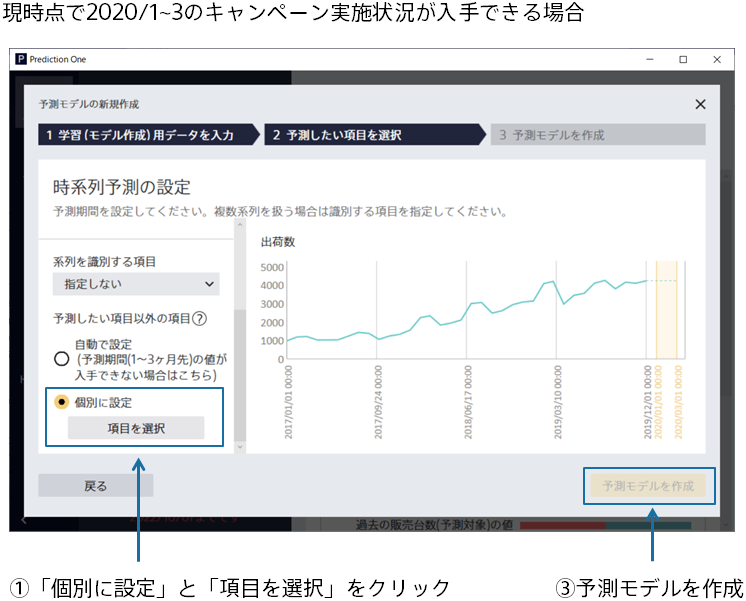
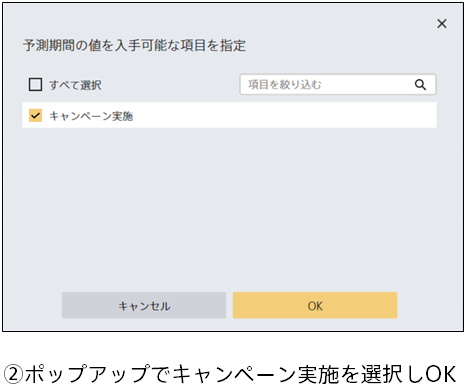
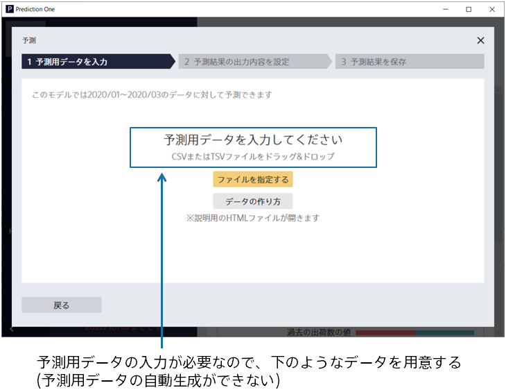

{}

{}
This section explains how Prediction One takes additional information about time into account in the training and prediction processes.

#### Predictions
First, if you **do not have** additional information about time, the prediction for the prediction period is based on past information on the variable to be predicted.

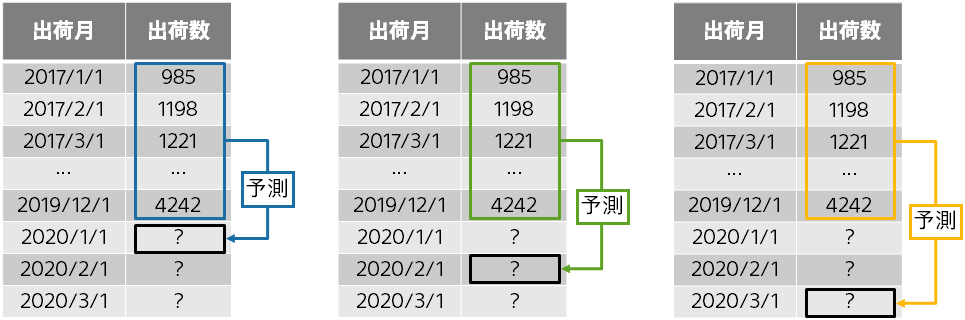

Next, if you **have** additional information for time and you **can** obtain variables other than the variable to be predicted for the prediction period,
the prediction is based on both past information on the variable to be predicted and variables other than the variable to be predicted current as of the target prediction time.

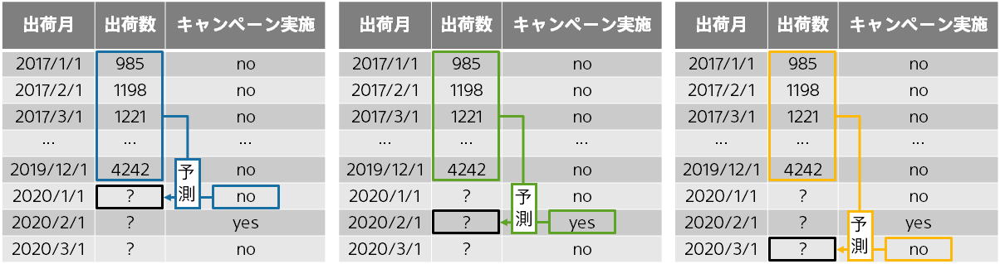

The final situation is where you **have** additional information for time but you **cannot** obtain variables other than the variable to be predicted for the prediction period. 
As it was in the case above, the prediction is based on past information on the variable to be predicted. The prediction also takes variables other than the variable to be predicted into account. Since there is no way to obtain information on those variables for the target prediction time, however, the prediction will look at only past information on variables other than the variable to be predicted. 
In this type of case, it will refer to the most recent available information on variables other than the variable to be predicted. For example, if you were to make a prediction for the prediction period (January-March 2020) at the present time (December 2019), you would need to do three predictions: one for 1 month into the future, one for 2 months into the future, and one for 3 months into the future. In a prediction for 1 month into the future, the latest variables other than the variable to be predicted current as of the present time (December 2019) are those current as of December 2019.  The variables current as of December 2019 would also be the latest variables in a prediction for 2 months into the future.

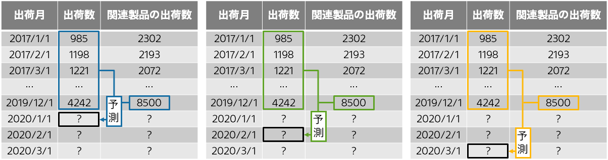

#### Training
Training takes place alongside the prediction configuration. That means that **you need to choose either "Set Automatically" or "Set Individually" for variables, depending on what you want to predict.**

If you **do not have** additional information about time,
training is based on past information on the variable to be predicted according to the target prediction time (1 month, 2 months, or 3 months into the future). 
If it is currently September 2018 and you want to predict the number of shipments for October 2018, 1 month into the future, you can use the values through September 2018. However, if the prediction for October 2018 is 2 months into the future, you can only use the values through August 2018; the prediction model, likewise, would train with only the values through August 2018.  Training thus uses **only the values that are actually available when doing predictions for the prediction period (January-March 2020)**.

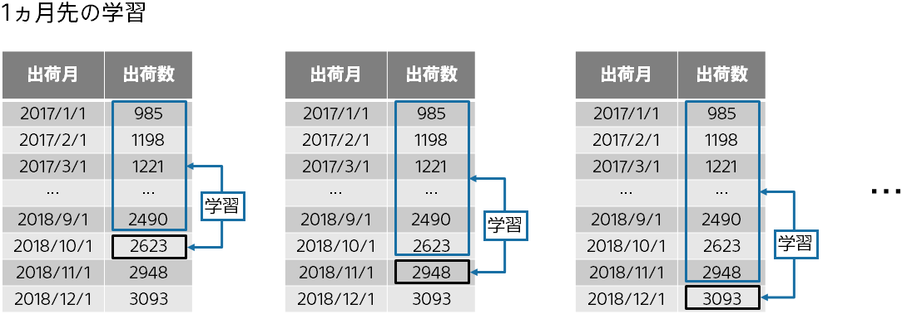
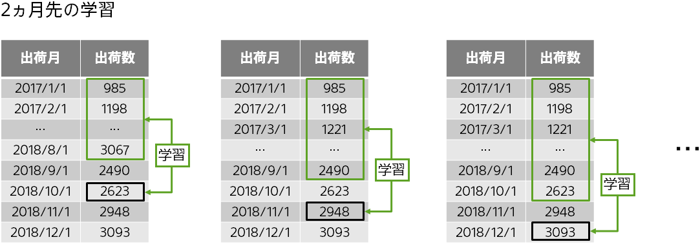
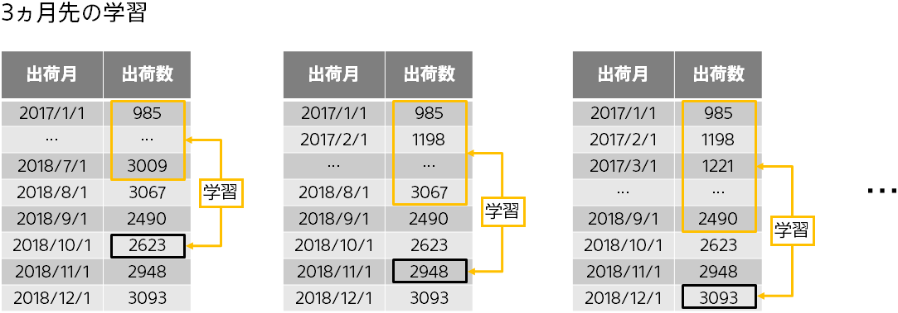

If you **have** additional information for time and you **can** obtain variables other than the variable to be predicted for the prediction period,
training is based on past information on the variable to be predicted according to the target time (1 month, 2 months, or 3 months into the future) for the prediction and
variables other than the variable to be predicted current as of the target prediction time. 
Since the variables other than the variable to be predicted are available for the prediction period, you can use values current as of the target prediction time.

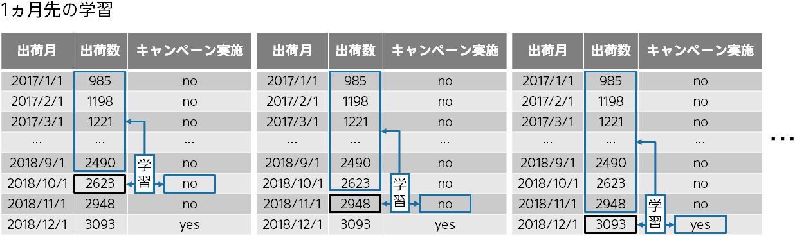
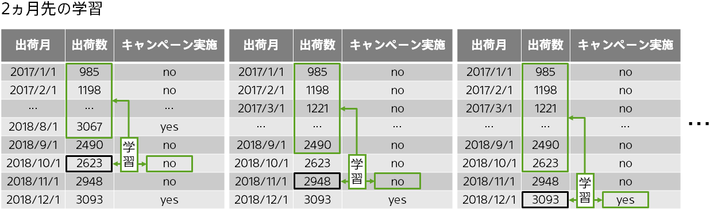
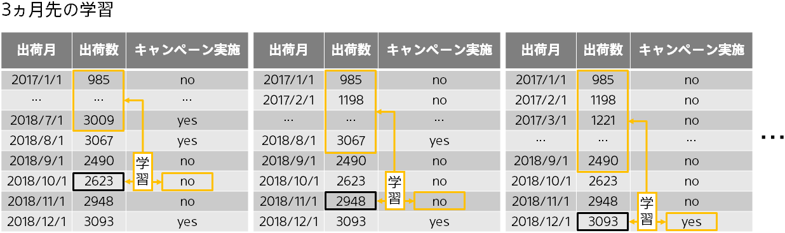

If you **have** additional information for time but you **cannot** obtain variables other than the variable to be predicted for the prediction period,
training is based on past information on the variable to be predicted according to the target time (1 month, 2 months, or 3 months into the future) for the prediction and
**the latest (depending on the target prediction time, namely 1 month, 2 months, or 3 months into the future)** variables other than the variables to be predicted. 
When you look at training data, you will see values for variables other than the variable to be predicted—at the target prediction time, as well—and it may seem like you can use them.
However, training is limited to a set scope in these cases **to recreate the conditions in the prediction period (January-March 2020), considering that you cannot obtain these values for that span of time.**

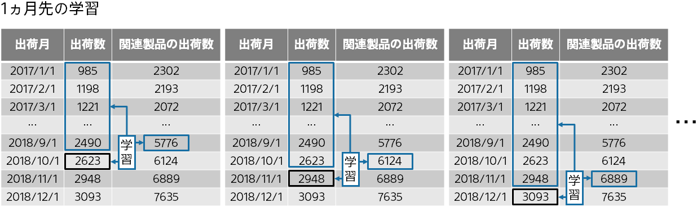
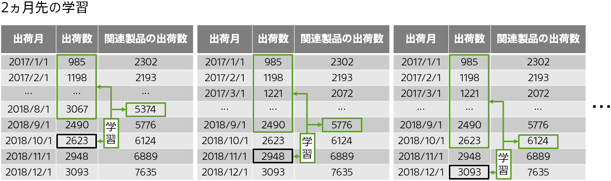
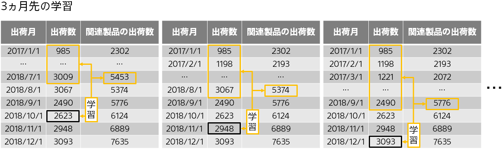

#### When you have a mix of variables for which you can and cannot obtain values for the prediction period
Suppose you have two variables other than the variable to be predicted for the prediction period: "campaign" and "number of shipments of the related product."
You can obtain values for the campaign variable for the prediction period (January-March 2020), given that the schedule is already set, but
you cannot obtain values for the number of shipments of the related product for the prediction period (January-March 2020) since shipments are actual values.
If you want to use these two pieces of additional information in predicting the number of shipments of your target product, the prediction process will take the two variables into account as follows.
The training process also takes place alongside the prediction process.

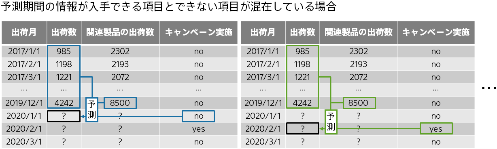

When you have a mix of variables for which you can and cannot obtain values for the prediction period, you need to
check only the variables with available values for the prediction period on the "Set Individually" screen and then perform training. 
The checked variables are the ones required for the prediction.

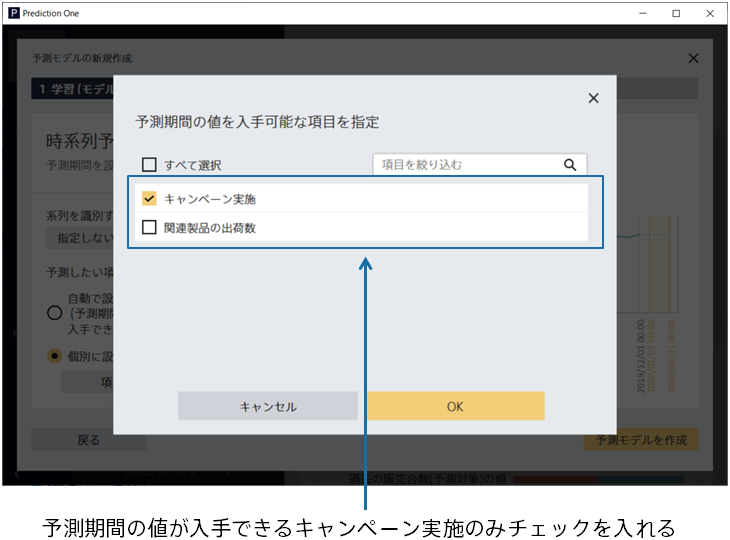

{}

{}

The optimal choice for variables other than the variable to be predicted depends on whether or not the variables have obtainable values for the prediction period 
when you have additional information about time. Below is a summary of how to select the right approach.

 
 

 - Use "Set Individually" for variables for which you can obtain information for the prediction period.
 - Do not use "Set Individually" for variables for which you cannot obtain information for the prediction period.
 - Use "Set Automatically" if you cannot obtain all the additional information for the prediction period.

{}
