{}

v3.1 (2022年10月) より前から Prediction One を使用されている方は、「個別に設定」の内容を**すべて選択**しないと、
今まで通りの予測モデル作成ができない仕様変更になっております。 
今までと同じように予測モデルの作成を行いたい場合はご注意ください。

{}

{}

v1.8 (2023年3月) より前から Prediction One を使用されている方は、「個別に設定」の内容を**すべて選択**しないと、
今まで通りの予測モデル作成ができない仕様変更になっております。 
今までと同じように予測モデルの作成を行いたい場合はご注意ください。

{}

{}
 - 「予測したい項目以外の項目」は、時系列予測モードで予測対象項目以外の項目を予測に利用する場合の機能です
 - 予測時に将来の値が入手できない場合、過去のバージョンでは、それを加味してデータを加工し学習する必要がありましたが、本機能を使用すれば学習設定画面から自動で行えるようになります。
 - 予測期間の (将来の) 値が入手できる項目 (祝日フラグ、天気予報など) と、予測期間の (将来の) 値が入手できない項目 (Webサイトアクセス数、株価など) を指定することで、必要な処理を自動で行います


 時系列予測の予測したい項目以外の項目を「個別に設定」する{}もありますので、具体例としてご参照ください。


{}

{}
Prediction One では、時間に対して付加的な情報がある場合、それを加味した予測を行うことができます。
この場合付加的な情報を時系列データに項目として追加します。

たとえば、{}で、キャンペーンを実施した月と実施しなかった月で出荷数が変わるため、
キャンペーンを実施したか否かの情報を予測に利用したいとします。このケースでは以下のように「キャンペーン実施」という**予測したい項目以外の項目**を追加することで、
この情報を加味することができるようになります。

また、関連製品の出荷状況が予測したい製品の出荷数に影響がありそうな場合で、関連製品の出荷数の情報を予測に利用したいとします。
このケースでも以下のように「関連製品の出荷数」という**予測したい項目以外の項目**を追加することで、この情報を加味することができるようになります。

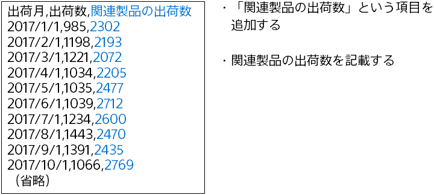

{}

{}
時間に対して付加的な情報がある際は、予測期間の付加情報を入手できるかどうかに応じて学習方法・予測方法が変わります。 
現在2019/12 (現時点) で2019/12までのデータをもとに、2020/1～3の期間 (予測期間) を予測したいとします。

関連製品の出荷数を予測に加味したいが、現時点 (2019/12) で予測期間 (2020/1～3) の関連製品の出荷数が入手できないとします (実績値なので未来の値は入手できない)。
この場合は、学習時に「予測したい項目以外の項目」の自動で設定を選択します。 
これによって予測時点の関連製品の出荷数が入手できない場合に対応した方法で学習が行われます。 
予測する時に付加する情報がないので予測データの自動生成ができます。 

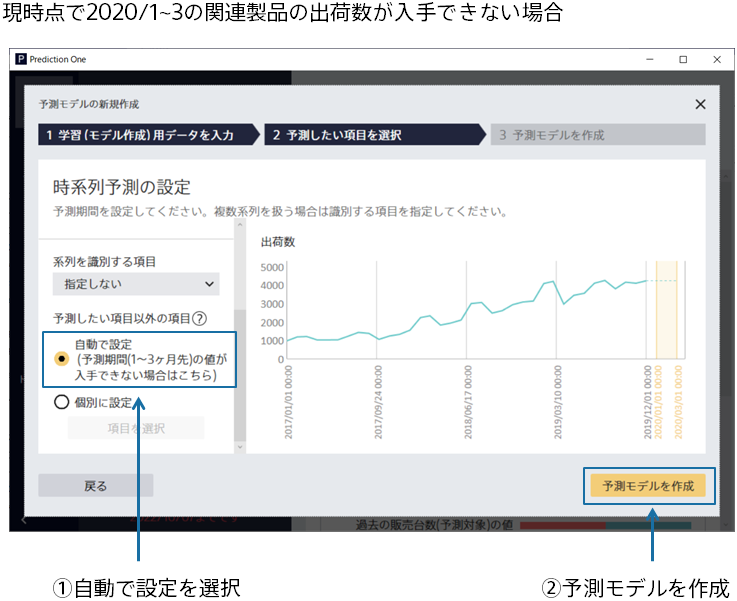
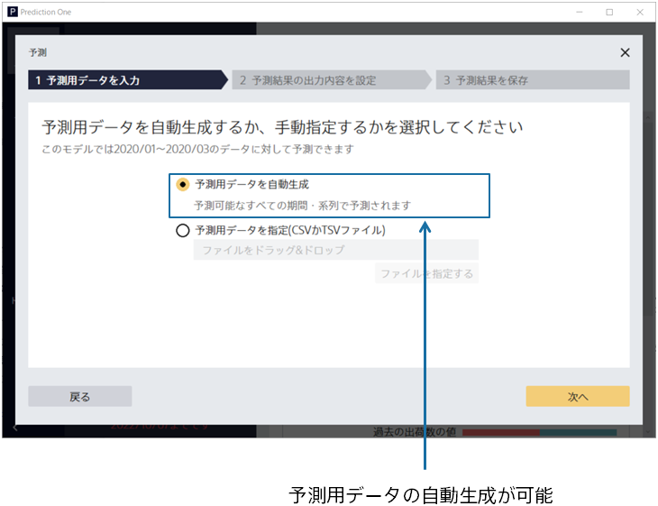

一方で、キャンペーン実施状況を予測に加味したくて、現時点 (2019/12) で予測期間 (2020/1～3) のキャンペーン実施状況が入手できるとします (キャンペーン実施のスケジュールなど)。
この場合は、学習時に「予測したい項目以外の項目」を個別に設定します。 
これによって予測期間のキャンペーン実施状況を参考にした予測が行えます。学習も予測期間のキャンペーン実施状況を参考にすることを前提に行われます。 
予測期間の付加情報が得られる場合は、個別に設定をすることで予測モデルの精度が向上する可能性があります。
なので、予測期間の付加情報が得られる場合は自動で設定ではなく、個別に設定を使用してみると良いかもしれません。 
予測する時には、個別に設定すると選択した項目が入ったデータの入力が必要です。
また、あらかじめ決まった予測可能期間内（予測データを読み込む画面で確認できます。詳細は{}の**予測可能期間について**を参照）のデータを用意する必要があります。 

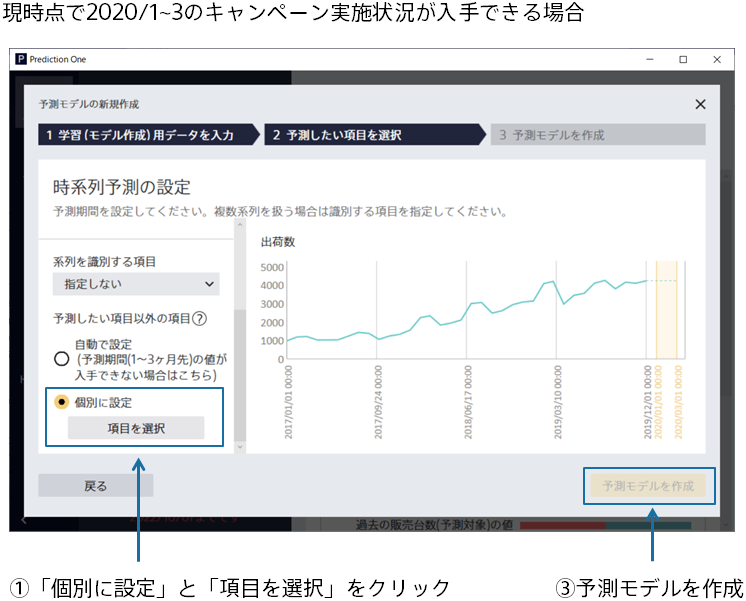
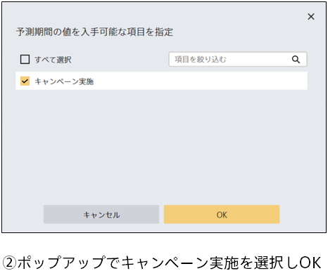
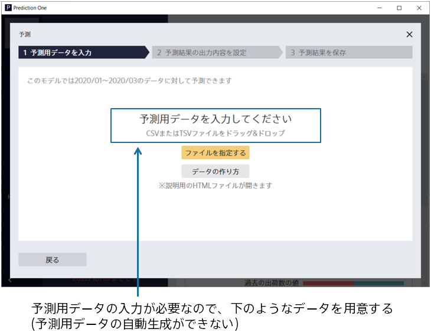
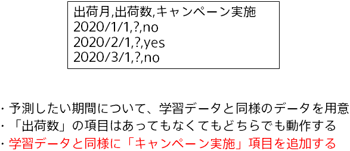
{}

{}
時間に対して付加的な情報がある場合に、Prediction One がそれをどのように加味して学習・予測を行うのかについて説明します。

#### 予測について
まず、時間に対して付加的な情報が**ない**場合、過去の予測したい項目を参考に予測期間を予測します。

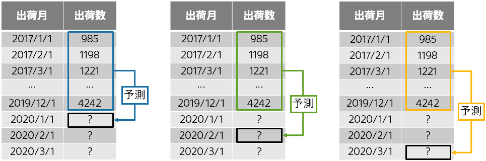

次に、時間に対して付加的な情報が**ある**ときで、予測期間の「予測したい項目以外の項目」が入手**できる**場合、
過去の予測したい項目に加えて、予測したい時点の「予測したい項目以外の項目」も参考に予測します。

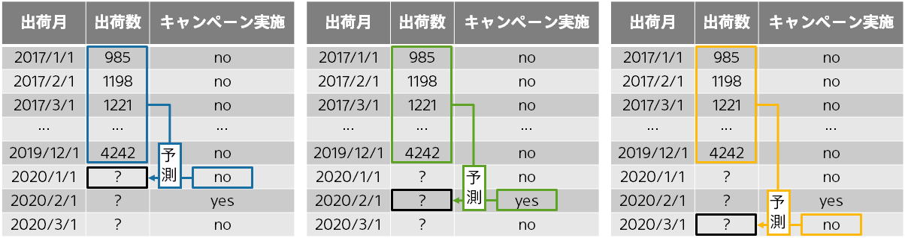

最後に、時間に対して付加的な情報が**ある**ときで、予測期間の「予測したい項目以外の項目」が入手**できない**場合です。 
上記の場合と同様に過去の予測したい項目を予測の参考にします。「予測したい項目以外の項目」も参考にしますが、予測したい時点の「予測したい項目以外の項目」は入手できないので、過去の「予測したい項目以外の項目」を予測の参考にします。 
この時、できるだけ最新の「予測したい項目以外の項目」を参考にします。例えば、現時点 (2019/12) で予測期間 (2020/1～3) を予測する場合、1ヵ月先の予測と2ヵ月先の予測と3ヵ月先の予測を行う必要があります。1ヵ月先を予測する場合、現時点 (2019/12) で最新の「予測したい項目以外の項目」は 2019/12 です。同様に、2ヵ月先を予測する場合の現時点で最新の「予測したい項目以外の項目」も 2019/12 です。

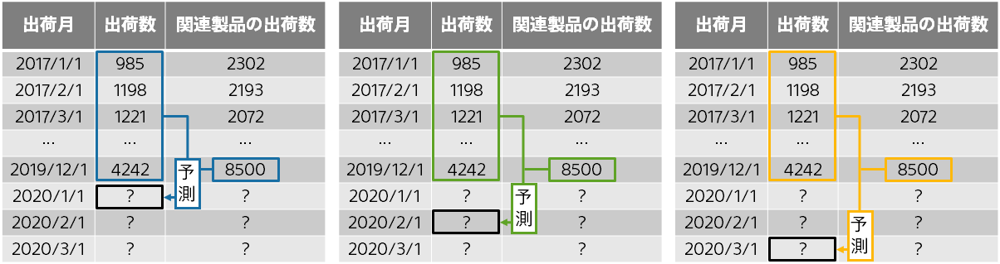

#### 学習について
学習は上記の予測の設定に合わせて行われます。つまり、**どのような予測をしたいかに合わせて「自動で設定」「個別に設定」を選択する必要**があります。

時間に対して付加的な情報が**ない**場合、
以下のように予測したい先 (1ヵ月先、2ヵ月先、3ヵ月先) に合わせた過去の予測したい項目を参考に学習を行います。 
例えば、1ヵ月先に 2018/10 の出荷数を予測したい場合は、2018/9 までの値を使用できますが、2ヵ月先に 2018/10 の出荷数を予測したい場合は、2018/8 までの値しか使用できないため、2018/8 までの値のみを参考に予測モデルの学習を行います。このように**予測期間 (2020/1～3) を予測する時も使用できる値のみ**を用いて学習します。

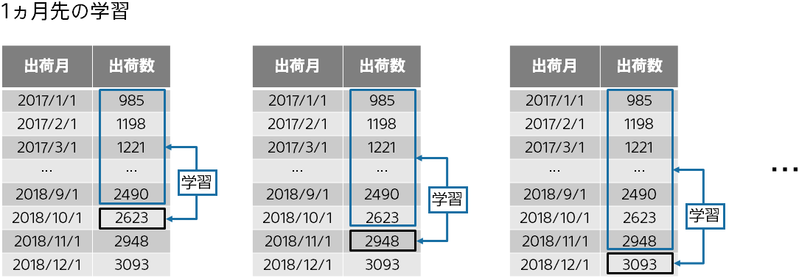
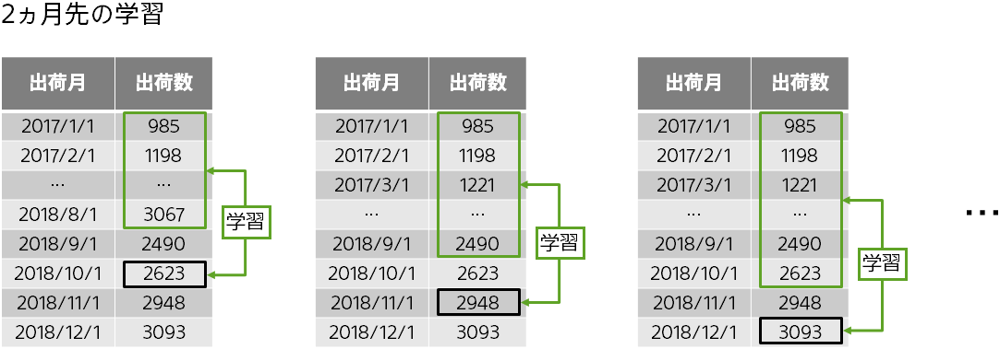
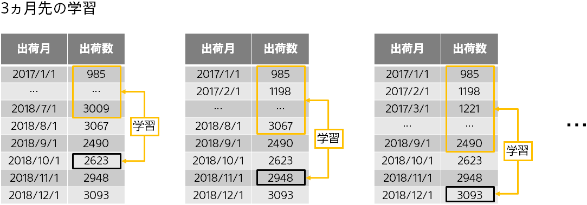

時間に対して付加的な情報が**ある**ときで、予測期間の「予測したい項目以外の項目」が入手**できる**場合、
以下のように予測したい先 (1ヵ月先、2ヵ月先、3ヵ月先) に合わせた過去の予測したい項目に加えて、
予測したい時点の「予測したい項目以外の項目」を参考に学習を行います。 
予測期間の「予測したい項目以外の項目」が入手できるため、予測時点と同時刻の値を用いることができます。

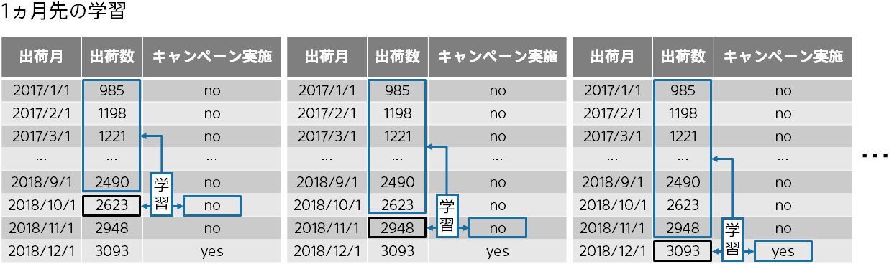
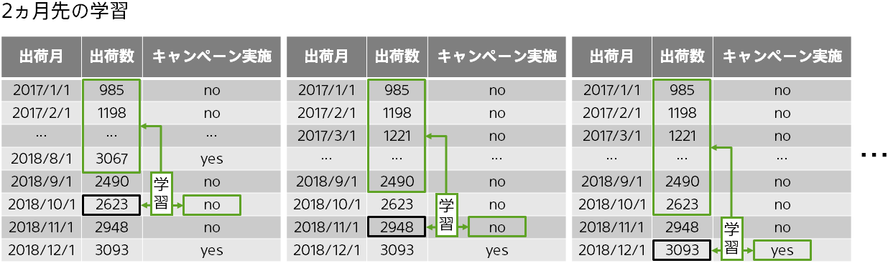
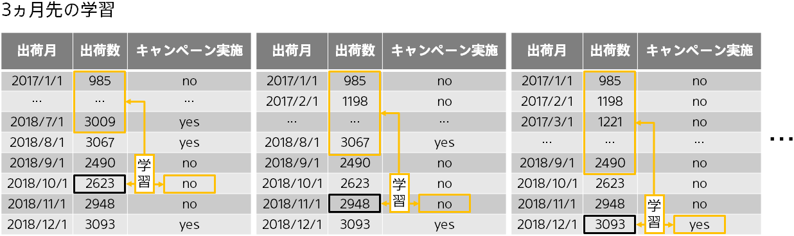

時間に対して付加的な情報が**ある**ときで、予測期間の「予測したい項目以外の項目」が入手**できない**場合、
以下のように予測したい先 (1ヵ月先、2ヵ月先、3ヵ月先) に合わせた過去の予測したい項目に加えて、
**予測したい先 (1ヵ月先、2ヵ月先、3ヵ月先) に合わせた最新の**「予測したい項目以外の項目」を参考に学習を行います。 
学習データを見ると予測したい時点の「予測したい項目以外の項目」の値も存在していて、これを利用できるように見えますが、
**予測期間 (2020/1～3) ではこれらの値は入手できないことを踏まえて、同じ状況を再現するために**このような学習をしています。

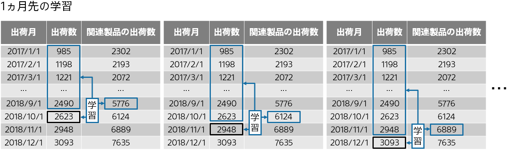
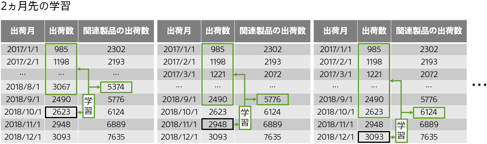
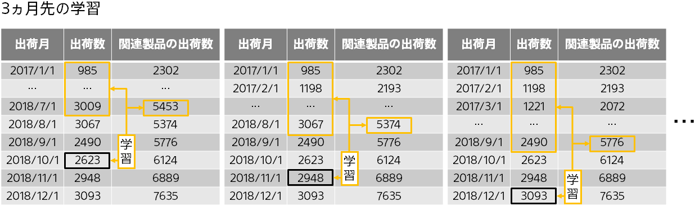

#### 予測期間の値が入手できる項目とできない項目が混在している場合
予測期間の「予測したい項目以外の項目」について、キャンペーン実施と関連製品の出荷数があったとします。
この時、キャンペーン実施はスケジュールが決まっているため予測期間 (2020/1～3) の値が入手できるが、
関連製品の出荷数は実績値なので予測期間 (2020/1～3) の値が入手できないとします。
そして、この二つの付加情報を加味して予測したい製品の出荷数を予測する場合は以下のとおりにそれぞれの項目の値を参考に予測を行います。
学習もこれに合わせて行われます。

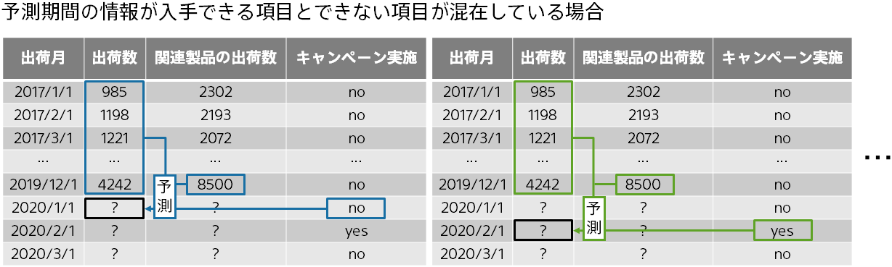

なお、このように予測期間の値が入手できる項目とできない項目が混在している場合は、個別に設定する画面で以下のように
予測期間の値が入手できる項目のみにチェックを入れて学習を行う必要があります。 
予測の際に必要な項目はチェックを入れた項目のみです。

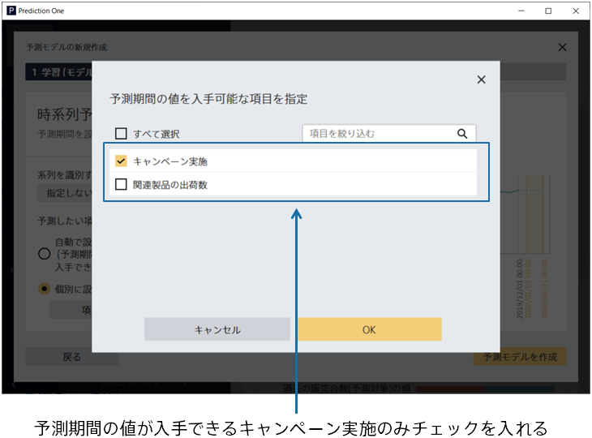

{}

{}

予測したい項目以外の項目は、時間に対して付加的な情報がある場合に、予測期間のその情報が手に入るかどうかで
選ぶべき選択肢が変わる設定です。以下に選択方法についてまとめます。

 
 

 - 予測期間の情報が手に入る項目は、個別に設定で選択をする
 - 予測期間の情報が手に入らない項目は、個別に設定で選択をしない
 - 予測期間の付加的な情報の全てが手に入らない場合は、自動で設定を使用する

{}
