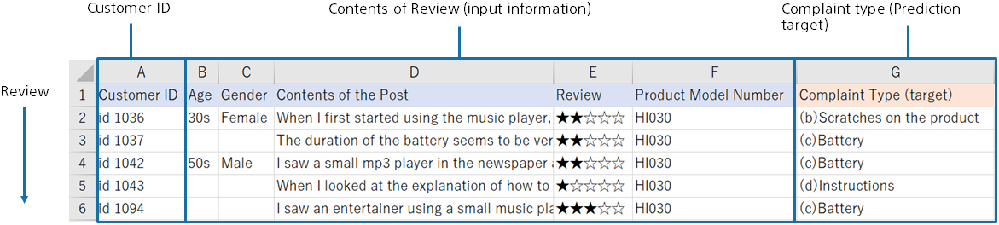

{}

This document describes the concept of predictive contribution in Prediction One. 
You can use the predictive contribution to determine which data variables and which values affect the prediction results to what extent. 
This is very important when you actually use predictive analytics. 

- You can use the prediction results with confidence because you can understand and confirm how to predict.
- You can get explain the results of predictive analytics to stakeholders in a way that is easier to understand.
- You can see which parts of the data are important and how much, which leads to better datasets. This makes it easier to notice errors.
- Contribution of previously unimagined variables leads to new discoveries.
  {}

{}

Predictive analytics involves two steps: training and predicting. The following is an example of predicting a customer's purchase from actual purchase data.

{}

{}

The predictive contribution is calculated against the prediction model. First, calculate the predicted result (for example, probability of purchase) for some data (for example, customer A). 

Next, with some variables (for example, department information) removed from the input data, the predicted results are calculated again. 

The predicted contribution of the removed variable is the difference in the prediction probability when the variable is included or removed. In the above example, the predictive contribution of information for Customer A's department is 0.85 - 0.70 = 0.15. This example assumes that the department information variable has increased the prediction probability by 0.15.  
The larger the difference in the prediction probability, the more likely the variable is to contribute to the prediction. For example, if there is a variable that does not affect the prediction result (no contribution), the difference in the prediction probability should be zero, because it is the same whether it exists or not. You can also see whether it contributes to increasing or decreasing the probability of purchase by looking at whether it is increasing or decreasing the prediction probability.
{}

{}

The detail screen of prediction contribution is described using a dataset for binary classification as an example. 
A dataset used to predict the purchase of premium services from customer data. 

{}
<small>This sample dataset is in the following folder: `C:/Program Files/Sony/Prediction One/ja-JP/doc/sample_dataset/use_case/マーケティング_顧客行動予測に基づいたターゲティング`</small>
{}
{}
<small>This sample dataset is available from the Data -> Samples tab data list.</small>
{}

The left side of the screen lists the predictive contribution of each variable. The greater the contribution, the longer the bar. The bar length is relative to the variable with the highest contribution.  
The blue bar represents the amount of contribution to increasing the probability of purchase (the probability of "purchased"). The red bar represents the degree of contribution to decreasing the purchase probability. 
You can toggle which bar is displayed in the Sort Order pull-down. When you click a variable name or bar, the display on the left switches to that of the variable you clicked.

The right side of the screen displays details about the variable selected on the left. Suppose you click the "Customer Rank" variable on the screen. "Customer Rank" can be "Platinum," "Gold," "Silver," or "Bronze." From this screen, you can see that "Platinum" customers contribute to the prediction by increasing the probability of "purchased".

Contribution strength is displayed as the length of the Contribution bar. Percentage of Values is the percentage of customers whose selected variable in the dataset is the value of the variable's contents.
For this dataset, 32% of all customers have a Customer Rank of "Platinum". Platinum is important information that contributes greatly and has many customers.

You can see that customers with a Customer Rank of Bronze, Silver, or Gold contribute to the prediction results in a way that increases the prediction probability of No Purchase (and decreases the prediction probability of Purchased). Contributions are listed in descending order, and the magnitude of the contribution is indicated by the length of the Contribution bar.

These results may seem obvious if there are practitioners familiar with the service. Confirming that it matches the perceptions and intuitions of practitioners can increase confidence in predictions.

Now, let's say you clicked on the Past Purchases variable. Past Purchases is a numeric variable. For a numeric variable, a range of values is automatically set, and each range shows how it contributes to the purchase probability.
By looking at the "range of numbers", you can see at a glance which range of "past purchases" will increase or decrease the prediction probability. Blue contributes to purchase and red contributes to no purchase.

{}

{}

Next, the predictive contribution screen of multiclass classification will be explained. Let's take an example of the analysis results of the dataset below. A dataset to predict which complaint types to classify for review statements. 
{}
<small>This sample dataset is in the following folder: `C:/Program Files/Sony/Prediction One/ja-JP/doc/sample_dataset/use_case/CRM_顧客の声のラベリング自動化`</small>
{}
{}
<small>This sample dataset is available from the Data -> Samples tab data list.</small>
{}

The left side of the screen lists the predictive contribution of each variable.
Multiclass classification calculates the contribution for each class (complaint type), but initially displays the total. You can toggle which classes' contributions are displayed in the Filter pull-down. You can also use the Filter button on the right to toggle in the same way.
As with binary classification, click the variable name or bar to switch the display on the right.

Let's look at the right side. Multiclass classification calculates the contribution for each class (complaint type), so each class displays the contents of the variables that contribute to that class. There are five classes in this dataset, so there are five.
The Post Content variable is a text type. The variable content displays the words contained in the text. Inclusion of "different", "look", and "feel" increases the probability of the "(a) look" class.
{}

{}

The screen of the predictive contribution of regression is described below. Let's take an example of the analysis results of the dataset below. You predict the number of incoming calls in the future from the number of incoming calls in the past at the call center. 
{}
<small>This sample dataset is in the following folder: `C:/Program Files/Sony/Prediction One/ja-JP/doc/sample_dataset/use_case/コールセンター_入電予測によるオペレータ人数決定`</small>
{}
{}
<small>Click "Select from Uploaded Data" and select the sample data from the data list on the "Samples" tab.</small>
{}

The left side of the screen lists the predictive contribution of each variable. The greater the contribution, the longer the bar. The bar length is relative to the variable with the highest contribution.
The blue bar indicates the magnitude of the contribution to the increase in the predicted value (predicted number of incoming calls). The red bar represents the degree of contribution to decreasing the predicted value. You can toggle which bar is displayed in the Sort Order pull-down.
When you click a variable name or bar, the display on the left switches to that of the variable you clicked.

Let's look at the right side. Let's say you clicked on the "Day of Week" variable.
From this screen, you can see that "Monday", "Wednesday", and "Friday" increase the predicted number of incoming calls. "Saturday" and "Sunday" will reduce the predicted number of incoming calls.
Percentage of Values is the same as binary classification or multiclass classification. For example, you can see that 15% of the data in this dataset has the day of the week as "Monday".

This section describes the predictive contribution of date-type variables. Suppose you click "Date," a date-type variable.
In this dataset, the "Date" is something like "2018/2/1", but Prediction One shows the most predictive year, month, day, etc. In this dataset, the "month" is selected. For example, you can see that "January" contributes to reducing the predicted number of incoming calls.
{}

{}

This section describes the Add Prediction Reason option and how to read its output when predicting.

You can add prediction reasons for each row of prediction data by checking the Add Prediction Reason option when predicting.

When the option "Add Prediction Reason" is ON, columns "Increase ~ 1", "Increase ~ 2", "Increase ~ 3", "Decrease ~ 1", "Decrease ~ 2", and "Decrease ~ 3" are added to the prediction result CSV file. This means Top 1, Top 2, and Top 3, which are factors that increase or decrease the predicted probability or value.
Each prediction reason column is output in the format`[項目名]:[項目内容]:[寄与度]`.
In this example, a customer with a "Customer ID" of "ID01006" has a high probability of purchasing of 71.95%, but you can see that the Top 1 factor that increases the probability of a purchase is because the "Customer Rank" is "Platinum". You can also see that having a "Customer Rank" of "Platinum" increased the probability of a purchase by 21.61%.
(`寄与度` can be interpreted as an increase/decrease in prediction probability for binary classification and an increase/decrease in predicted value for regression. However, multiclass classification cannot be interpreted as prediction probability.)

{}

{}

In this document, we have explained the predictive contribution of Prediction One. 
As I explained at the beginning of this document, predictive contribution is very useful when you actually use predictive analytics in your business. 
There are many users who place more importance on predictive contribution than on prediction accuracy. 
This software has been developed with an emphasis on calculation and display of predictive contribution. Please get to know the perspective of the contribution screen in this document, and use it for predictive analytics. 
{}
