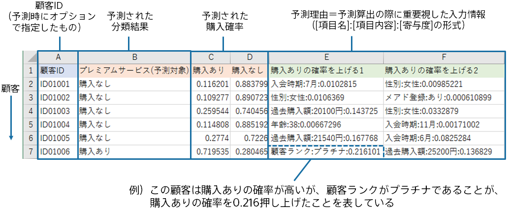

{}

本資料では、Prediction One の予測寄与度について説明します。 
予測寄与度から、データのどの項目のどの値がどの程度予測結果に影響を与えているかを知ることができます。 
これは実際に予測分析を利用する際にとても重要です。 

- 予測の仕方が把握・確認できるので、自信をもって予測結果を利用できる
- 予測分析の結果を関係者に説明する際に理解が得られやすくなる
- データのどの部分がどれくらい重要かがわかるので、データセットの改善に繋げられる。ミスに気付きやすい
- 以前は想像していなかった項目の寄与があると、新たな発見に繋がる
  {}

{}

予測分析では、学習と予測という２つのステップがあります。以下は購入実績データから顧客の購入予測を行う例です。

{}

{}

予測寄与度は、予測モデルに対して算出されます。まず、あるデータ（例：顧客 a の情報）について予測結果（例：購入確率）を算出します。 

次に入力データからある項目（例：部署の情報）を取り除いた状態で、再度予測結果を算出します。 

取り除いた項目の予測寄与度は、その項目を 含めた場合/取り除いた場合 の予測確率の差です。上記の例ですと、顧客 a の部署の情報の予測寄与度は、0.85－0.70=0.15 となります。部署の項目が予測確率を 0.15 増加させたとみなします。  
予測確率の差が大きいほど、項目は予測結果に寄与しているとみなします。たとえば、予測結果に影響を与えない（寄与度がない）項目があった場合は、あってもなくても同じなので予測確率の差は 0 になるはずです。また予測確率を増やすか減らすかを見ることで、購入確率を上げる方に寄与しているのか、下げる方に寄与しているのかがわかります。
{}

{}

予測時の「予測理由を追加する」オプションとのその出力結果の見方について説明します。

予測時に「予測理由を追加する」というオプションにチェックを入れると、予測データの行毎に予測理由を追加できます。

「予測理由を追加する」というオプションがONのときは、予測結果のCSVファイルに「～を上げる1」「～を上げる2」「～を上げる3」「～を下げる1」「～を下げる2」「～を下げる3」という列が追加されます。これは予測確率や予測値を上昇/下降させる要素のTop1/Top2/Top3という意味です。
各予測理由の列は、`[項目名]:[項目内容]:[寄与度]`の形式で出力されています。
この例では、「顧客ID」が「ID01006」の顧客は、購入ありの確率が71.95%と高いですが、購入ありの確率を上昇させる要素のTop1は、「顧客ランク」が「プラチナ」だから、ということがわかります。さらに、「顧客ランク」が「プラチナ」であることによって、購入ありの確率が21.61%上昇した、ということもわかります。
(`寄与度`は二値分類の時は予測確率の上昇/下降分、数値予測のときは予測値の上昇/下降分と解釈できます。ただし、多値分類のときは予測確率としての解釈はできません。)

{}

{}
予測精度の概要について理解したら、各予測タイプにおける予測寄与度の見方と活用方法を以下のリンクから確認しましょう。 

二値分類の場合 
{} 

多値分類 
{} 

時系列予測 
{} 
数値予測の場合もこちらをご参照ください 

{}

{}
実際に予測分析をビジネスで利用する際には、予測寄与度がとても役に立ちます。 
ユーザー様の中には、予測精度よりも予測寄与度を重視される方も多くいらっしゃいます。 
本ソフトウェアは予測寄与度の算出と表示内容に力を入れて開発されていますので、本概要の解説と、上記の読み解き方のページをご覧いただき、是非ご自身のケースにお役立てください。 
{}
