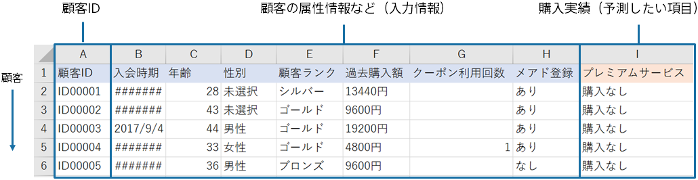
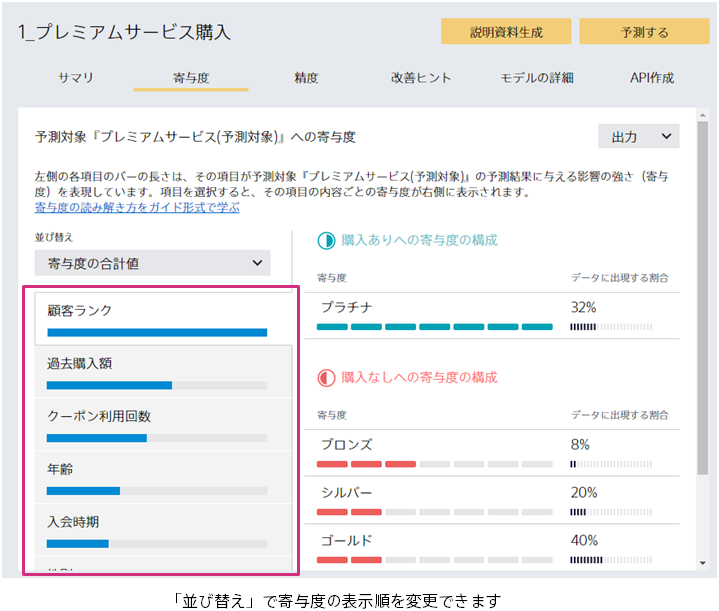
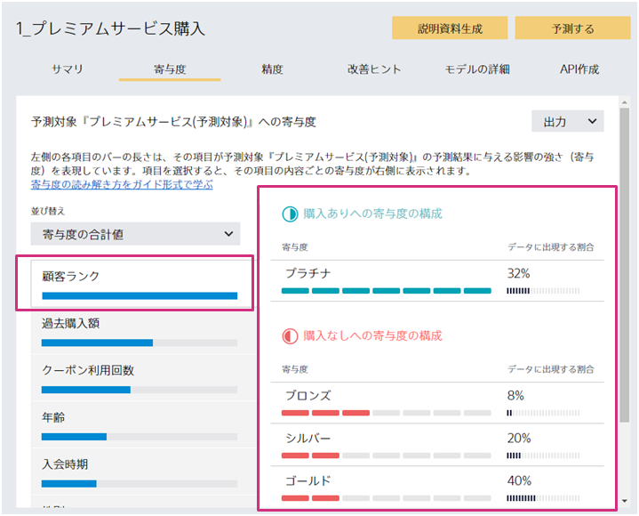
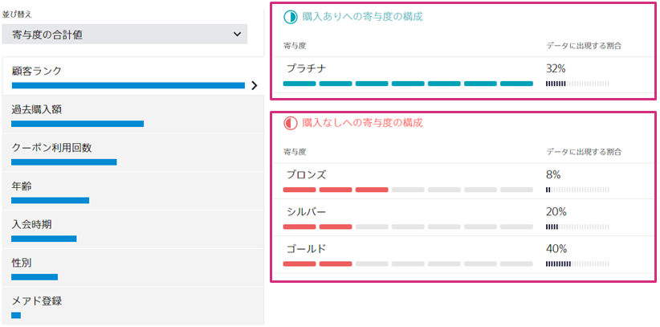
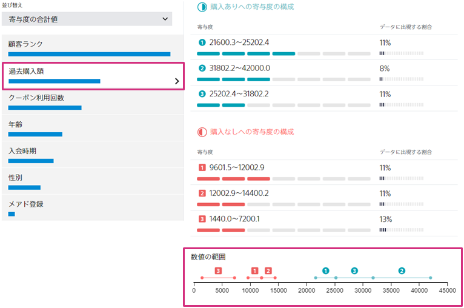
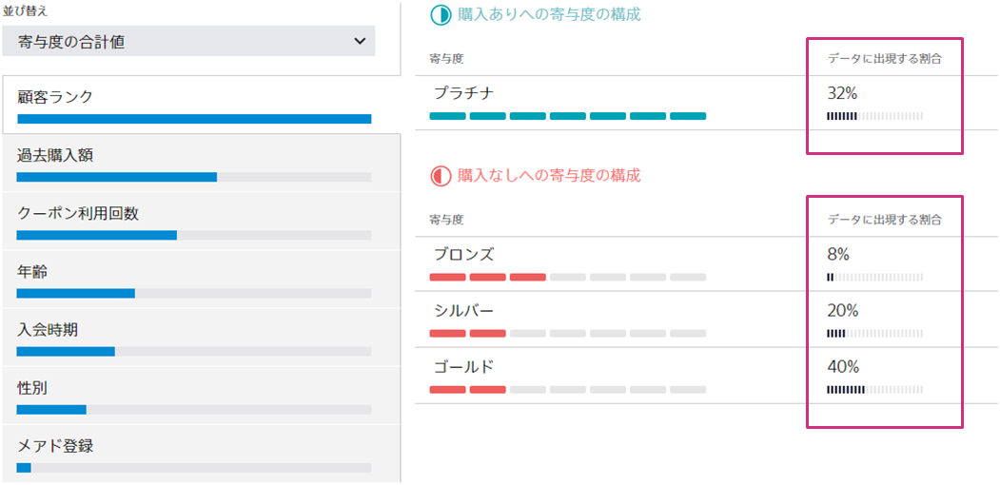

{}
予測寄与度を正しく読むことができると、予測モデルの改善や業務施策の立案に活用することができます。

ここでは、二値分類の寄与度の読み解き方のポイントや活用方法を紹介します。
{}

{}
ここでは、顧客データからプレミアムサービスの購入を予測するためのデータセットを元に、予測寄与度の読み解き方のステップとその活用方法を説明します。 
このサンプルデータセットは、「データ」→「サンプル」タブのデータ一覧から取得可能です。 

{}

{}
まず、寄与度の合計の大きい順に、項目を確認しましょう。 
「ご自身の考える項目の影響の強さと寄与度の大きさが一致するか」「想定外のところはあるか」をポイントに確認します。 

{}

{}
それぞれの寄与度の項目をクリックして、寄与度を構成する要素を確認していきます。

予測対象の確率を上げる項目、下げる項目が、ご自身の経験や直感と合っているかを確認します。 
確率を上げている項目・下げている項目は以下の□部分で確認できます。 

この画面から、「プラチナ」である顧客は「購入あり」の予測確率を高めるように予測に寄与することがわかります。

ここで、ご自身が寄与が高いと思っていた項目が低かったり、逆に、寄与が低いと思っていた項目が高い場合は、使用すべきデータを間違ってしまっている可能性があります。まずデータを見直してみましょう。 
データを見直し、間違っていなかった場合、以下のような気付きが考えられます。 
・思わぬ項目が予測へ寄与している 
・思っていた項目が予測へ寄与していない 
ここから、ビジネス上に重要なインサイトが得られる可能性があります。 

#### 画面の見方のポイント

「過去購入額」のような数値の項目は、値の範囲が自動的に設定され、範囲ごとに購入確率にどう寄与するか表示されます。 
「数値の範囲」を見ると、「過去購入額」のどの範囲が予測確率を上げるのか下げるのかが一目でわかるようになっています。緑が「購入あり」への寄与、赤が「購入なし」へ寄与します。 

{}

{}
ここまでの考察より、業務施策が立案できそうか検討しましょう。 
ここでは、項目の大小に加え、寄与度の強さとデータに出現する割合を見ていく必要があります。 

先ほどの考察より、購入ありへの寄与度が大きいのはプラチナなので、それ以外のブロンズ・シルバー・ゴールドのランクをプラチナに上げれば購入ありのユーザーが増えそうだと考えられます。 
さらに、ブロンズ・シルバー・ゴールドの中でもブロンズの寄与が強いと読み取れます。 
しかし、データに出現する割合を見ると、ブロンズは8%となっており、ユーザー自体が少ないことが読み取れます。それを鑑みてブロンズユーザー向けに施策を打つのは効果がないかもしれない、と気づきます。 
このように、寄与の強さとその割合を合わせて見ることで、効果的な施策は何かを検討することができます。 
{}
