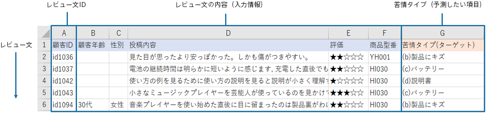
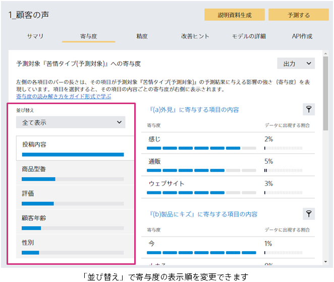
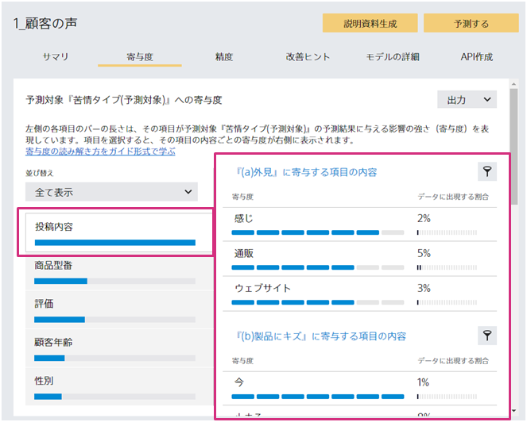
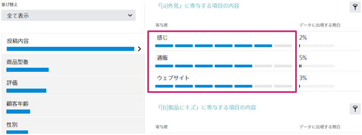
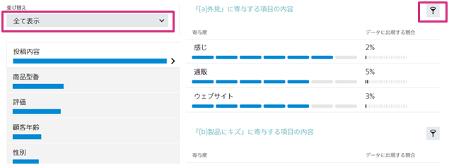
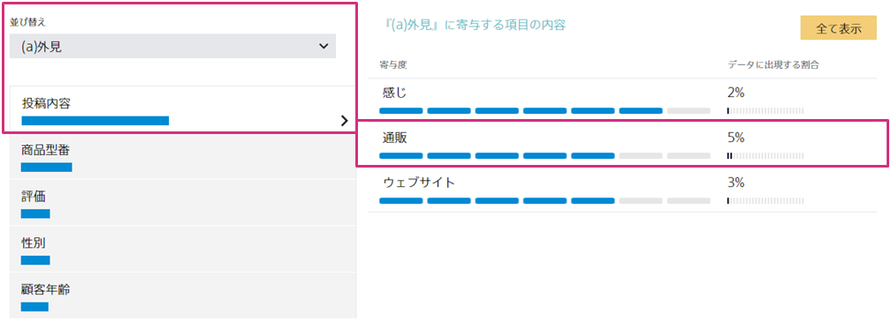
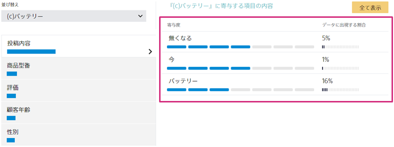

{}
予測寄与度を正しく読むことができると、予測モデルの改善や業務施策の立案に活用することができます。

ここでは、多値分類の寄与度の読み解き方のポイントや活用方法を紹介します。
{}

{}
レビュー文に対してどの苦情タイプを割り当てればよいかを予測するためのデータセットを元に、予測寄与度の読み解き方とその活用方法を説明します。 
このサンプルデータセットは、「データ」→「サンプル」タブのデータ一覧から取得可能です。 

{}

{}
まず、寄与度の合計の大きい順に、項目を確認しましょう。 
「ご自身の考える項目の影響の強さと寄与度の大きさが一致するか」「想定外のところはあるか」をポイントに確認します。 

{}

{}
それぞれの寄与度の項目をクリックして、寄与度を構成する要素を確認していきます。 

気になる項目をクリックすると、各クラス（苦情タイプ）が選べるようになっており、それぞれのクラスに寄与する項目内容（この場合、テキストに含まれる単語）を見ることができます。 
これが、ご自身の経験や直感と合っているかを確認しましょう。 

確率を上げている項目・下げている項目は以下の□部分で確認できます。 

また、右上のフィルターボタンを押すことで、そのクラスに絞った項目内容を確認できます。「並び替え」のプルダウンからも同じ絞り込み操作が可能です。

ここで、ご自身が寄与が高いと思っていた項目が低かったり、逆に、寄与が低いと思っていた項目が高い場合は、使用すべきデータを間違ってしまっている可能性があります。まずデータを見直してみましょう。 
データを見直し、間違っていなかった場合、以下のような気付きが考えられます。 
・思わぬ項目が予測へ寄与している 
・思っていた項目が予測へ寄与していない 
ここから、ビジネス上に重要なインサイトが得られる可能性があります。 
{}

{}
今回の、顧客の声のラベリングを行う分類モデルを作成したときに明らかになった寄与度を用いて、施策立案を行った場合は以下のような例が考えられます。 

例えば「(a)外見」に寄与する単語の一つに「通販」があります。仮に、この製品が店舗と通販サイトの両方で販売されていた場合、通販サイト経由での販売時に外見に関する苦情が相対的に発生しやすくなるのではないかと推測されます。 

そこで、「(a)外見」に関する苦情を減らすための施策を検討するときに、通販サイトで販売される商品の梱包、配送などの手順を見直すといったことが効果的なのではないか、と考えることができます。 

また、「(c)バッテリー」の寄与度に注目する場合、最も寄与度の大きい単語は「無くなる」となっています。

これは、バッテリーに関する意見の中でも、バッテリー切れの場合に課題を抱えているユーザが多いことを示唆しています。 
バッテリーに関するネガティブな意見を減らすためのアクションとして、バッテリー切れ時の対応をマニュアル内の顧客の目の付きやすい場所に分かりやすく記載したり、次期製品開発時にバッテリー消費を抑える仕組みを検討したりする、といったものが挙げられます。 
以上の例のように、予測結果をラベリング自動化に用いるだけでなく、寄与度を将来のビジネスに繋がる施策立案に活用することができます。 
{}
