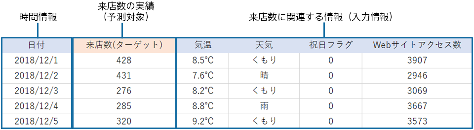
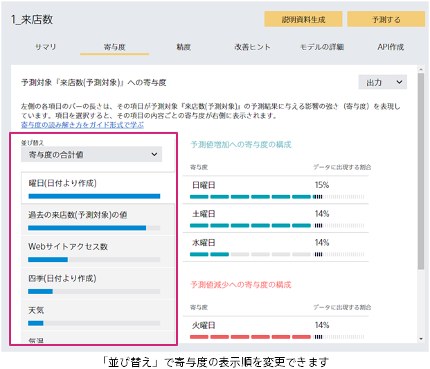
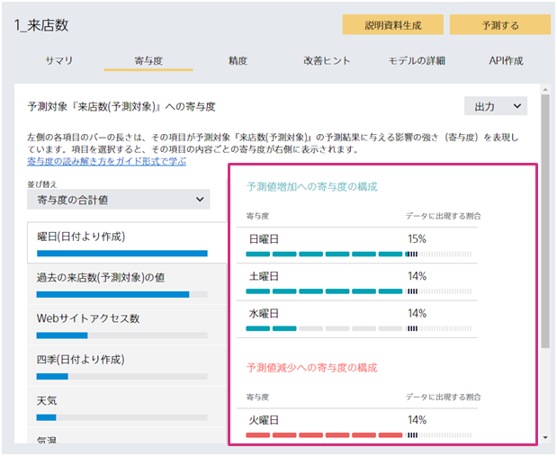
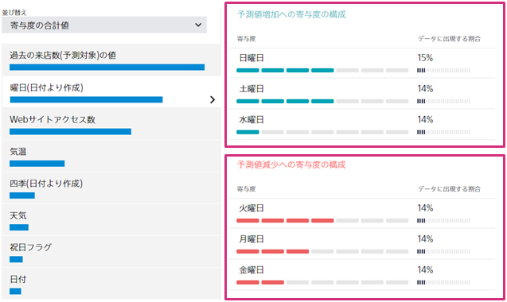
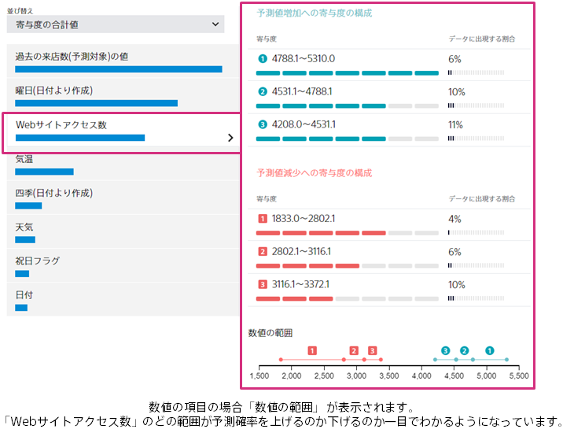
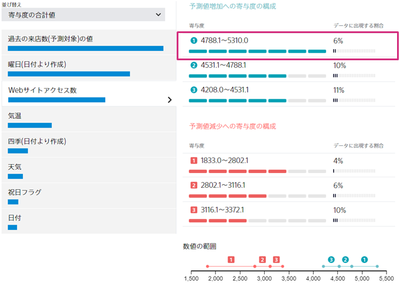

{}
予測寄与度を正しく読むことができると、予測モデルの改善や業務施策の立案に活用することができます。 

ここでは、時系列予測の寄与度の読み解き方のポイントや活用方法を紹介します。 
数値予測の場合も、この例を参照してください。 
{}

{}
来店数を予測するためのデータセットを元に、予測寄与度の読み解き方とその活用方法を説明します。 

{}

{}
まず、寄与度の合計の大きい順に、項目を確認しましょう。 
「ご自身の考える項目の影響の強さと寄与度の大きさが一致するか」「想定外のところはあるか」をポイントに確認します。 

{}

{}
それぞれの寄与度の項目をクリックして、寄与度を構成する要素を確認していきます。 

予測対象の値を上げる項目、下げる項目が、ご自身の経験や直感と合っているかを確認します。 
値を上げている項目・下げている項目は以下の□部分で確認できます。 

この画面から、土曜日と日曜日が来店数増加に寄与していることがわかります。 

ここで、ご自身が寄与が高いと思っていた項目が低かったり、逆に、寄与が低いと思っていた項目が高い場合は、使用すべきデータを間違ってしまっている可能性があります。まずデータを見直してみましょう。 
データを見直し、間違っていなかった場合、以下のような気付きが考えられます。 
・思わぬ項目が予測へ寄与している 
・思っていた項目が予測へ寄与していない 
ここから、ビジネス上に重要なインサイトが得られる可能性があります。 
{}

{}
寄与度を構成する要素を見ながら、業務施策が立案できそうか検討しましょう。 
ここでは、項目の大小に加え、寄与度の強さとデータに出現する割合を見ていく必要があります。 

Webサイトアクセス数の予測値増加への寄与度の構成を見てみます。 
Webサイトのアクセス数が多いほど、来店数も多くなることが分かります。 

数値の項目は、値の範囲が自動的に設定され、範囲ごとに購入確率にどう寄与するか表示されます。 

また、予測増加へ一番寄与している4788.1~5310.0の項目を見ると、データに出現する割合は6%です。 

この割合を増やせば、来店数の多い日が増えるかもしれない、と気づきます。 
これにより、Webサイトのアクセス数を増やすための施策を検討することで来店数増加につながるという、思わぬ施策が思いつく場合があります。 

このように、寄与の強さとその割合を合わせてみることで、効果的な施策は何かを検討することができます。 
{}

{}
ここからは寄与度を見るうえで役に立つ方法を紹介します。 

・予測対象を増加させる項目を強化させたい場合 
寄与度の合計値になっているのを増加への寄与度の表示に切り替えてみましょう。 
そうすると、予測対象増加に寄与する項目のみが表示されるので、その中で特に寄与が大きい項目を選択して項目の内容を確認します。 

・予測対象を減少させる項目を改善項目として検討したい場合 
減少への寄与度の表示に切り替えます。 
この場合は、予測対象減少に寄与する項目のみが表示されるのでその中から改善項目を検討します。 

一方、予測対象増加・減少をさせる項目の寄与度のみに注目すると偏った判断になってしまう場合があります。 
例えば、予測値減少では、気温や天気の方がWebサイトアクセス数より寄与していても、予測値増加ではWebサイトアクセス数と比較して、気温や天気の寄与が顕著に小さくなる場合、気温や天気に対して施策を検討することは筋が悪くなってしまいます。 
総合的に判断することがポイントになります。 
{}
