{}
It is important to understand the prediction accuracy, or how accurate the prediction is, when making a decision to introduce predictive analytics or when explaining the results of the analysis to someone. 
Prediction One automatically evaluates the accuracy of predictions and calculates and displays multiple accuracy evaluation values, graphs and tables. This document explains binary classification. 

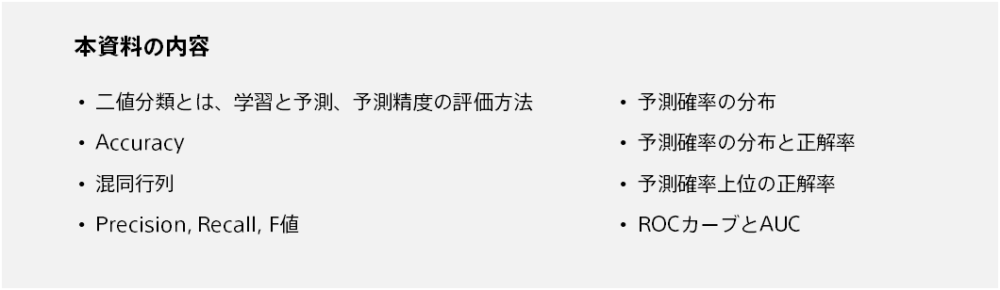
{}

{}

Binary classification has a wide range of applications and can be used in various situations. For example, you can use customer data to predict the probability that each customer will buy an item by using a binary classification: buy (Class A) or not buy (Class B). 
{}

{}
Predictive analytics involves two steps: training and predicting. The following is an example of predicting a customer's purchase from actual purchase data. 

{}

{}

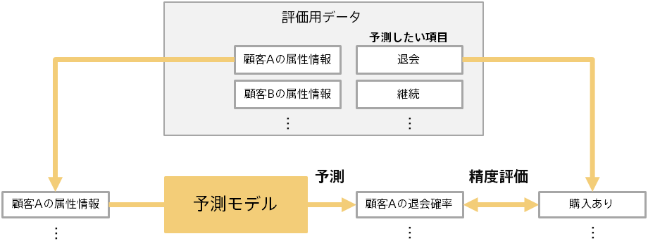

Before you can use the prediction results, you need to evaluate how accurate the prediction model is. Evaluate the predictive accuracy of the prediction model using data (evaluation data) separate from the data for creating the prediction model (training). 
For example, you might enter information about customers who have actually made a purchase into a prediction model to assess whether you can successfully predict a purchase probability. At this time, you can evaluate a generic prediction capability by evaluating a customer that is not the customer used for training.
{}

{}

As shown on the previous page, the prediction model is evaluated by comparing the predicted results (example: Purchase Probability) with the actual results known in advance (example: Purchased or not). Since the evaluation data contains multiple pieces of data (example: Customer), the original information for the evaluation is as follows:

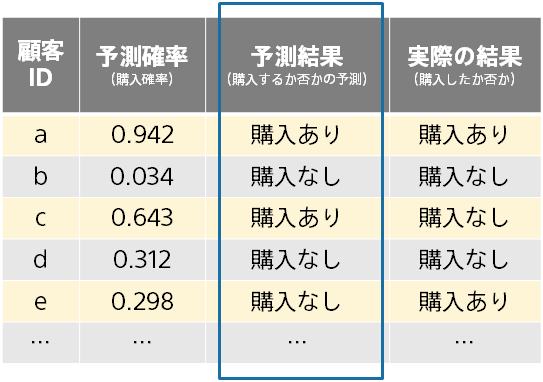

In this example, the prediction result was determined as follows:

- Purchase if probability of prediction is 0.5 or greater
- No purchase if probability of prediction is less than 0.5

Changing the threshold (using a value other than 0.5) changes the predicted results. Prediction One automatically selects the threshold with the highest F-score, as described below.{}

{}
Accuracy is the most basic measure of how well predicted results match the correct answer. 

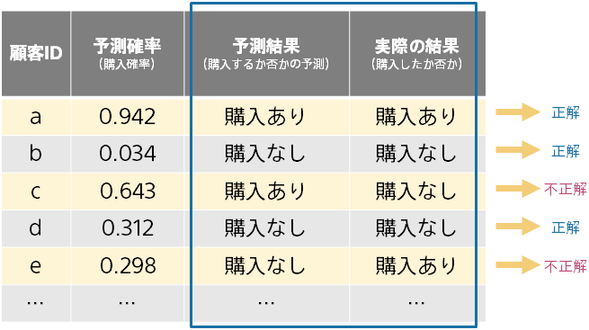

If the number of correct answers is 85 and the number of incorrect answers is 15, then Accuracy is 0.85. 
Note that if there is a bias in the amount of data in one class, the Accuracy value will be high, even if the actual prediction is false. 
For example, If 99% of the evaluation data was no purchase, a meaningless prediction model that always predicts no purchase would have a high Accuracy of 0.99. In this case, look at other metrics.
{}

{}

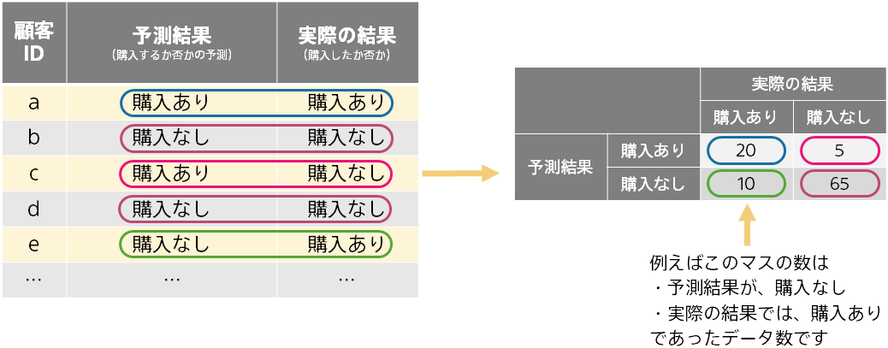

Confusion Matrix is a table showing the correct answer and the incorrect answer. You can see more details than Accuracy on how the prediction is coming and going. 
Create a matrix by counting four patterns (Two patterns of predicted results × two patterns of actual results) as follows: Each pattern is colored below.
{}

{}
In some use cases, you may be interested in finding one value. For example, if you want to prevent equipment failure by predicting in advance, it is more important to predict and prevent failure than to predict normal. 
Precision, Recall, and F-score are evaluation metrics that focus on one detection. Computes from the confusion matrix. 

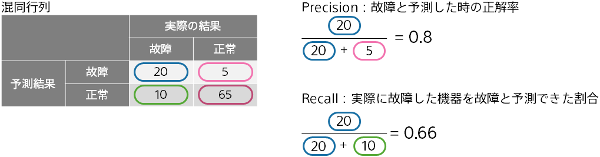

The higher the Precision, the more likely it will actually fail if it is predicted to fail. The higher the Recall, the higher the percentage of equipment that actually fails that could be predicted as fail. 
You can adjust the threshold that determines the outcome of the prediction from the probability of prediction to make a precision or recall focus. Which is more important depends on the use case. 
The F-score is the combined value of Precision and Recall, which is the harmonic average. In this example, 0.727.
{}

{}
Prediction One displays a graph as a "distribution of prediction probability" showing how often the prediction probability is calculated for two results. The predicted result is not used and is calculated by the prediction probability. 

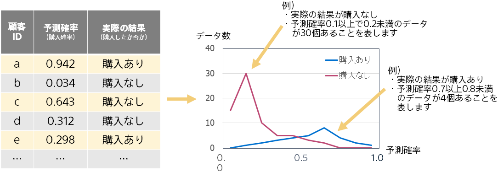

The farther the red mountain and the blue mountain are, the more accurate the prediction is, because the prediction probability is used to distinguish between purchase and non-purchase. Conversely, when two peaks overlap, the prediction accuracy is lower.{}

{}
Distribution and accuracy of prediction probability shows the overall prediction probability output by the prediction model. 

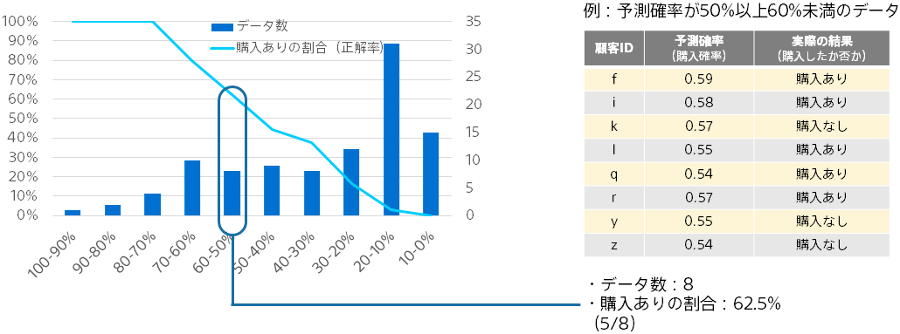

Probability ranges are defined as ranges in which the probability of prediction is 0% or more and less than 10%, 10% or more and less than 20%... . For each range of data, the amount of data and the percentage of correct answers are calculated and plotted. 
The broken line is the ratio of purchase in each prediction probability range, and it can be seen that the prediction probability is close to the actual purchase ratio. The bar graph represents the amount of data for each predicted probability range. 
{}

{}
For example, you may want to take an action such as making a sales call to 10 people who are likely to make a purchase.
In this case, the actual return is the number of people who actually buy among the 10 people with the highest probability of prediction. 

Therefore, this graph shows the purchase rate of the top data by sorting in order of the prediction probability.

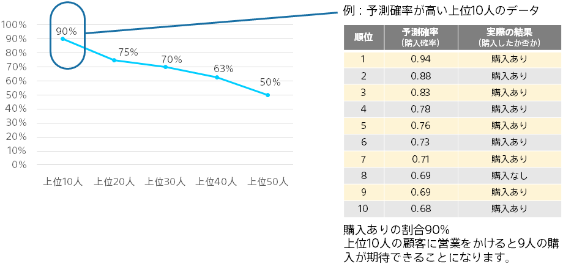
{}

{}
As with "percentage of correct answers with the highest prediction probability", the ROC curve is a graph based on the number of purchased items and the number of non-purchased items in data with a high prediction probability.
A graph is created by calculating and plotting the coverage ratio with purchase and the coverage ratio with no purchase using data from the top to each rank in order.
The higher the upper left (the more purchase at the top), the higher the prediction accuracy. Intuitive understanding of graphs is difficult and not always necessary.

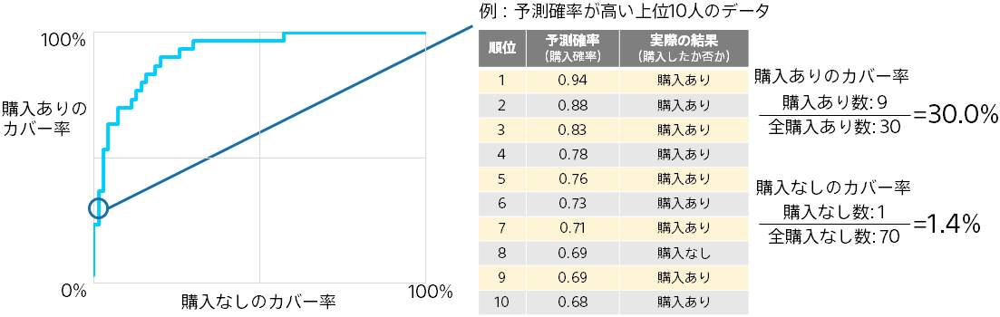

The area under the ROC curve is called the AUC (Area Under the ROC Curve). AUC can be between 0 and 1, with a higher AUC indicating better prediction accuracy.
Unlike Accuracy, Recall, Precision, and F-score, these values are determined solely by prediction probability and actual results (is not dependent on the threshold for determining the prediction), and are therefore often used as an evaluation of the prediction accuracy of binary classification.{}

{}
This document describes the predictive accuracy evaluation values, graphs, and tables displayed by Prediction One. Here are the key points:

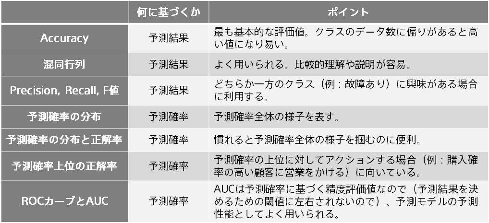
{}
