{}
予測分析の導入判断をする際や、分析結果を誰かに説明する際に、予測精度、つまり予測がどれくらい当たるのか、を理解することが重要です。 
Prediction One では、予測精度を自動的に評価し、複数の精度評価値、グラフや表を計算・作成して表示します。本資料では、本資料では、二値分類についてご説明します。 

{}

{}

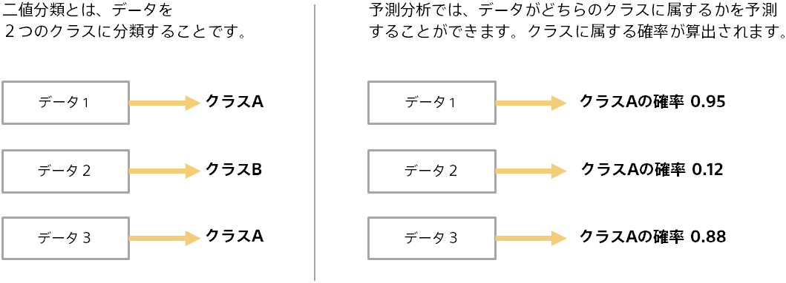

二値分類は応用範囲が広くさまざまな場面で利用できます。たとえば、顧客データに対して、商品を購入するか（クラス A）、購入 しないか（クラス B）の二値分類とすることで、各顧客が商品を購入する確率を予測できます。 
{}

{}
予測分析では、学習と予測という２つのステップがあります。以下は購入実績データから顧客の購入予測を行う例です。 

{}

{}

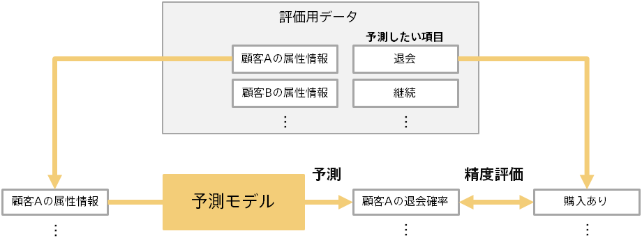

予測結果を利用する前に、予測モデルの予測精度がどれくらいかを評価する必要があります。予測モデル作成(学習)用データとは別のデータ（評価用データ）を使って、予測モデルの予測精度を評価します。 
たとえば、実際に購入した顧客の情報を予測モデルに入力し、ちゃんと購入確率を高く予測できるか、を評価します。この際、 学習に使用した顧客ではない顧客について評価することで、汎用的な予測能力を評価できます。
{}

{}

前のページの通り、予測結果（例：購入確率）とあらかじめわかっている実際の結果（例：購入したか否か）を比較すること で、予測モデルの評価を行います。 評価用データには複数のデータ（例：顧客）が含まれるため、評価の元のなる情報は下記のようになります。

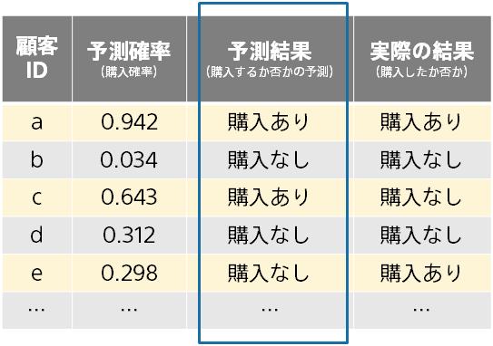

この例では、予測結果は以下のように決めました。

- 予測確率が 0.5 以上であれば、購入あり
- 予測確率が 0.5 未満であれば、購入なし

閾値変えると（0.5 ではない値を使うと）、予測結果は変わってきます。Prediction One では、後述の F 値がもっとも大きくなる閾値を自動的に選択します。{}

{}
Accuracy は、予測結果が正解とどれくらいの割合で一致するかを計算した、もっとも基本的な評価値です。 

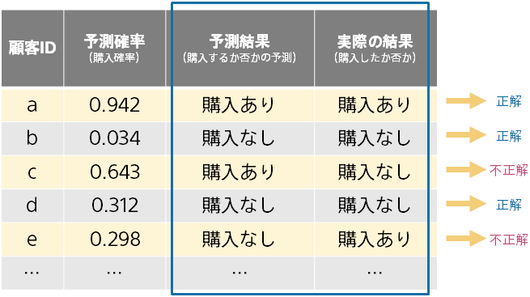

正解の数が 85、不正解の数が 15 であれば、Accuracy は 0.85 になります。 
注意点としては、一方のクラスにデータ数の偏りがあると、実際の予測がでたらめでも Accuracy の値が大きくなることです。 
たとえば、{評価用データの 99%のデータが購入なしであった場合に、常に購入なしと予測する意味のない予測モデルは、Accuracy が 0.99 と高い値になってしまいます。こういった場合は別の評価指標を見てください。
{}

{}

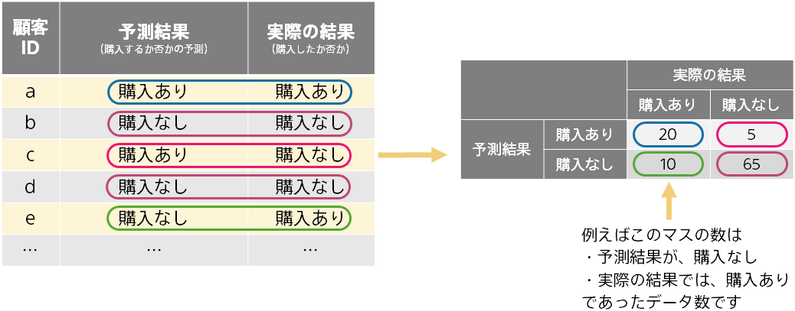

混同行列は、正解と不正解の様子をあらわす表です。予測が当たる様子・外れる様子を Accuracy よりも詳しく見ることができます。 
以下のように４パターン（予測結果２パターン × 実際の結果 2 パターン）のカウントを行って行列を作成します。 以下ではパターンごとに色を付けています。
{}

{}
ユースケースによっては、一方の値の検出に興味がある場合があります。たとえば、機器の故障を事前に予測して故障を防ぎたい場合では、故障しないことの予測よりも、故障することをいかに予測して防げるかが重要になります。 
一方の検出に重点をおいた精度評価値が、Precision、Recall、F 値です。混同行列から計算します。 

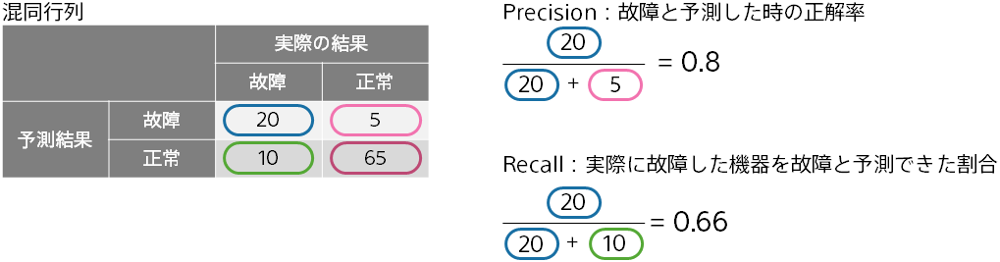

Precision が高いほど、故障と予測した時に実際に故障する可能性が高いことになります。Recall が高いほど、故障と予測した際に取りこぼしが少ないことになります。 
予測確率から予測結果を決める閾値を調整すると、Precision 重視か Recall 重視かの調整ができます。どちらを重視するかはユースケースによって変わってきます。 
F 値は、Precision と Recall を統合した値で、両者の調和平均の値になります。この例ですと、0.727 となります。
{}

{}
Prediction One では、２つの結果に対して予測確率がどのような頻度で算出されるかを表したグラフを、「予測確率の分布」として表示します。予測結果は利用せず予測確率によって計算されます。 

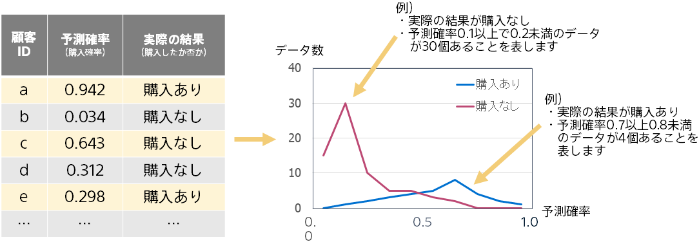

赤い山と青い山が離れているほど、予測確率によって購入ありと購入なしを分けれていることになるので、予測精度が高いことを表します。逆に２つの山が重なっているほど予測精度が低いことを表します。{}

{}
「予測確率の分布と正解率」では、予測モデルが出力する予測確率全体の様子がわかります。 

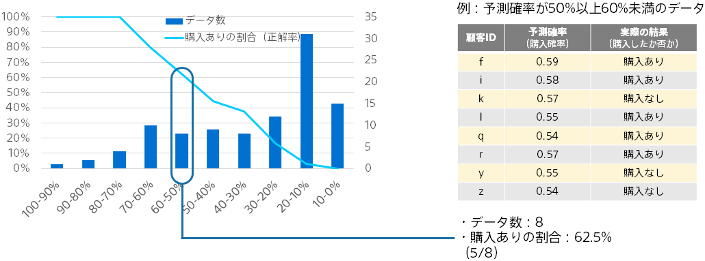

予測確率が 0%以上 10%未満、10%以上 20%未満…と 10%の幅で予測確率のレンジを作り、各レンジに入るデータに対して、データ数と正解率を算出してそれぞれをプロットします。 
折れ線は各予測確率レンジにおける購入ありの割合であり、予測確率と実際の購入割合が近いことがわかります。棒グラフは、予測確率レンジごとのデータ数を表します。 
{}

{}
たとえば、購入ありの確率が高い 10 人に対して、営業の電話をかけるといったアクションを取ることを考えます。
この場合、予測確率上位 10 人で実際に何人購入するかが実際のリターンになります。 

そこで、予測確率の高い順に並び替え、上位のデータの購入率を表示しているのが、このグラフになります。

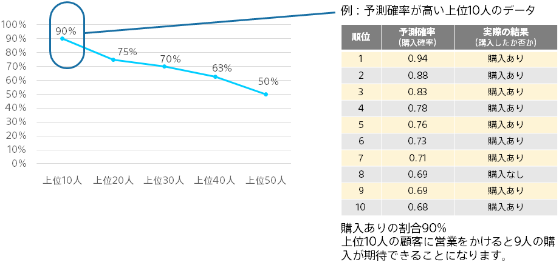
{}

{}
ROC カーブは、「予測確率上位の正解率」と同様に、予測確率上位のデータにおける購入ありと購入なしの個数に基づグラフです。
上位１位から順に各順位までのデータで、購入ありのカバー率と購入なしのカバー率を算出しプロットしていくことでグラフを作成します。
左上に膨らむほど（上位で購入ありが多いほど）予測精度が高いことになります。グラフの直観的な理解は難しいので必ずしも理解する必要はありません。

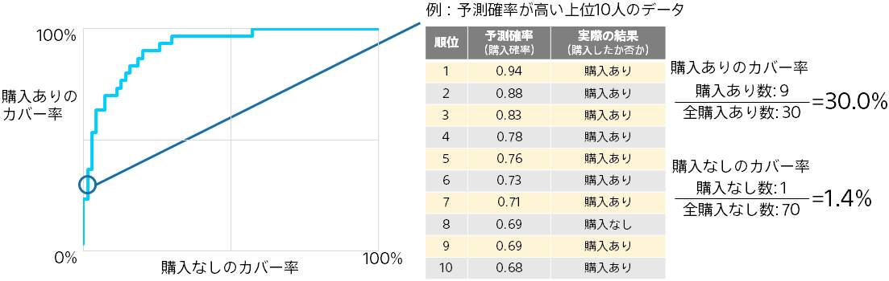

ROC カーブの下の面積を AUC（Area Under the ROC Curve）と言います。0 以上 1 以下の値で、大きいほど良い予測精度であることを表します。
Accuracy, Recall, Precision, F 値と違って、予測確率と実際の結果のみで決まる値なので（予測結果を決めるための閾値に左右されないので）、二値分類の予測精度の評価値としてよく利用されます。{}

{}
本資料では、Prediction One で表示される予測精度評価値、グラフや表についてご説明しました。以下にポイントをまとめます。

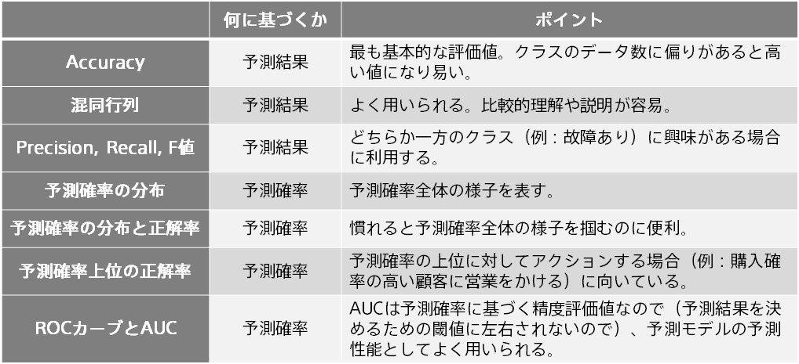
{}
