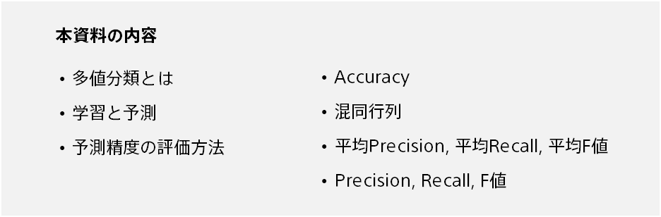
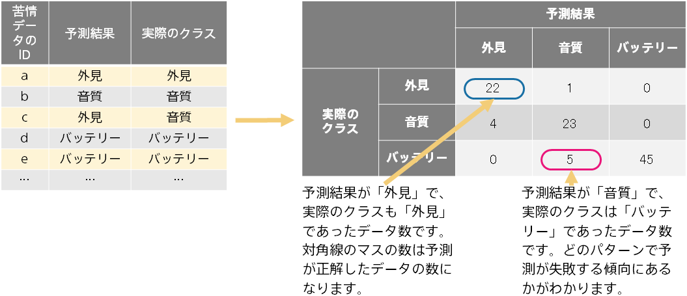

{}

It is important to understand the prediction accuracy, or how accurate the prediction is, when making a decision to introduce predictive analytics or when explaining the results of the analysis to someone. 
Prediction One automatically evaluates the accuracy of predictions and calculates and displays multiple accuracy evaluation values, graphs and tables. This document explains multiclass classification. 

{}

{}

Multiclass classification can be used in a variety of situations. For example, you can automatically categorize customer feedback data (web site reviews and call center complaint data).
{}

{}

There are two steps: training and predicting. The following is an example of assigning a class to customer complaint data.
Some complaint data is assigned a class by a human.
After training with it, you can predict the appropriate class for complaint data that you have not yet assigned a class to.  

{}

{}

Before you can use the prediction results, you need to evaluate how accurate the prediction model is.
Evaluate the predictive accuracy of the prediction model using data (evaluation data) separate from the data for creating the prediction model (training).
For example, you can enter complaint data that is classified as an "appearance" class into a prediction model and evaluate whether you can predict a high probability that it will be an "appearance" class.
You can evaluate general predictive capabilities by evaluating complaint data that is not used for training.

{}

{}

As shown on the previous page, the prediction model is evaluated by comparing the prediction probability with the actual assigned classes (example: "appearance").
Because evaluation data contains multiple pieces of data, the source information for the evaluation is as follows.
Below is an example of how complaint data can be divided into three classes ("appearance", "sound quality", "battery").

The predicted result is the class with the highest probability from the prediction probabilities for the three classes.
{}

{}

Accuracy is the most basic measure of how well predicted results match the correct answer.

{}

{}

Confusion Matrix is a table showing the correct answer and the incorrect answer. You can see more details than Accuracy on how the prediction is coming and going. For each combination (prediction result class, actual class), the amount of data is counted and a matrix is created. For a three-class classification, it is created by counting 3 x 3 = 9 combinations.

{}

{}

Accuracy is the percentage of correct answers for all classes, while the Precision, Recall, and F-score are evaluation values for one class. For example, you can know how accurate the prediction is for a class called "appearance".

The higher the Precision, the more likely that it will actually be "appearance" when it is predicted as "appearance".
The higher the Recall, the higher the rate at which data that are actually "appearance" could be predicted as "appearance"
The F-score is the combined value of Precision and Recall, which is the harmonic average. In this example, 0.897.
{}

{}

Accuracy is the percentage of correct answers for all classes, while the Precision, Recall, and F-score are evaluation values for one class.
For example, you can calculate the Precision, Recall, and F-score for a class called "appearance" to find out how accurate the prediction is for a class called "appearance".
Average Precision, Average Recall and Average F-score are calculated by calculating the Precision, Recall and F-score for each class and averaging them.

Average Precision, Average Recall, Average F-score are not high unless they are predictable for all classes. Accuracy, on the other hand, has a greater impact on prediction accuracy for classes with a large amount of data. For example, if the amount of data in one class is 1,000 and the amount of data in the other class is 10, then Accuracy is roughly determined by the accuracy rate of the 1,000 data classes.
{}

{}

In this document, we explained the prediction accuracy evaluation value and the confusion matrix displayed by Prediction One when performing multiclass classification. Here are the key points:

{}
