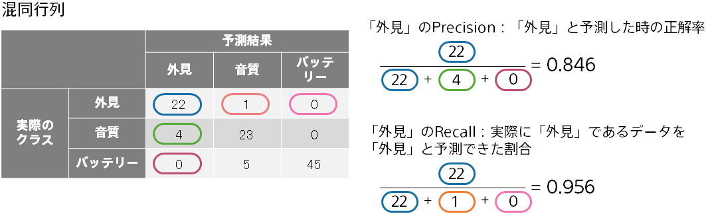

{}

予測分析の導入判断をする際や、分析結果を誰かに説明する際に、予測精度、つまり予測がどれくらい当たるのか、を理解することが重要です。 
Prediction One では、予測精度を自動的に評価し、複数の精度評価値、グラフや表を計算・作成して表示します。本資料では、多値分類についてご説明します。 

{}

{}

多値分類はさまざまな場面で利用できます。たとえば、顧客の声のデータ（Web サイト上でのレビュー文やコールセンターの苦情データなど）の分類を自動的に行う、といったことが可能になります。
{}

{}

学習と予測という２つのステップがあります。以下は顧客の苦情データにクラスを割り当てる例です。
一部の苦情データには人間がクラスを割り当てているとします。
それを学習した後、まだクラスを割り当てていない苦情データに対して、適切なクラスを予測できます。  

{}

{}

予測結果を利用する前に、予測モデルの予測精度がどれくらいかを評価する必要があります。
予測モデル作成(学習)用データとは別のデータ（評価用データ）を使って、予測モデルの予測精度を評価します。
たとえば、「外見」クラスと分類された苦情データを予測モデルに入力し、ちゃんと「外見」クラスである確率を高く予測できるかを評価します。
この際、学習に使用していない苦情データについて評価することで、汎用的な予測能力を評価できます。

{}

{}

前のページの通り、予測確率と、実際に割り当てたクラス（例：「外見」）を比較することで、予測モデルの評価を行います。
評価用データには複数のデータが含まれるため、評価の元のなる情報は下記のようになります。
以下では、苦情データを３つのクラス（「外見」、「音質」、「バッテリー」）に分類する例でご説明します。

３つのクラスに対する予測確率から、最大の確率であるクラスを予測結果としています。
{}

{}

Accuracy は、予測結果が正解とどれくらいの割合で一致するかを計算した、もっとも基本的な評価値です。

{}

{}

混同行列は、正解と不正解の様子をあらわす表です。予測が当たる様子・外れる様子を Accuracy よりも詳しく見ることがで きます。（予測結果のクラス、実際のクラス）の各組合せについて、データ数のカウントを行い、行列を作成します。3 クラス分類の場合、3×3 ＝９個の組合せについてカウントを行って作成します。

{}

{}

Accuracy は全クラスについての正解率でしたが、Precision、Recall、F 値はある１つのクラスに着目した評価値になります。 たとえば、「外見」というクラスに対してどの程度の予測精度かを知ることができます。

Precision が高いほど、「外見」と予測した時に実際に「外見」である確率が高いことになります。
Recall が高いほど、「外見」と予測した際に取りこぼしが少ないことになります。
F 値は、Precision と Recall を統合した値で、両者の調和平均の値になります。この例ですと、0.897 となります。
{}

{}

Accuracy は全クラスについての正解率でしたが、Precision、Recall、F 値はある１つのクラスに着目した評価値になります。
たとえば、「外見」というクラスに対してどの程度の予測精度かを知るために、「外見」というクラスに着目して Precision、Recall、F 値を計算できます。
平均 Precision・平均 Recall・平均 F 値は、クラスごとに Precision・Recall・F 値を計算し、それぞれを平均した値になります。

平均 Precision, 平均 Recall, 平均 F 値はすべてのクラスに対して予測ができていないと高い値になりません。一方、Accuracy はデータ数の多いクラスに対する予測精度の影響が大きくなります。たとえば、あるクラスのデータ数が 1000 で他のクラスの データ数が 10 の場合、Accuracy はデータ数 1000 のクラスの正解率でほぼ決まってしまいます。
{}

{}

本資料では、多値分類を実行した際に Prediction One で表示される予測精度評価値と混同行列についてご説明しました。以下にポイントをまとめます。

{}
