{}

It is important to understand the prediction accuracy, or how accurate the prediction is, when making a decision to introduce predictive analytics or when explaining the results of the analysis to someone. 
Prediction One automatically evaluates the accuracy of predictions and calculates and displays multiple accuracy evaluation values, graphs, and tables.
This document explains regression.

{}
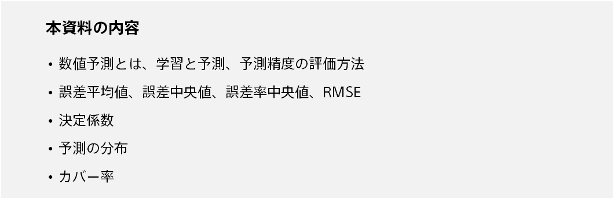
{}

{}
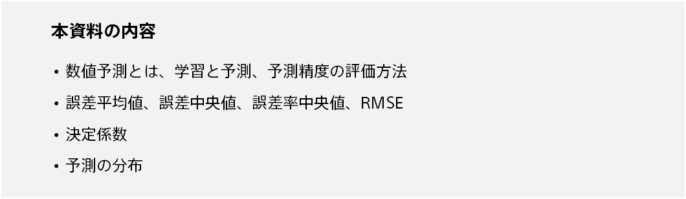
{}

{}

{}
Regression is the prediction of numerical values based on data. This is also called "regression." 

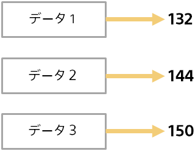

Regression has a wide application range and can be used in various situations. 

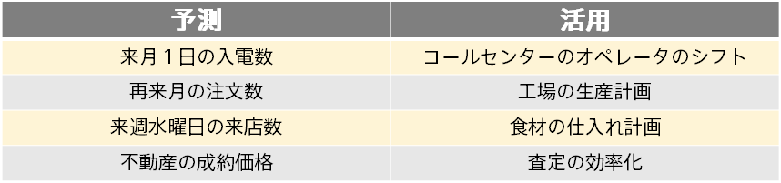
{}

{}
Predictive analytics involves two steps: training and predicting. The following is an example of predicting incoming calls from call center incoming call data. 

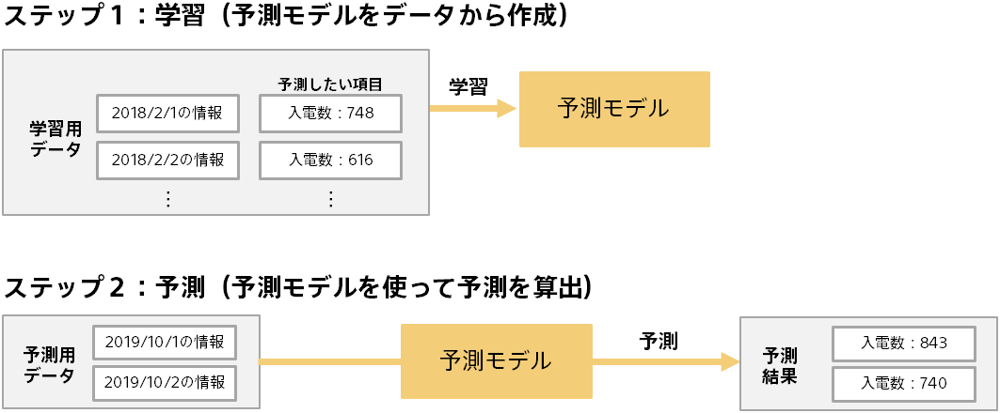
{}

{}
Before you can use the prediction results, you need to evaluate how accurate the prediction model is.
Evaluate the predictive accuracy of the prediction model using data (evaluation data) separate from the data for creating the prediction model (training). 
For example, we predict the number of incoming calls on a day that we know the number of incoming calls, and evaluate whether we can predict a value close to the actual number of incoming calls.
In this case, by using the data for a day not used for training, the general-purpose prediction ability can be evaluated. 

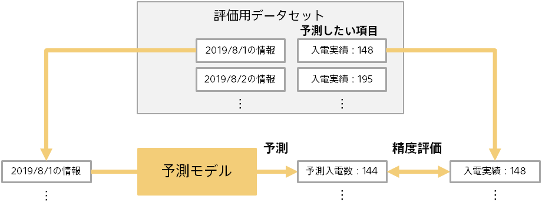
{}

{}
As shown on the previous page, the prediction model is evaluated by comparing the predicted results (example: predicted number of incoming calls) with the actual results known in advance (example: number of incoming calls). 
Since the evaluation data contains multiple pieces of data (example: Multiple Date Data), the source information for the evaluation is as follows: 

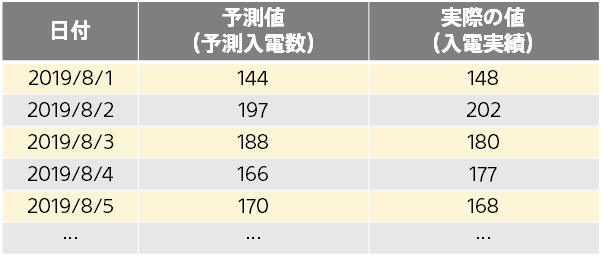

The following is an example of predicting the number of incoming calls.
{}

{}
There are three ways to measure the error of numerical values: error, error ratio, and squared error.

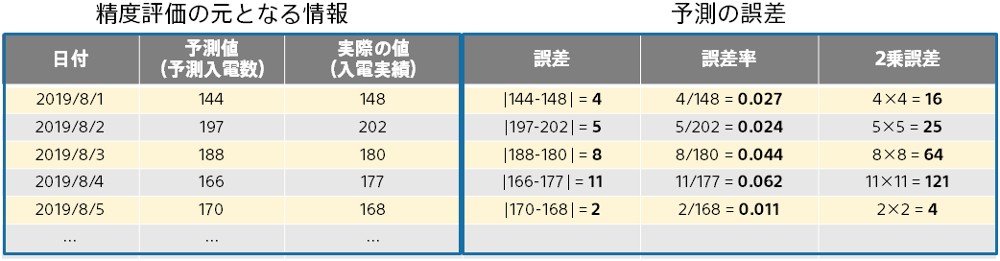

- Error is the absolute difference between the predicted value and the actual value. The smaller the size, the higher the prediction accuracy.
- Error Ratio is the error divided by the actual value. For example, if you predict 1,000 as 1,010 and 10 as 20, the former is more accurate, but the error is 10 in both cases. The error rate is 0.1 and 1.0. The former has a smaller error rate.
- Squared error is the square of the difference between the predicted value and actual value. The smaller the size, the higher the prediction accuracy. For example, if the error is 2, the squared error is 4, and if the error is 3, the squared error is 9, so the larger the error, the larger the acceleration. Squared errors are treated more harshly for data that deviate widely from predictions.
{}

{}
There are two ways to calculate error, error ratio, and squared error: average and median. 
Median is the middle value of multiple values sorted from highest to lowest. For example, 20, 4, 3, 2, 1 has a median value of 3. By the way, the average value in this case is 6. Median is an aggregate value that is less sensitive to extremes (In this case, 20).

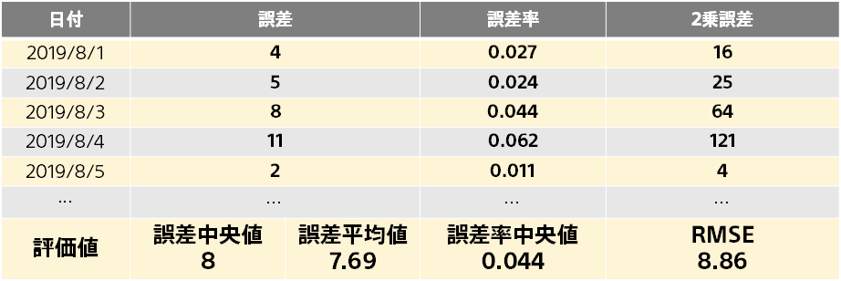

RMSE stands for Root Mean Squared Error. Square root of the mean squared error. Since it is based on the squared error, it is easy affected by the data which greatly deviates the prediction from the average error value.{}

{}
Coefficient of determination is an evaluation metric based on the mean of the squared error. Higher values indicate better accuracy, up to a maximum value of 1.0.
Although the evaluation values described above are intuitive, they are affected by the size of the prediction value in the dataset.
For example, a price prediction for real estate has an error ratio of about seven digits (millions), whereas a prediction for incoming calls has an error ratio of about two digits (tens). Then, it becomes impossible to compare the accuracy of the real estate price prediction with the accuracy of the incoming call prediction. 

Coefficient of determination is an evaluation metric that is not affected by the size or variability of the prediction values in the dataset (Real estate prices and incoming calls). Intuitive comprehension is difficult, but it is calculated as follows: 

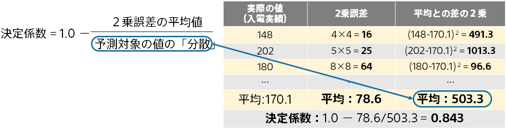

<small>\*"Variance" is one of the aggregate values of numeric values (statistics) and indicates the magnitude and variation of multiple numeric values. The average of the squares of the differences between each number.</small>
{}

{}
Distribution of Prediction is a visualization of the actual prediction. Each (predicted, actual values) is plotted as a point. You can see the prediction intuitively. 

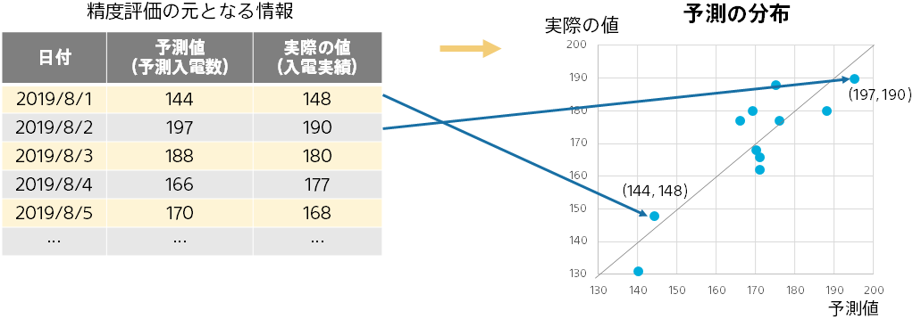

The closer the point is to the diagonal of the diagram (the predicted value equals the actual value), the more accurate the prediction. By looking at the deviation from the diagonal line, you can grasp situations such as not being able to predict well when the actual value is large. 
{}

{}
Distribution of prediction errors shows the overall picture of prediction errors. 
Bar charts show the percentage of the total prediction error between 0 and 5, the percentage of the total prediction error between 5 and 10, and so on... 
You can see what kind of error the prediction is likely to have. 

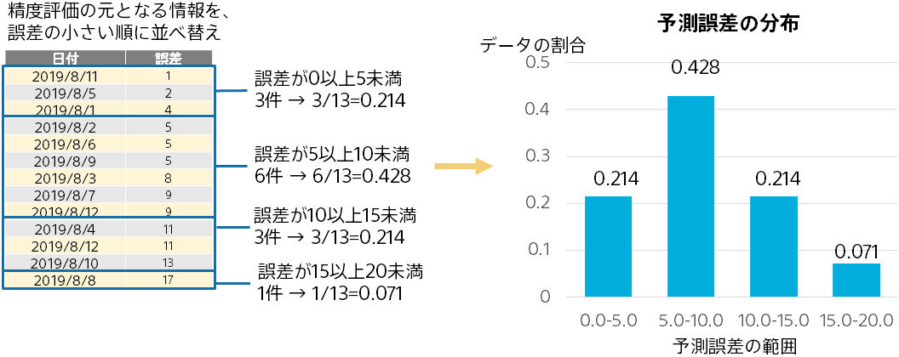
{}

{}
{}
{}
Coverage rate is an evaluation metric calculated only when upturn/downturn prediction is enabled in time series prediction mode.
{}
It indicates the probability that the actual value will be within the range of upturn/downturn prediction. The following figure illustrates how the calculation process works.
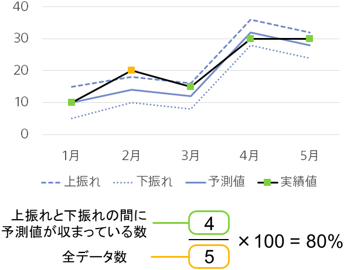
Since there is no way to observe actual upturn/downturn values, you cannot compare the upturn/downturn prediction values against the corresponding actual values. However, you can measure the performance of the upturn/downturn model by using coverage rate. Because Prediction One trains models to have a coverage of 90%, the closer the number is to 90%, the better the upturn/downturn prediction model is.
{}
{}

{}
This document describes the predictive accuracy evaluation values, graphs, and tables displayed by Prediction One. Here are the key points:

{}
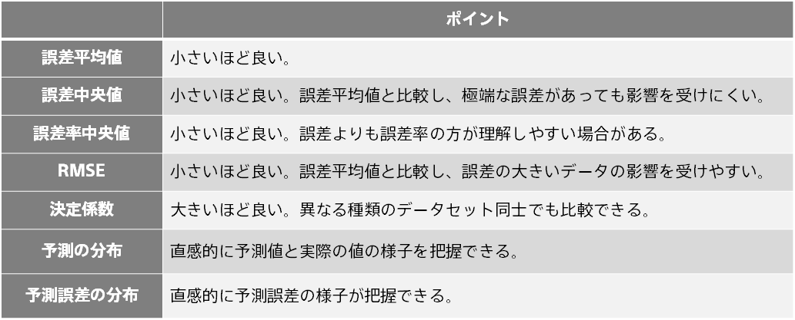
{}

{}
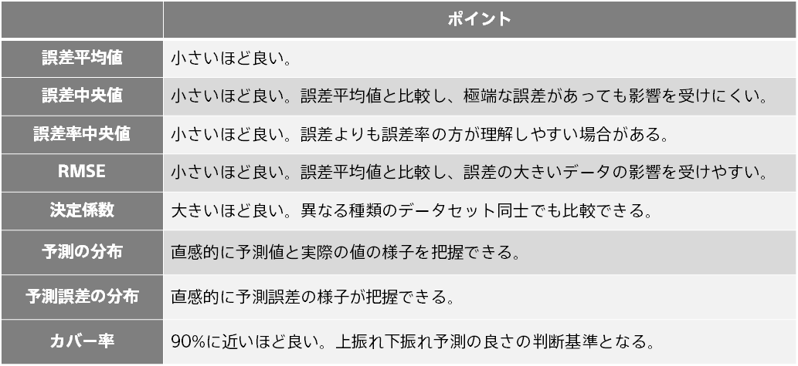
{}
{}
