{}

予測分析の導入判断をする際や、分析結果を誰かに説明する際に、予測精度、つまり予測がどれくらい当たるのか、を理解することが重要です。 
Prediction One では、予測精度を自動的に評価し、複数の精度評価値や図を計算・作成して表示します。
本資料では、数値予測についてご説明します。

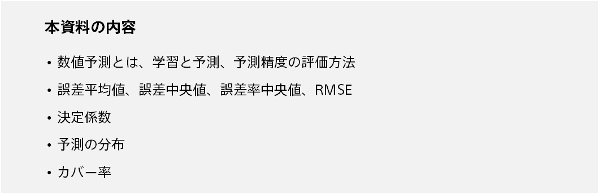

{}

{}
数値予測とは、データに基づいて数値を予測することです。回帰とも呼ばれます。 

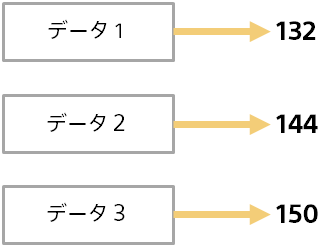

数値予測は応用範囲が広くさまざまな場面で利用できます。 

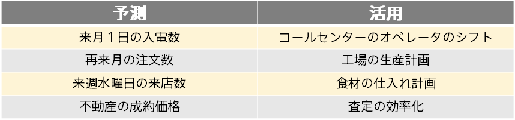
{}

{}
予測分析では、学習と予測という２つのステップがあります。以下は、コールセンターの入電実績データから入電予測を行う例です。 

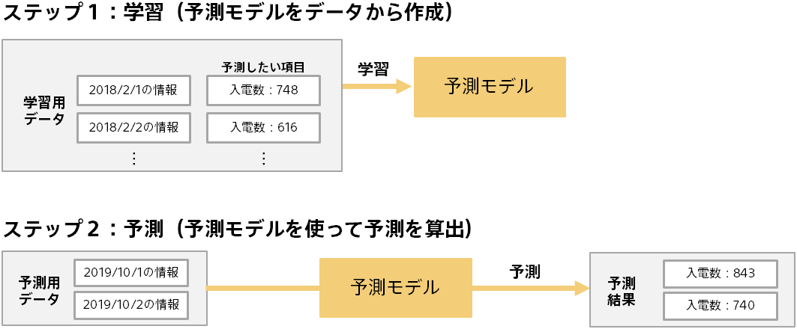
{}

{}
予測結果を利用する前に、予測モデルの予測精度がどれくらいかを評価する必要があります。
予測モデル作成(学習)用データとは別のデータ（評価用データ）を使って、予測モデルの予測精度を評価します。 
たとえば、入電数がわかっている日の入電数を予測させ、実際の入電数と近い値を予測できるかを評価します。
この際、学習に使用していない日のデータを利用することで、汎用的な予測能力を評価できます。 

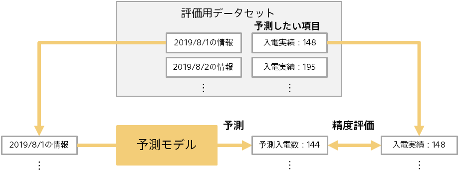
{}

{}
前のページの通り、予測結果（例：予測入電数）とあらかじめわかっている実際の結果（例：入電実績）を比較することで、予測モデルの評価を行います。 
評価用データには複数のデータ（例：複数の日付のデータ）が含まれるため、評価の元のなる情報は下記のようになります。 

以下では、入電数予測の例でご説明していきます。
{}

{}
数値の誤差の測り方は、誤差、誤差率、2 乗誤差の３種類があります。

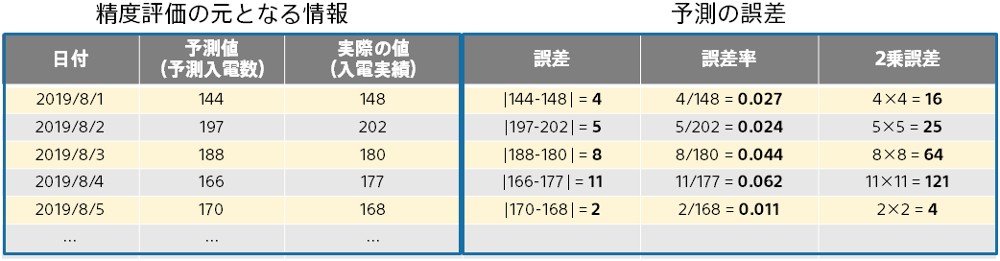

- 誤差は、予測値と実際の値との差の絶対値です。小さいほど予測精度が高いことになります。
- 誤差率は、誤差を実際の値で割った値です。たとえば、1000 を 1010 と予測するのと、10 を 20 と予測するのでは、前者の方が予測精度が高いと言えますが、誤差は両方とも 10 になってしまいます。誤差率だと 0.1 と 1.0 となり、前者の方が誤差率が小さくなります。
- ２乗誤差は、予測値と実際の値との差の２乗を取った値です。小さいほど予測精度が高いことになります。たとえば、誤差が２だと２乗誤差は４、誤差が３だと２乗誤差は９となり、２乗を取るので、誤差が大きいほど加速度的に大きい値になっていきます。予測を大きく外すデータについてより厳しく扱うことになります。
{}

{}
誤差や誤差率、２乗誤差の集計の仕方には、平均値と中央値があります。 
中央値とは複数の値に対して、大きい順に並べ替えた中央の値です。たとえば、20,4,3,2,1 の中央値は 3 になります。ちなみにこの場合の平均値は 6 です。中央値は極端な値（この例だと 20）に影響を受けにくい集計値です。

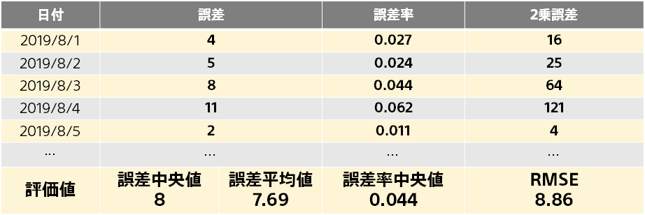

RMSE は Root Mean Squared Error の略です。２乗誤差の平均を取ってその平方根を取った値です。２乗誤差がベースなので、誤差平均値よりも予測を大きく外したデータの影響を受けやすいです。{}

{}
決定係数は２乗誤差の平均値をベースとした精度評価値です。値が大きいほど精度が良いことを表し、最大 1.0 の値になります。
これまでご説明した評価値は直観的にわかりやすいのですが、データセットの予測対象の値の大きさに影響を受けます。
たとえば、不動産の価格予測では誤差率は７桁程度（数百万）になりますが、入電数予測は誤差率は２桁程度（数十）です。すると不動産価格予測の精度と入電数予測の精度の比較ができなくなってしまいます。 

決定係数は、データセットの予測対象の値（不動産の価格や入電数）の大きさやばらつきの影響を受けないような精度評価値です。直観的な理解は難しいですが、以下のように計算されます。 

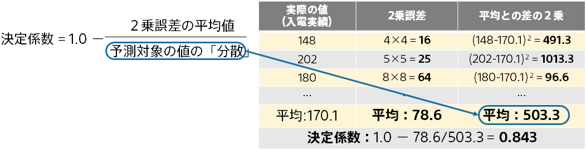

<small>※「分散」は、数値の集計値（統計量）の１つで、複数の数値の大きさとばらつきを表す値です。各数値で平均との差の２乗を計算し、さらにその平均を取った値です。</small>
{}

{}
予測の分布は、実際の予測の様子を可視化した図になります。１つ１つの（予測値、実際の値）を点としてプロットしたものです。予測の様子が直感的にわかります。 

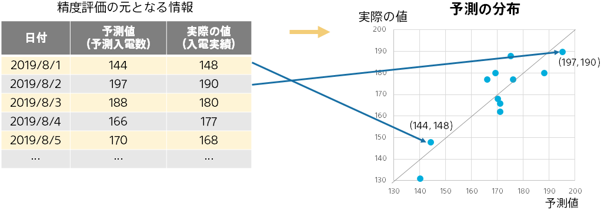

点が図の対角線上（予測値と実際の値が等しいことになる）に近いほど予測精度が高いことを表します。対角線からのずれを見ることで、実際の値が大きいときは予測がうまくできていないなどの状況を掴むことができます。 
{}

{}
予測誤差の分布から、予測誤差全体の様子がわかります。 
予測誤差が 0 以上 5 未満に収まるのは全体の何％か、5 以上 10 未満に収まるのは全体の何％か、…といったことが棒グラフとして表示されます。 
予測がどういった誤差になりやすいのかを見ることができます。 

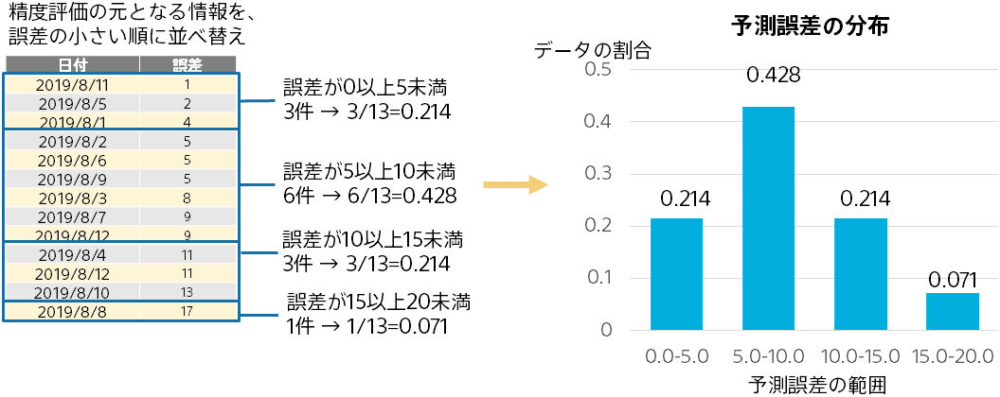
{}

{}
{}
カバー率は時系列予測モードで上振れ下振れ予測を有効にした場合のみに計算される精度評価値になります。
{}
カバー率は上振れ下振れ予測値の間に実績値が収まる確率を表します。具体的な計算方法は下の図に示します。

上振れ下振れの実際の値を観測することはできないため、上振れ下振れの予測値と実績値を比較するようなことは出来ません。そこでカバー率を用いることによって上振れ下振れのモデルの良さを測っています。Prediction One ではカバー率が90%になるようにモデルの学習をしており、90%に近いほど良い上振れ下振れ予測モデルが学習できていると言えます。
{}

{}
本資料では、Prediction One で表示される予測精度評価値、グラフや表についてご説明しました。以下にポイントをまとめます。

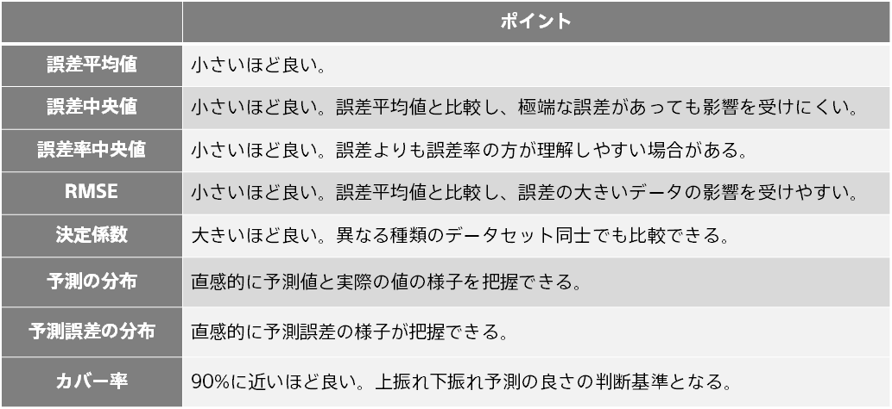
{}
