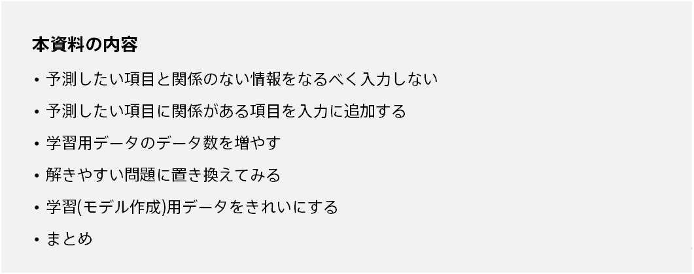
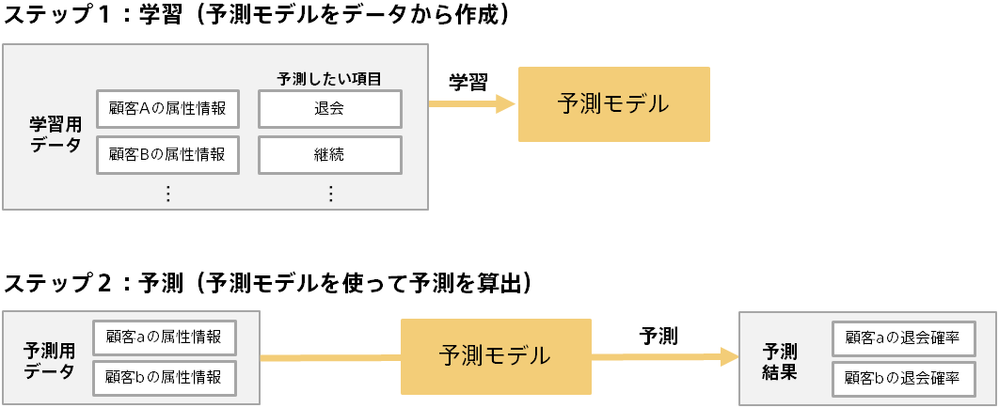
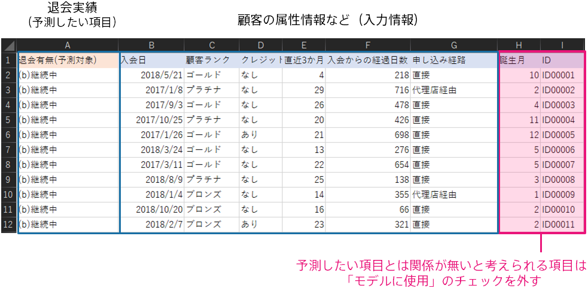
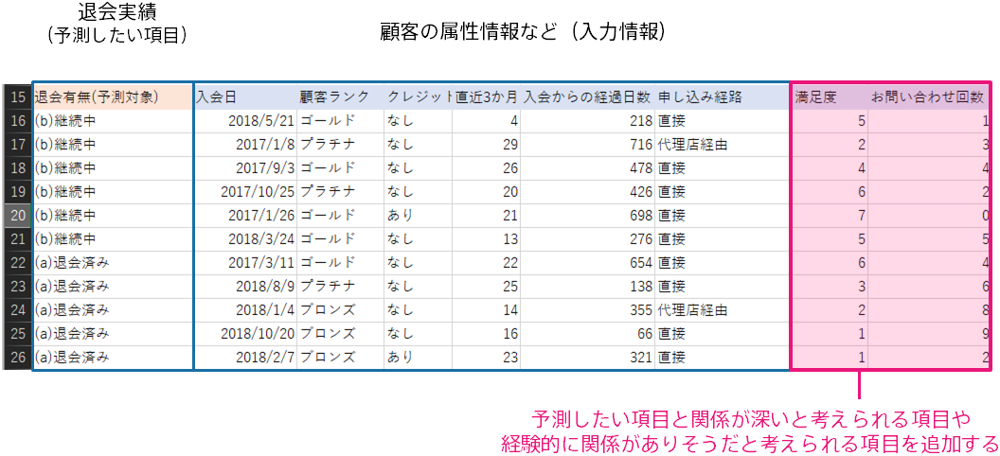
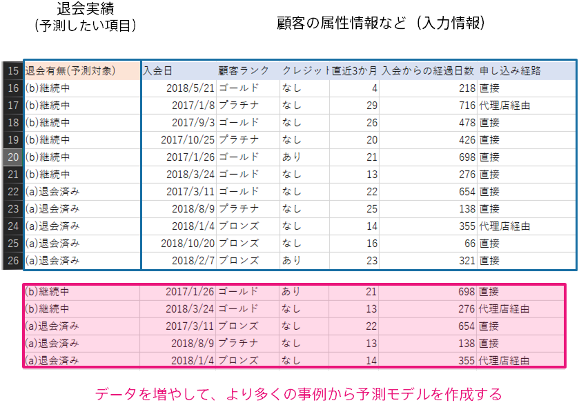
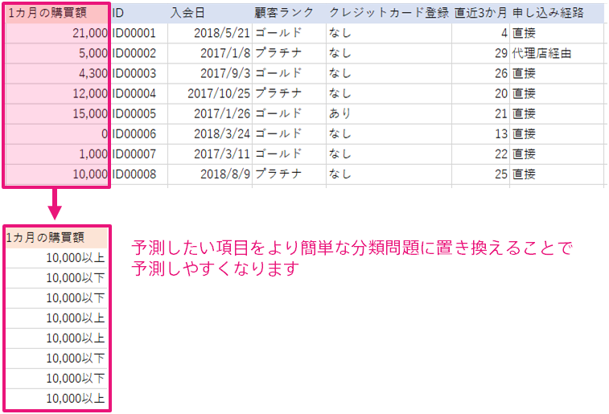
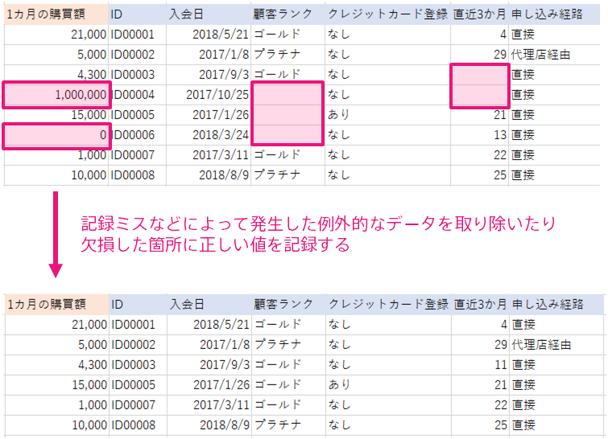

{}

This document describes how to improve the prediction accuracy of models created with Prediction One.
By improving the prediction accuracy, you are more likely to be able to make decisions and improve operations using the prediction model.
However, some datasets do not improve the accuracy of predictions by performing the steps described in this document.

{}

{}

To illustrate how to improve prediction accuracy, we first explain how a prediction model is created.
Predictive analytics involves two steps: training and predicting. The following is an example of how to predict whether a customer will continue a service or withdraw from a customer's attributes.

Prediction models can be made by combining rules and patterns hidden in input data. In this example, various data contained in the customer's attribute information can be used to predict whether the customer will withdraw.
In other words, the kind of information included in the data for creating the prediction model (training) is important to make a more accurate prediction.
{}

{}
Removing information that is clearly unrelated to the variable you want to predict, such as sequentially assigned IDs or randomly assigned numbers, from the input of Prediction One may improve prediction accuracy.
<u>In particular, if you only have a few dozen or hundreds of pieces of data for creating the prediction model (training), it's a good idea to get rid of variables that aren't relevant to your predictions</u>.

Prediction One automatically extracts variables related to the variable to be predicted from the variables entered as data for creating the prediction model (training), and it uses those resources to create a prediction model.
However, if you have only a few tens or hundreds of pieces of data, you may end up finding the wrong rules for unrelated variables when performing a prediction.
For example, a prediction model might be created that predicts that "If the ID is 10 or less, do not withdraw; if the ID is 10 or more, withdraw", because many customers who happen to have an ID less than 10 didn't withdraw.
This may be true only from looking at the data for creating the prediction model (training), but in reality, there is no relationship between ID and customer withdrawal.
By removing variables such as IDs in advance, you are more likely to be able to make predictions using appropriate information.
{}

{}
Prediction models can make predictions by capturing the relation between given data and the variables you want to predict.
Therefore, the more variables that contain information about the variable that you want to predict, the more accurate the prediction.

By "related" we mean, for example, a condition that correlates with the variable you want to predict or that seems empirically related.
For example, if you feel that the number of inquiries is related to continuing or withdrawing, you may improve the accuracy by adding "Number of inquiries" as a variable.

In addition, there are cases where the accuracy of equipment failure prediction is improved by adding "temperature" as a variable based on the intuition of people in the field that they feel that there are many failures when the temperature is high.
By asking people who are doing work related to the variables you want to predict, you may find hints for improving prediction accuracy in the data you have neglected so far.
{}

{}
In some cases, increasing the amount of data for creating the prediction model (training) can improve prediction accuracy.
A prediction model can be predicted by capturing the relation between the given data and the variables to be predicted.
By increasing the amount of data for the data for creating the prediction model (training), it may be possible to include more examples of various patterns in the data for creating the prediction model (training) and grasp the relation with the variable to be predicted.

However, it is important to note that <u>increasing data does not always improve accuracy</u>.
No matter how much data you add, you can't predict it unless there are variables related to the variable you want to predict.
It's a good idea to start with 100 to a few hundred data points and make sure you have some level of accuracy (for example, a model level above 4).
If the model level is less than 2, the data most likely does not contain information relevant to the variable you want to predict.
In this case, simply adding more data may not improve accuracy.

{}

{}
If the model level is low, you may be able to predict by replacing the variable you want to predict with simple ones.

For example, an e-commerce site might want to predict how much a customer will buy in the next month.
In this case, a prediction model is created using data related to the customer and data on the "purchase amount per month".

The prediction model that you create will be able to predict the monthly purchases, but it may be less accurate than you expect.
In such a case, you may be able to classify the variables you want to predict with a high degree of accuracy by using the binary classification of "whether the monthly purchase amount exceeds 10,000 yen" instead of "purchasing amount per month". If you can classify them with high accuracy, you can use prediction models for measures such as sending e-mails to people who are likely to spend less than 10,000 yen per month to encourage them to buy.

If the accuracy of regression or multiclass classification is poor, as in this example, consider whether the problem can be replaced by simple binary classification.

{}

{}
If you want to improve the accuracy of a prediction model with a certain degree of accuracy, you may be able to do so by cleansing the data included in the data for creating the prediction model (training).

To cleanse, you can, for example:

- Enter correct values for variables with many missing values
- Remove unusual or exceptional data
- Remove previously recorded data that differs from recent trends

and so on. If the data for creating the prediction model (training) contains abnormal data or data that differs from recent trends,
the prediction model will attempt to train to be able to make predictions on abnormal data,
resulting in poor overall performance.

data that people can see is clearly a recording error, or data that is very old and may be contrary to current trends or human intuition.
Create a prediction model that eliminates
{}

{}
This document describes how to improve the prediction accuracy of models created with Prediction One.
The following is a summary of initiatives that may lead to improved accuracy.

- Try not to enter information that is not related to the variable you want to predict.
- Add variables related to the variable you want to predict to the input.
- Increase the amount of data for creating the prediction model (training).
- Replace with an easy-to-solve problem.
- Cleanse the data for creating the prediction model (training).

These efforts are not guaranteed to improve accuracy.
In many cases, the accuracy is gradually improved through trial and error, such as collecting information that seems to be related to the variable to be predicted → improving prediction accuracy → increasing data → achieving practical performance.
Please refer to these initiatives and start with the easiest example.

{}
