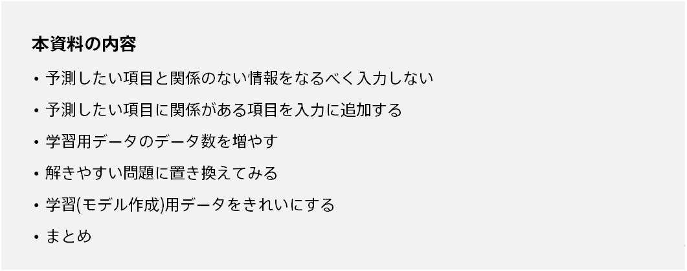
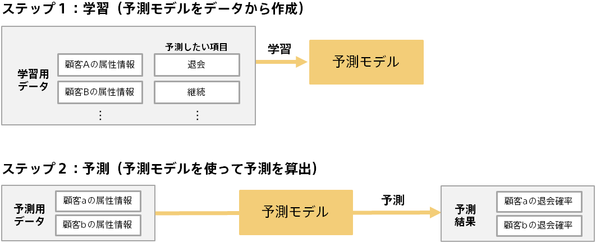
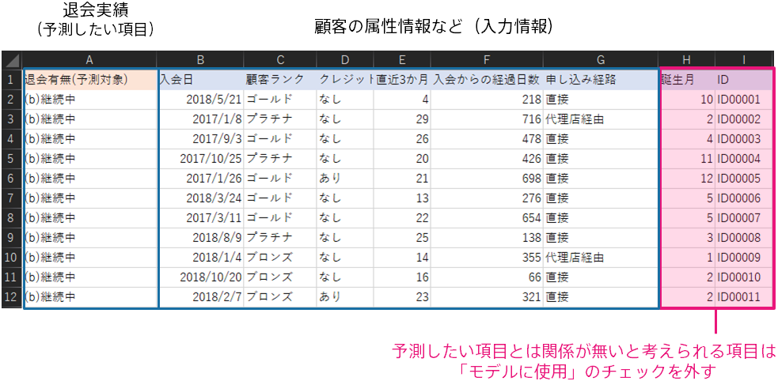
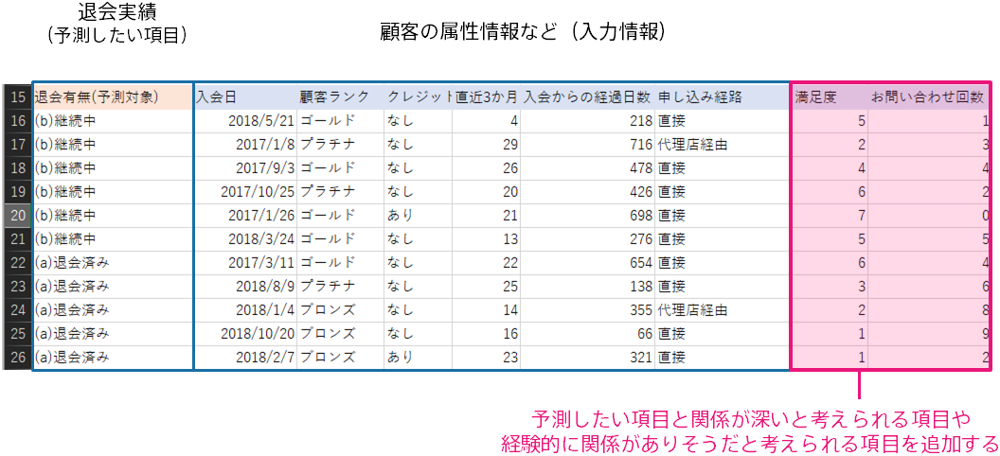
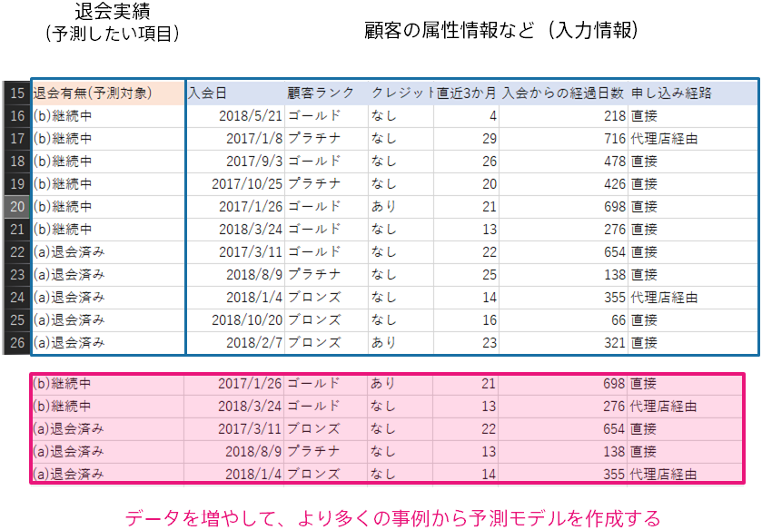
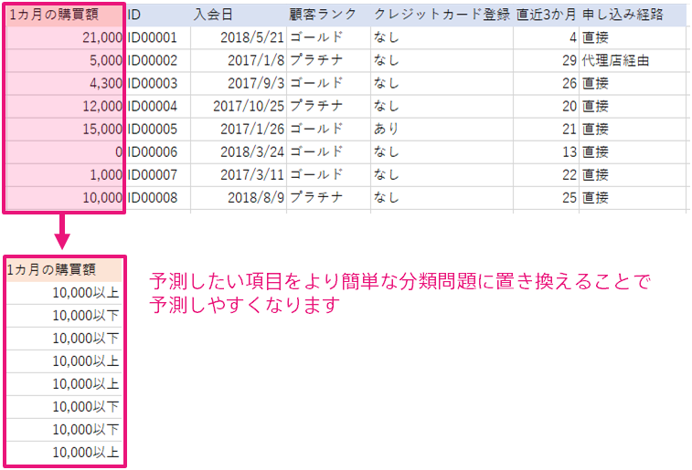
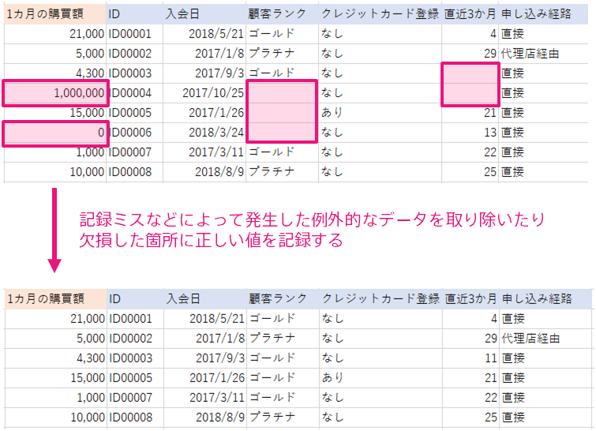

{}

本資料では、Prediction One で作成するモデルの予測精度をどの様に改善するかについて説明します。
予測精度を改善することで、予測モデルを用いた意思決定や業務の改善をできる可能性が高くなります。
ただし、データセットによっては、本資料で説明した内容を実行しても予測精度が改善しない場合もあります。

{}

{}

どのようにして予測精度を改善するかを説明するために、はじめに予測モデルがどのようにして作成されるかを説明します。
予測分析では、学習と予測という 2 つのステップがあります。以下は顧客の属性から、顧客がサービスを継続するか退会するかを予測する場合の例です。

予測モデルは、入力されたデータの中に潜んでいるルールやパターンを上手く組合わせることで予測ができるようになります。この例の場合、顧客の属性情報に含まれるさまざまなデータを使うことで、顧客が退会するかどうかを予測できるようになります。
つまり、より正確な予測を行うためには、予測モデル作成(学習)用データにどのような情報が含まれているかが重要になります。
{}

{}
予測したい項目とは明らかに関係のない情報、たとえば順番に割り振った ID やランダムに割り振った数などを Prediction One の入力から外すことで、予測精度の改善につながる可能性があります。
<u>とくに予測モデル作成(学習)用データが数十～数百と少ない場合は、予測したい項目とは関係のない項目をあらかじめ取り除くことをオススメします</u>。

Prediction One は予測モデル作成(学習)用データとして入力された項目の中から予測したい項目に関係のある項目を自動的に抽出し、予測モデルを作成します。
しかし、データ数が数十～数百と少ない場合は、関係のない項目から誤ったルールを見つけ出して予測を行う可能性が出てきます。
たとえば、顧客の退会予測において、たまたま ID が 10 以下の人に退会しない人が多かったため「ID が 10 以下ならば退会せず、10 以上なら退会する」といった予測を行う予測モデルが作成されるかもしれません。
これは予測モデル作成(学習)用データだけを見れば正しいかもしれませんが、現実では ID と顧客の退会に関係性はありません。
あらかじめ ID などの項目を取り除いておくことで、適切な情報を使った予測をできる可能性が高くなります。
{}

{}
予測モデルは与えられたデータと予測したい項目の間の関係性をとらえることで予測ができるようになります
そのため、予測したい項目の情報が部分的に含まれている項目が存在するほど、予測精度が高くなります。

「関係がある」というのは、たとえば予測したい項目と相関があったり、経験的に関係していると思われる状態を指しています。
たとえば、問い合わせ回数が継続・退会に関係がありそうだと感じているならば「お問い合わせ回数」を項目として追加することで精度が改善するかもしれません。

また、機器の故障予測を行うならば現場の人の「気温が高いときに故障が多いと感じる」という直感に基づき「気温」を項目として加えることで予測精度が改善するといった事例も考えられます。
予測したい項目に関係する業務を行っている人に聞き込み調査を行うことで、これまで無視してきたデータの中に予測精度向上の改善ヒントが見つかるかもしれません。
{}

{}
予測モデル作成(学習)用データのデータ数を増やすことで、予測精度が改善できる場合もあります。
予測モデルは与えられたデータと予測したい項目の間の関係性をとらえることで予測ができるようになります。
予測モデル作成(学習)用データのデータ数を増やすことで、より色々なパターンの事例が予測モデル作成(学習)用データの中に含まれて、予測したい項目との関係性をつかむことができるかもしれません。

ただし、<u>データを増やしたら必ず精度が向上するわけではないことに注意する必要があります</u>。
どれだけデータを増やしたとしても、予測したい項目に関係のある項目がなければ予測することはできません。
まずはじめは 100 ～数百のデータを用いて予測を行い、ある程度（たとえばモデルレベルが 4 を超えるなど）の予測精度が出ることを確認することをオススメします。
モデルレベルが 2 を下回る場合、予測したい項目に関係のある情報がデータに含まれていない可能性が高いです。
この場合、データを増やしただけでは精度の向上につながらない可能性があります。

{}

{}
モデルレベルが低い場合、予測したい項目を単純なものに置き換えてみることで予測ができるようになるかもしれません。

たとえば、ある EC サイトにて顧客がこれから 1 カ月の間に何円分の商品を購入してくれるかを予測したいとします。
この場合、顧客に紐づいたデータと「1 カ月の購買額」のデータを用いて予測モデルを作成します。

作成した予測モデルは「1 カ月の購買額」を予測できるようになりますが、期待する予測精度よりも低い可能性があります。
このような場合、予測したい項目を「1 カ月の購買額」ではなく「1 カ月の購買額が 10,000 円を超えるかどうか」の二値分類を行ってみると高い精度で分類ができるかもしれません。高い精度で分類ができるならば、1 カ月の購買額が 10,000 円を下回る可能性が高い人にメールを送信して購買を促してみるなどの施策に予測モデルを使うことができます。

この例のように、数値予測や多値分類の精度が良くない場合は、その問題がシンプルな二値分類に置き換えられないかどうかを検討してみてください。

{}

{}
ある程度の精度が出ている予測モデルの精度をさらに高めたい場合、予測モデル作成(学習)用データに含まれるデータを綺麗にすることで精度改善できる可能性があります。

綺麗にするとは、たとえば

- 欠損が多い項目に正しい値を入力する
- 異常なデータや例外的なデータを取り除く
- とても前に記録されたデータで、最近の傾向とは異なるものを取り除く

などが挙げられます。異常なデータや最近の傾向とは異なるデータが予測モデル作成(学習)用データに含まれていると、
予測モデルはこのような異常なデータに対しても予測を行えるように学習をしようと試み、
結果として全体の性能が低くなってしまう場合があります。

人が見て明らかに記録のミスだと判断できるデータや、とても古いデータであり最近の傾向や人の直感に反していると考えられるデータは
あらかじめ取り除いた上で予測モデルを作成してみてください。
{}

{}
本資料では、Prediction One で作成するモデルの予測精度をどの様に改善するかについてご説明しました。
以下に、精度改善につながる可能性がある取り組みをまとめます。

- 予測したい項目と関係のない情報をなるべく入力しない
- 予測したい項目に関係がある項目を入力に追加する
- 予測モデル作成(学習)用データのデータ数を増やす
- 解きやすい問題に置き換えてみる
- 予測モデル作成(学習)用データを綺麗にする

これらの取り組みは、行えば必ず精度が改善すると保証されたものではありません。
予測したい項目に関係がありそうな情報を集める → 予測精度が改善する → データを増やす → 実運用できる性能になる、といったように試行錯誤をする中で精度が少しずつ改善していくことが多いです。
これらの取り組みを参考にしつつ、一番取り組みやすい事例からはじめてみてください。

{}
