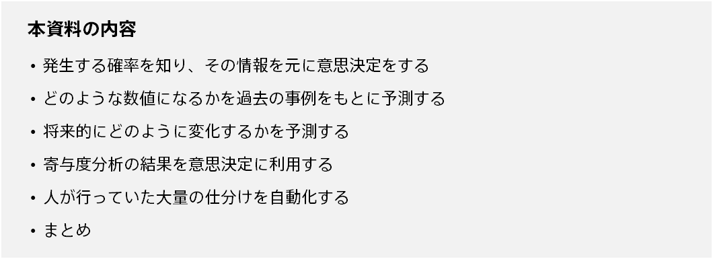
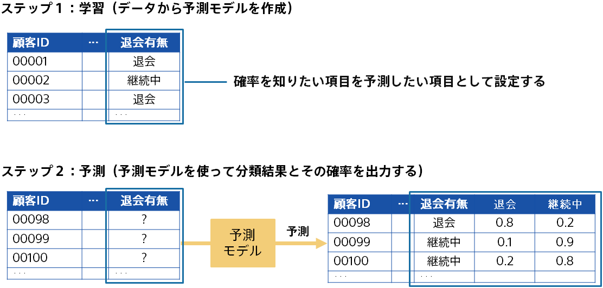
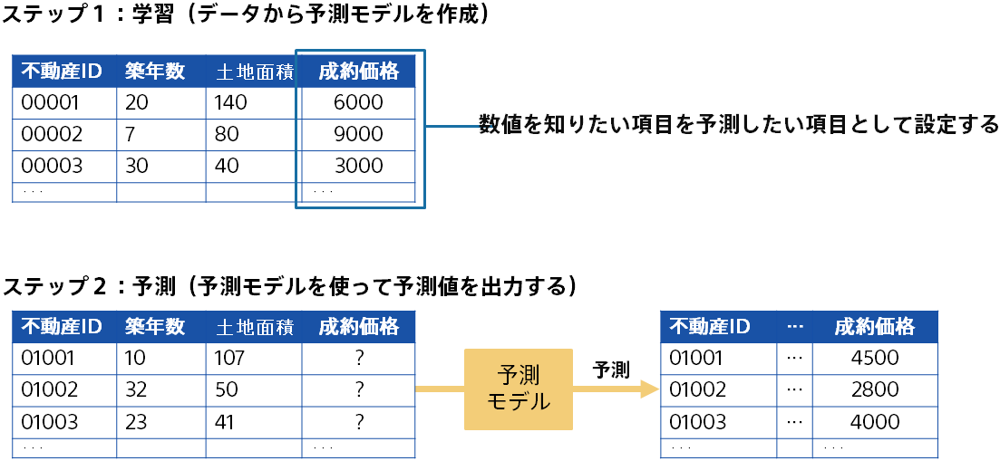
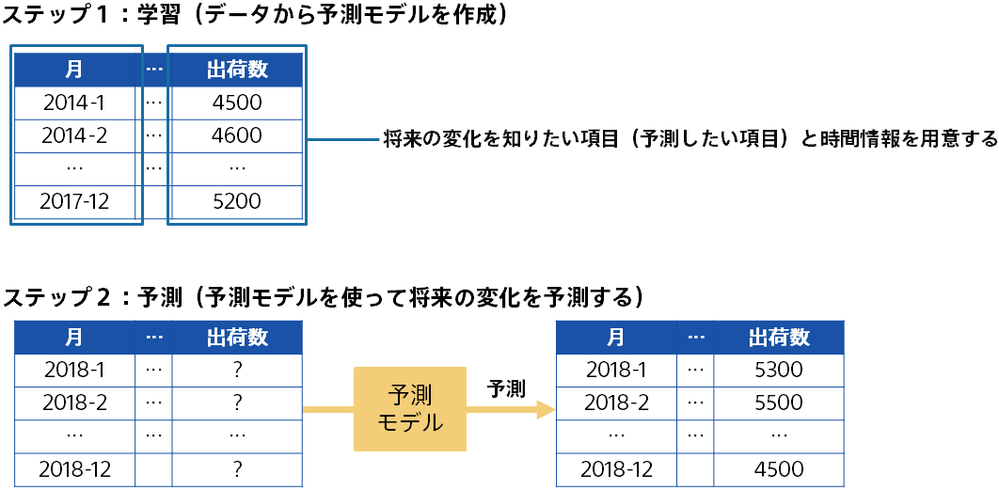
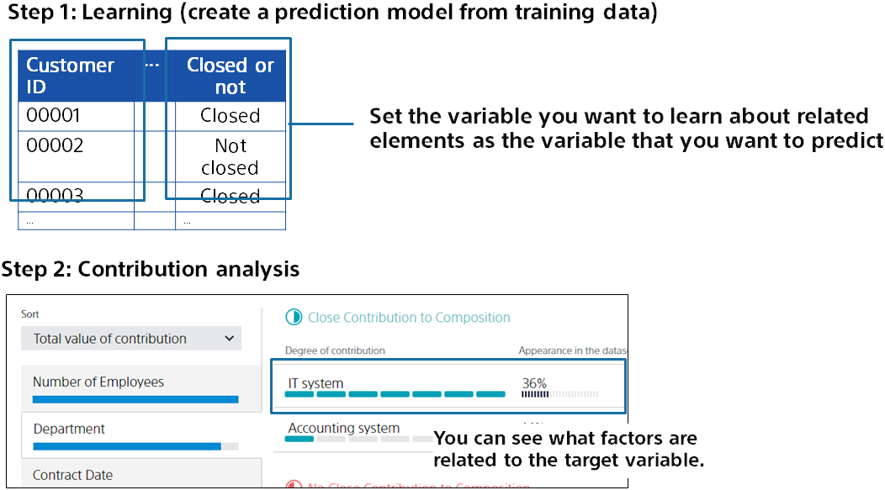
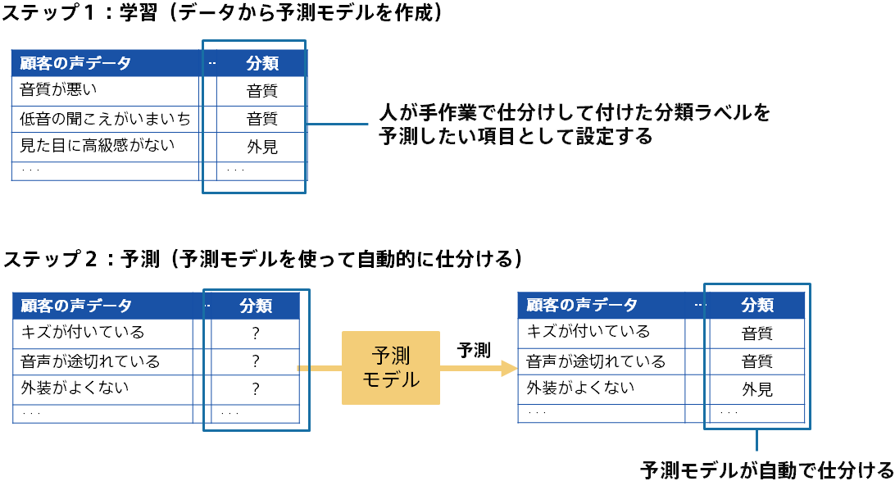

{}
Using the prediction model created by Prediction One, you can predict the future state of the input data.

This document provides an example of how prediction models can help you make decisions and improve your business.

{}

{}
Prediction models that perform classification such as binary classification and multiclass classification not only perform classification but also output the probability when classified. It is possible to predict whether an event will occur, and to take measures against those with high or low probability of occurrence.

#### Example 1:  {}

To prevent a failure by preparing a prediction model using data of equipment which has failed in the past and equipment which operates normally, and checking the equipment with high possibility of failure in the future based on the prediction model.

#### Example 2:  {}

A prediction model for classifying whether or not a customer withdraws in the future is prepared, and a decision is made by using the withdrawal probability of each customer outputted from the prediction model.{}

{}
A large number of past cases are prepared as a dataset, and a prediction model is created using the dataset. The prediction results are used for decision making. You can make predictions with a prediction model and make decisions based on the predicted results before you know what the actual numbers will be.

#### Example 1:  {}

Based on the data of past real estate contracts, we predict the price at which uncontracted real estate will be closed.

#### Example 2:  {}

Based on the data of a large number of past experiment results, we predict in advance what kind of result will be obtained from a specific experiment setting, and decide what kind of experiment will be performed next using the result.
{}

{}
Intuitively predictable numbers can be more accurately predicted by creating prediction models for regression.

#### Example 1:  {}

Based on past shipments of multiple products, it predicts how many products it expects to ship in the next three months.

#### Example 2:  {}

To determine the number of operators in the call center, predict how many calls are coming in each day.
{}

{}
Depending on how the data is collected, it may be difficult to collect prediction data in advance to make predictions.
For example, you may want to predict whether a contract will close for each customer, but it may take some time for customer records to become organized.

In such cases, a prediction model can be created for past cases, and the results of analysis of the contribution can be used for decision making.

#### Example 1:  {}

By creating a prediction model that predicts what customers will close, you can look at what factors are involved in the close.

#### Example 2:  {}

Promote work-style reforms by encouraging employees to take time off based on predictions of which employees will be able to take time off.
{}

{}
It is possible to improve the business by automating the process of sorting and classifying a large amount of data using the predicted result of the prediction model.

Create a prediction model using the data that people have sorted as prediction model creation (training) data, and prepare the data that has not been sorted as prediction data.
By entering prediction data into a prediction model, you automatically sort data that has not yet been sorted.

#### Example 1:  {}

Use prediction models to automatically label and categorize large numbers of customer review statements that arrive at the call center.

#### Example 2:  {}

With the background that we want to automatically sort out which parts of the machine are out of order in a stream of text messages about equipment failures, we automate sorting using prediction models.
{}

{}
In this document, we explained how to use the predicted results obtained from the prediction model to improve decision making and business operations. The following is an example of how you can use the results of the prediction model created by Prediction One.

- Create a prediction model to classify and make decisions based on the predicted results and probabilities
- Predict values that you would be happy to predict in advance using prediction models
- Predict how things will change in the future
- Use results of contribution analysis for decision making
- Automate the mass sorting that people were doing.

Beyond these examples, the use of predictive analytics varies from user to user.
Consider how to use the contribution and predicted results from Prediction One in your own case.
{}
