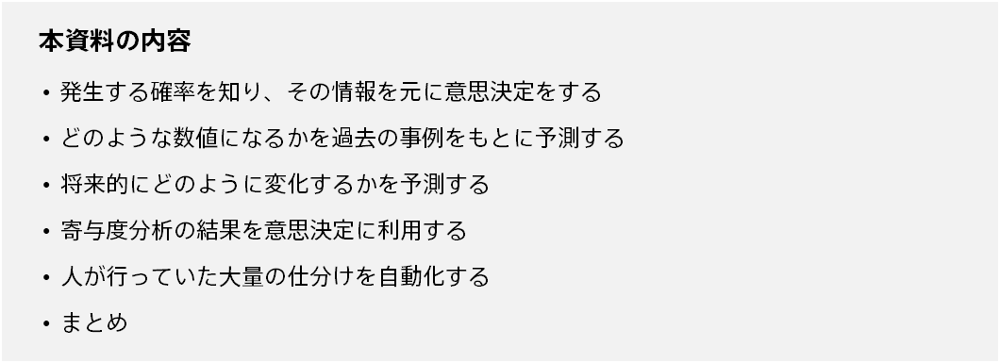
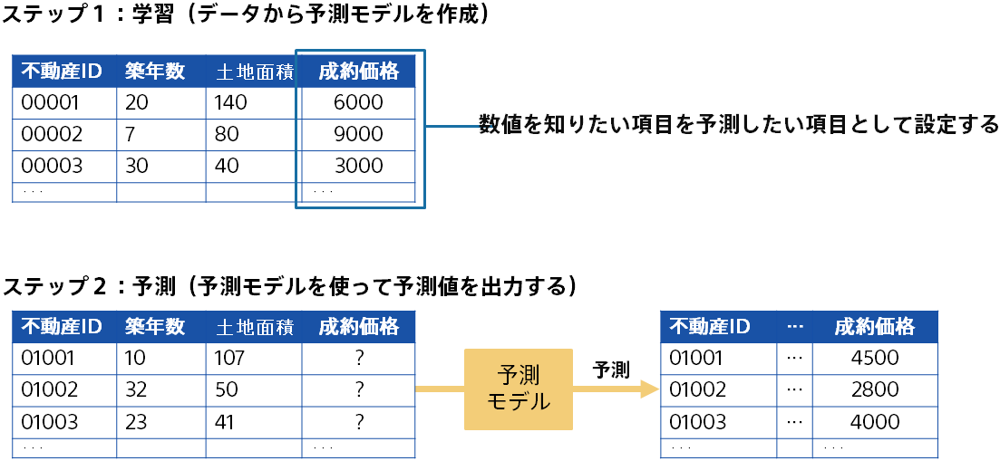
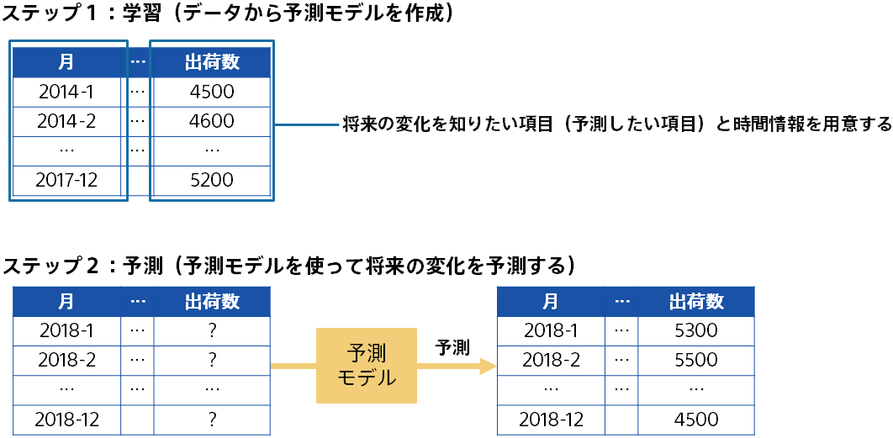
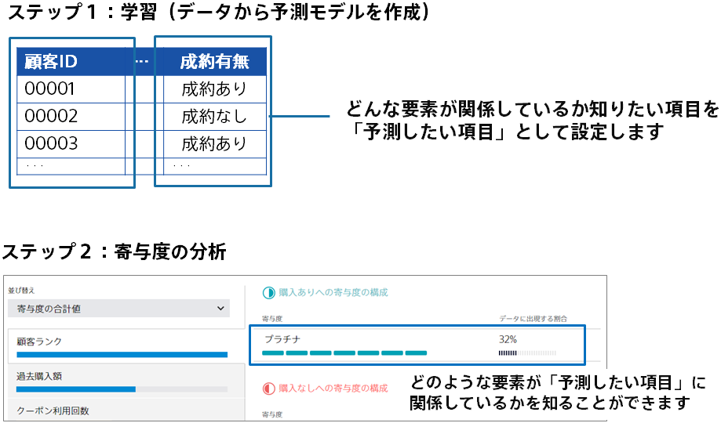
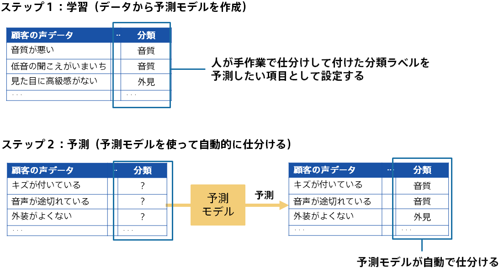

{}
Prediction One で作成した予測モデルを用いれば、入力したデータが将来的にどのような状態になるかを予測できます。

この資料では、予測モデルから得られる予測結果を活用して意思決定や業務の改善を行う方法について例を挙げてご説明します。

{}

{}
二値分類・多値分類のような分類を行う予測モデルは、単純に分類を行うだけでなく、分類した時にその確率を出力できます。ある出来事が発生するかどうかを予測し、発生する確率が高い・低いものに対して何か施策を行うことができます。

#### 例 1: {}

過去の故障した機器・正常に動作している機器のデータを用いて予測モデルを作成し、それを元に将来的に故障する可能性が高い機器の目星をつけて点検をすることで故障を防止しています。

#### 例 2: {}

顧客が将来的に退会をするか退会しないかを分類する予測モデルを作成し、予測モデルから出力された顧客ごとの退会確率を用いて意思決定を行います。{}

{}
過去の多くの事例をデータセットとして用意して、それを用いて予測モデルを作成し、予測結果を意思決定に活用します。実際にどのような数値になるか分かる前に予測モデルで予測を行い、予測値を元に意思決定をできます。

#### 例 1: {}

これまでの不動産の成約事例のデータから、まだ成約していない不動産がどれくらいの価格で成約に至るかを予測しています。

#### 例 2: {}

過去の多数の実験結果のデータを元に、特定の実験設定からどのような結果が得られるかをあらかじめ予測して、その結果を用いて次にどのような実験を行うかを決定します。
{}

{}
直感的には予測が立てられる数値を、数値予測の予測モデルを作成することでより正確に予測できる可能性があります。

#### 例 1: {}

複数の製品の過去の出荷数を元にして、これから 3 か月の間にどれくらいの製品の出荷が見込まれるかを予測します。

#### 例 2: {}

コールセンターのオペレータを配置するために、毎日どれくらいの入電があるかを予測します。
{}

{}
データの集め方によっては、あらかじめ予測用のデータを集めて予測を立てることが難しい場合もあります。
たとえば、顧客ごとに契約が成約に至るかどうかを予測したいものの、顧客の記録が整理された状態になるまで時間がかかるケースなどが該当します。

このような場合、過去の事例に対して予測モデルを作成し、その寄与度の分析結果を見ることで意思決定に用いることができます。

#### 例 1: {}

どのような顧客が成約するかを予測する予測モデルを作成することで、どんな要素が成約に関係しているかを考察できます。

#### 例 2: {}

どの社員が休暇取得の達成に至るかを予測して社員が休暇を取得するように促すことで、働き方改革を推進します。
{}

{}
大量のデータの仕分けや分類を行う工程を予測モデルの予測結果を用いて自動化することで業務が改善できる可能性があります。

人が仕分けたデータを予測モデル作成(学習)用データとして予測モデルを作成し、まだ仕分けができていないデータを予測用データとして用意します。
予測モデルに予測用データを入力することで、まだ仕分けがされていないデータに対して仕分けを自動的に行います。

#### 例 1: {}

コールセンターに届いた大量の顧客のレビュー文に対して、予測モデルを用いて自動的にラベルを付与して分類します。

#### 例 2: {}

機器の故障状態が次々と文章で送られてくる中でどの部分の故障についての文章かを自動的に仕分けたいという背景があり、予測モデルを用いて仕分けを自動化します。
{}

{}
本資料では、予測モデルから得られた予測結果をどのように活用して意思決定や業務の改善に用いるかについご説明しました。以下に Prediction One で作成した予測モデルの予測結果を活用できる事例をまとめます。

- 分類をする予測モデルを作り、その予測結果と確率を元に意思決定をする
- あらかじめ予測できると嬉しい数値を予測モデルを用いて予測する
- 将来的にどのように変化するかを予測する
- 寄与度分析の結果を意思決定に利用する
- 人が行っていた大量の仕分けを自動化する

これらの事例に限らず、予測分析の活用方法はユーザーによって多岐にわたります。
ぜひ身近にある事例で Prediction One から得られる寄与度・予測結果を活用する方法を考えてみてください。
{}
