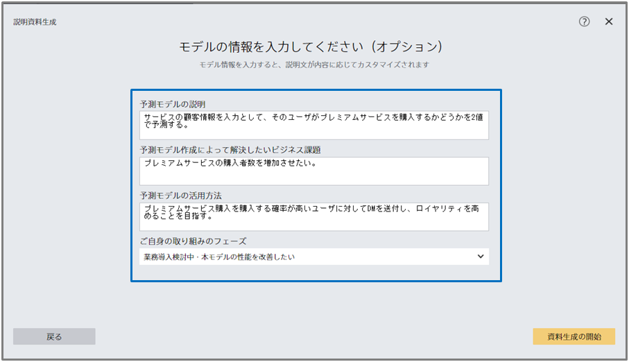

Prediction One (クラウド版) では一部の機能で <a href="https://learn.microsoft.com/ja-jp/azure/ai-services/openai/overview">Azure OpenAI Service</a> の大規模言語モデル (Large Language Model, LLM) GPT-3.5, GPT-4o と埋め込みモデルを用いています。 
Azure OpenAI Service とは OpenAI の大規模言語モデルを Microsoft Azure 環境で動作させている Microsoft のサービスです。 
LLM の利用にあたり、データの一部が Azure OpenAI Service に送信されます。どのような機能で LLM を利用しているのか、どのようなデータを LLM へ入力 (送信) しているのか、また LLM へ入力 (送信) したデータの扱われ方についてご説明します。

### どの機能で LLM を利用しているか

LLM は以下の機能で利用されています。各機能で LLM がどのように使用されるのかをご説明いたします。
- {}
- {}

### 改善ヒント機能での LLM の使用方法
#### LLM が用いられている改善ヒント
LLM は改善ヒント機能の一部で利用されています。ヒントは予測モデルの学習時に作成されるため、予測モデルを作成する際に LLM が利用されます (データの送信が行われます)。

LLM が用いられている改善ヒントは以下です。

- {}
- {}
- {}
- {}
- {}
- {}
- {}

#### LLM に入力 (送信) しているデータ

LLM に入力しているデータ (Azure OpenAI Service に送信しているデータ) は入力された学習用データの**項目名**です。 
例えば「{}」では、LLMは入力された項目名を基にユースケースにあったチュートリアルを推定します。

入力された学習用データの項目名以外は一切 LLM に入力 (送信) されません。つまり、各項目の具体的な値については LLM に入力 (送信) されません。

### 説明資料生成での LLM の使用方法
#### LLM によって生成される内容
生成される説明資料のスライドのうち、「精度評価」と「寄与度の要約と解釈」と「結論」の文章が LLM によって生成されています。下図の青枠に囲まれた部分が該当箇所です。
- 精度評価
  
- 寄与度の要約と解釈
  
- 結論
  

#### LLM に入力 (送信) しているデータ
「精度評価」の文章を生成するために LLM には以下のデータが入力されます。
- **項目名**
- **精度評価値**
- **予測タイプ**
- **予測対象の項目の統計** (数値予測のみ)
- **予測期間** (時系列予測のみ)

これらの情報は Prediction One のアプリ上の「モデルの詳細」タブと「精度」タブに記載されている、下図の青枠中の情報に対応しています。

予測タイプが数値予測であるときだけ予測対象の項目の統計を使用し、項目の値の最大値・最小値・平均値・中央値が LLM へ入力されます。

また、「寄与度の要約と解釈」の文章を生成するために LLM には以下のデータが入力されます。
- **項目名**
- **寄与度**

これらの情報は Prediction One のアプリ上の「寄与度」タブ中の下図に示す青枠中の情報に対応しています。

「結論」の文章を生成するためには上記の精度評価や寄与度の文章生成に用いたデータ全てに加え、以下に列挙するモデル情報入力画面で入力した内容が LLM に入力されます。
- **予測モデルの説明**
- **予測モデル作成によって解決したいビジネス課題**
- **予測モデルの活用方法**
- **ご自身の取り組みのフェーズ**

モデルの情報は以下の画面で入力された内容を用います。

### LLM に入力 (送信) されたデータの扱われ方

Prediction One では Azure OpenAI Service の LLM を使用しているため、 LLM に入力したデータ (Azure OpenAI Service に送信したデータ) の扱われ方は、 Azure OpenAI Service のドキュメント (<a href="https://learn.microsoft.com/ja-jp/legal/cognitive-services/openai/data-privacy?context=%2Fazure%2Fai-services%2Fopenai%2Fcontext%2Fcontext">Data, privacy, and security for Azure OpenAI Service</a>) に従います。

- 入力されたデータが他の顧客に利用されることはありません
- 入力されたデータが OpenAI に利用されることはありません
  - Azure OpenAI Service は Microsoft が提供するサービスで、 OpenAI のモデルを Microsoft Azure 環境で提供していますが、 OpenAI の運営するサービスと相互作用しません
- 入力されたデータが Microsoft やサードパーティの製品やサービスの改善のために使われることはありません
- 入力されたデータは Azure OpenAI Service のモデルの学習、再学習、改善のために使われることはありません
- 入力されたデータは保存されません
  - 通常は不正使用監視の目的で入力されたデータは 30 日間保存され、必要に応じて Microsoft の人手による確認が入ることもあります。しかし、 Prediction One は不正使用監視の設定をオフにして Azure OpenAI Service を使用しているため入力されたデータが保存されることも人手の確認がされることもありません。

上記の通り入力されたデータ (入力された学習用データの項目名等) が他者に渡り利用されることはありませんので、安心して LLM により機能が強化された Prediction One を使用できます。

2023 年 12 月 20 日時点の情報を基に記載しています。適宜 Azure OpenAI Service の情報に合わせて更新をしていますが、最新の状況と記載内容が一時的に一致しない可能性があります。
