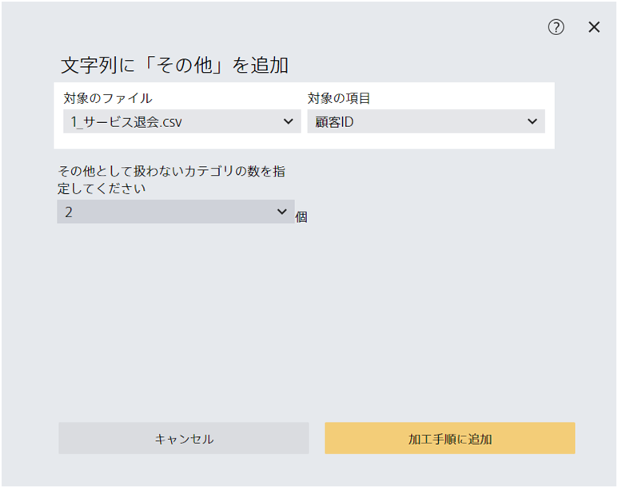

This section explains the details of each data processing step available in the Data Preparation feature.
## Aggregate/Join
Performs processing on the entire file, such as aggregation and data joining.

### Aggregate by date/time

Aggregate by date/time aggregates data by day, week, month, and year based on datetime variables

- **Target variables**: Specify the datetime variables to be used for aggregation.
- **Aggregation units**: Day, week, month, and year can be specified.
- **Series**: Specify a series name.
- **Aggregation method**: Total, average, top value, number of unique values, and number of rows can be specified.
  - Total: Gives the sum of the numeric values as the aggregated result.
  - Average: Gives the average of the numeric values as the aggregated result.
  - Top value: Gives the first value to appear as the aggregated result.
  - Number of unique values: Gives the number of unique values to be aggregated as the aggregated result.
  - Number of rows: Gives the rows to be aggregated as the aggregated result.

The aggregation methods that can be specified depend on the data type of the variable.
Total and average can only be specified for numeric variables.

### Data Join

Specifies how multiple rows are aggregated when performing a data join.

- **Aggregation method**: Total, average, top value, number of unique values, and number of rows can be specified.
- Total: Gives the sum of the numeric values as the aggregated result.
- Average: Gives the average of the numeric values as the aggregated result.
- Top value: Gives the first value to appear as the aggregated result.
- Number of unique values: Gives the number of unique values to be aggregated as the aggregated result.
- Number of rows: Gives the rows to be aggregated as the aggregated result.

### Conversion of Data for Time Series Prediction
Converts files of a specific format into a form that allows for time series prediction.
If date/time and series name are included in the first line and first column, the file is converted to a format that allows time series prediction.

For details on the conversion procedures, see {}.

## Process Variables
Performs processing on the specified variables, overwriting existing variable data.

### Replace Numeric Values and Strings

Applicable only to numeric and string variables, this replaces the specified numeric/string values **where they contain an exact match**.
String replacement based on partial matches can be performed with "Replace part of string". Also, blank spaces cannot be specified as the string after replacement.

### Split Values into Bins

Divides a numeric variable into the specified number of divisions (bins).
However, if the number of bins exceeds the number of unique numeric variables, a number of bins smaller than the number of unique variables will be automatically specified.


The "Split Values into Bins" option creates bins so that the data is divided as evenly as possible into each bin. Therefore, the width of the interval section may vary between bins.


### Binarize Numeric Values with a Threshold Value

Determines if a numeric variable is greater than or equal to the specified threshold value and replaces the numeric value with one of "greater than or equal to [specified value]" or "less than [specified value]".
### Round off Numeric Values

Rounds numeric values to the specified number of digits. Missing values are ignored.
### Fill Missing Values

Fills in missing values for numeric variables.

- **Treat null character as zero**: Sets all missing values to 0
- **Fill with variable mean**: Finds the mean value of the variable in question and uses it to fill missing values.
- **Fill with variable median**: Finds the median value of the variable in question and uses it to fill missing values.
- **Fill using adjacent values**: Linear fill based on the values above and below the missing value

### Fill Missing Strings

Fills missing values for string variables.

- **Fill with string with highest number of appearances**: Fills missing values with the most common string for the variable in question
- **Fill with string with lowest number of appearances**: Fills missing values with the least common string for the variable in question
- **Fill using nearby strings**: Fills with the string that appears above the missing value, or fills with the string below if there is no string above.
- **Fill with specified string**: Fills missing values with the specified string

### Add "Other" to String

For a string variable, converts strings that appear infrequently to "Other".
For example, if "2" is specified as the "number of categories not to be treated as Other," all strings ranked outside the top two in terms of occurrences will be replaced with "Other."

### Replace Part of a String

It is possible to replace a part of a string.
"Replace Numbers and Strings" can be used to replace exact matches.


Specify "all variables that contain strings" as the target variable to perform replacements on all string variables in the file.


### Unify Similar Strings

The system determines whether the string contains characters in common with the specified string and unifies them if there are many characters in common.
As a general rule, if more than 70% of the characters are shared in common, the strings will be unified.

- If "Prediction One" is specified, "Prediction-One" and "Prediction_One" will be replaced with "Prediction One".
- If "プレディクションワン" is specified, no substitution will be performed because "Prediction-One" and "Prediction_One" do not have any characters in common with "プレディクションワン".

## Add Variable
Performs processing on the specified variable and adds the resulting new variable.

### Apply the Specified Operation to a Numeric Value

Applies the specified operation to a numeric value. Square roots are calculated only for numbers greater than or equal to 0.
The natural logarithm is calculated only for numbers greater than 0.
Numeric values outside the range are treated as missing values.

### Extract Numeric Values from String

Extracts numeric values from string/text variables.

- **Default**: The string is scanned in order from the beginning, and the first number that appears is read.
  - Example: "Lot 1, Room 301" → read as "1"
- **Treat "△" and "▲" as minus**: Reads △ and ▲ symbols in character strings as minus signs.
  - Example: "▲100,000 yen" → read as "-100,000 yen"

### Split String

Splits a string by a specified symbol/string.
If there are multiple applicable strings, the first occurrence of the string is used as the basis for division.

- Split "A+B" by "+" → Split into "A" and "B"
- Split "A+B+C" by "+" → Split into "A" and "B+C"

### Produce Variable from Date/Time

Produces a new variable from a date/time variable.

- **Day of week**: Adds a variable recording the day of the week from Monday to Sunday. The variable is treated as a string.
- **Year/month/day**: Extracts the year, month, and day from the date/time variable. All variables are treated as numeric.
- **Number of days from beginning of year**: Adds a variable recording the number of days from January 1 of the year. The variable is treated as numeric.

### Extract Prefecture/Municipality from Text

Extracts the names of prefectures and municipalities from text variables in which addresses are recorded and produces a new variable.
The text variable must begin with the name of a prefecture. Extraction may also fail if the name of the municipality contains 5 characters or more or the name of the municipality contains the characters for "city," "town," or "village".

### Calculate Differences between Variables

Calculates the difference between columns of numeric or date/time variables.

- Numeric: Calculates the difference between two numeric values and records the result in a new variable
- Datetime: Calculates the **difference in days** between two dates/times and records the result in a new variable

If there are missing values or values that cannot be converted to numeric or datetime in the specified two variables, the result will be a missing value.

### Copy Variable

Copies a variable and adds it as a new variable.

### Join Variable

Joins the two specified variables and adds the result as a new variable.

## Delete Variable
### Delete Variable

Deletes the specified variable.
Deleted variables cannot be used for processing again.

### Delete Low-Correlation Variables

Calculates the correlation coefficient with a specified numeric variable and deletes variables with low correlation coefficients.
Non-numeric variables cannot be deleted.

## Delete Rows
### Delete Rows that Match Criteria

Deletes rows from the file that match the specified criteria.
This processing does not apply to **evaluation data or prediction data**.

### Delete Rows with Missing Values

Deletes rows that contain missing values from the file.
This processing does not apply to **evaluation data or prediction data**.

If "all variables" is specified as the target variable, the row is deleted even if there is just one missing value in the row.

### Delete Duplicate Rows

Leaves one of the duplicate rows and deletes the rest. If a variable is specified, only rows where there is a duplicate for the specified variable will be deleted. This processing does not apply to **evaluation data or prediction data**.

If "entire row" is specified as the target variable, the rows with all variables matching exactly are selected for deletion.