データ準備機能で使用できる各データ加工ステップの処理内容の詳細を説明します。
## 集約・結合
集計やデータ結合など、ファイル全体に対して加工処理を実行します。

### 日時による集約
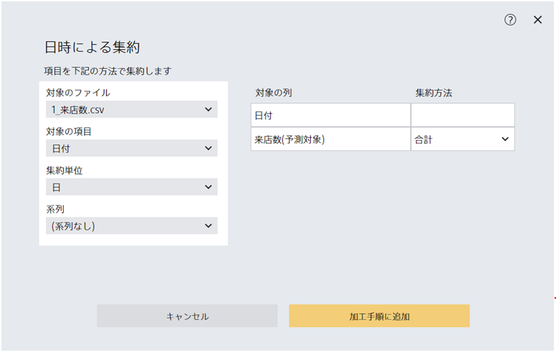

日時による集約は、日時型項目をもとにして日ごと・週ごと・月ごと・年ごとにデータを集約します。

- **対象の項目**：集約する際に使用する日時型項目を指定します。
- **集約単位**：日・週・月・年を指定できます。
- **系列**：系列名を指定します。
- **集約方法**：合計・平均・先頭の値・ユニーク数・個数を指定できます。
  - 合計：数値の合計を集約した結果とします。
  - 平均：数値の平均を集約した結果とします。
  - 先頭の値：集約する際に、一番はじめに出現した値を集約した結果とします。
  - ユニーク数：集約対象となる値のユニーク数を集約した結果とします。
  - 個数：集約対象となる行の数を集約した結果とします。

指定できる集約方法は項目のデータタイプによって異なります。
数値型項目のみ合計・平均を指定できます。

### データ結合
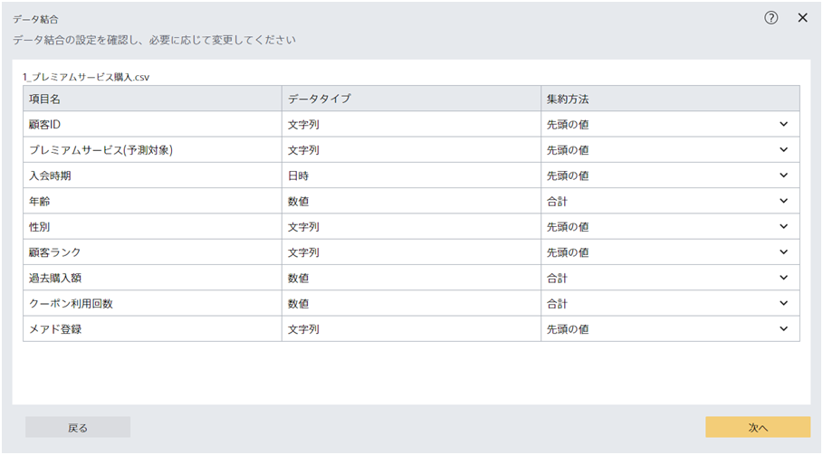

データ結合をする際に、複数の行をどのように集約するかを指定します。

- **集約方法**：合計・平均・先頭の値・ユニーク数・個数を指定できます。
- 合計：数値の合計を集約した結果とします。
- 平均：数値の平均を集約した結果とします。
- 先頭の値：集約する際に、一番はじめに出現した値を集約した結果とします。
- ユニーク数：集約対象となる値のユニーク数を集約した結果とします。
- 個数：集約対象となる行の数を集約した結果とします。

### 時系列予測用データの変換
特定のフォーマットのファイルを、時系列予測が可能な形に変換します。
日時と系列名が一行目・一列目に含まれている場合、ファイルを時系列予測が可能なフォーマットに変換します。

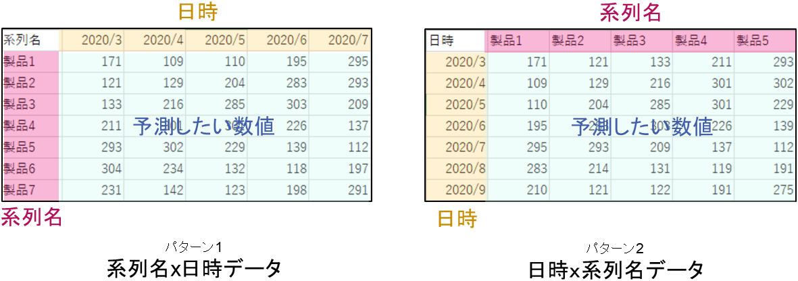

変換手順の詳細は{}をご確認ください。

## 項目を加工
指定した項目に加工を実行し、既存の項目のデータを上書きします。

### 数値や文字列を置換
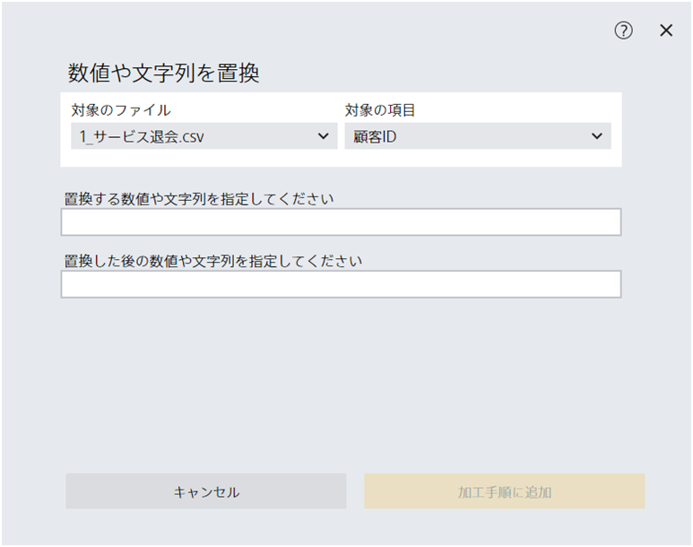

数値型・文字列型の項目にのみ適用でき、**完全に一致する値が含まれる箇所**を指定した数値・文字列に置換します。
部分一致による文字列の置換は「文字列の一部を置換」で実行できます。また、置換した後の文字列として空白は指定できません。

### 数値をビンに分割
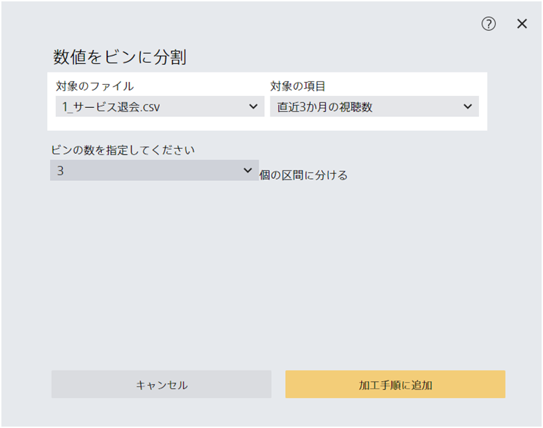

数値型項目を指定した数の区画(ビン数)に分割します。
ただし、ビン数が数値型項目のユニーク数を上回る場合はユニーク数よりも小さいビン数を自動的に指定します。


「数値をビンに分割」ではそれぞれのビンになるべく均等にデータが分かれるようにビンを作成します。そのため、ビンによって区間の幅が異なる場合があります。


### 数値を閾値で二値化
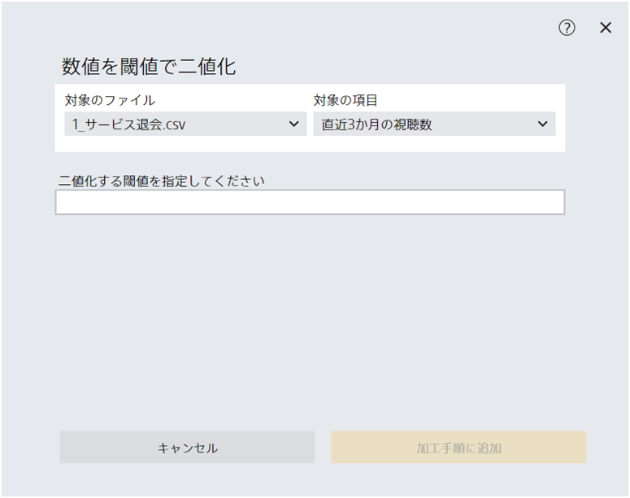

数値型項目が指定した閾値以上かどうか判定し、数値を『[指定した値]以上』、『[指定した値]より小さい』のどちらかの値に置換します。
### 数値を四捨五入
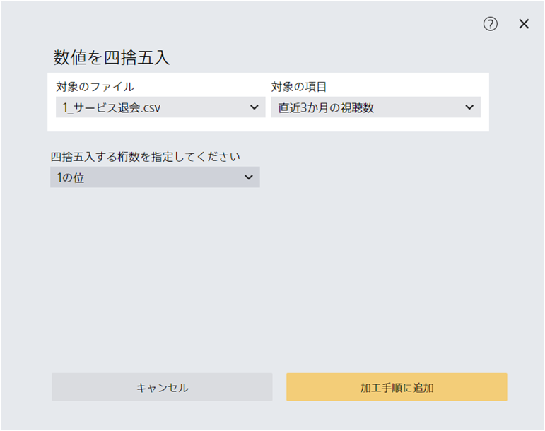

数値を指定された桁で四捨五入します。欠損値は無視されます。
### 数値の欠損を補完
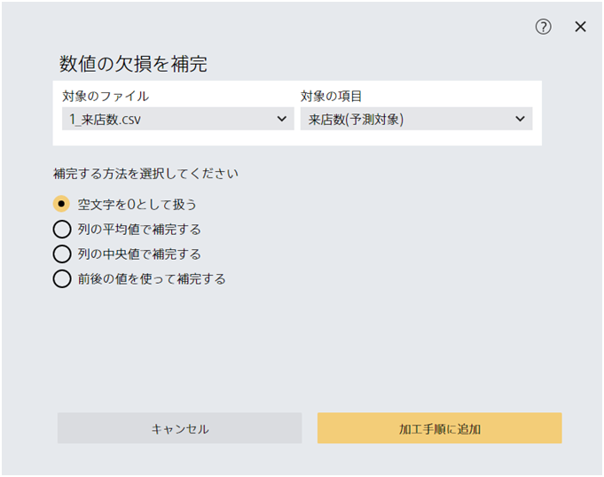

数値型項目の欠損を補完します。

- **空文字を0として扱う**：欠損している箇所をすべて0にします
- **項目の平均値で補完する**：その項目の平均値を求めて、平均値で欠損を補完します
- **項目の中央値で補完する**：その項目の中央値を求めて、中央値で欠損を補完します
- **前後の値を使って補完する**：欠損の上下の値をもとに線形補完します

### 文字列に「その他」を追加
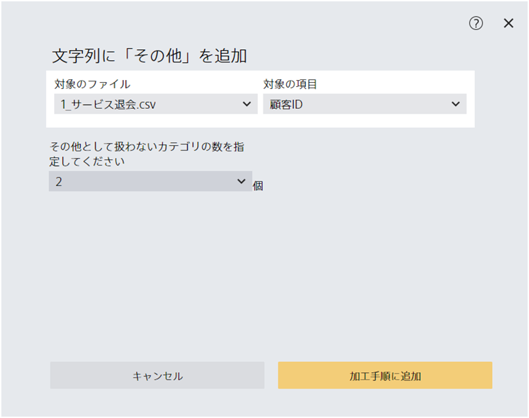

文字列型項目で、出現回数が少ない文字列を『その他』に置換します。
たとえば、『その他として扱わないカテゴリの数』として『2』を指定した場合、出現回数が3位以下である文字列をすべて『その他』に置換します。

### 文字列の欠損を補完
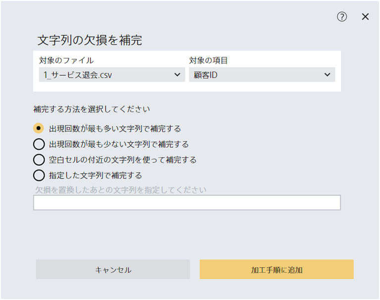

文字列型の項目にある欠損値を補間します。

- **出現回数が最も多い文字列で補間する**：その項目で出現回数が最も多い文字列で欠損を補間します
- **出現回数が最も少ない文字列で補間する**：その項目で出現回数が最も少ない文字列で欠損を補間します
- **空白セルの付近の文字列を使って補間する**：欠損となっている箇所より上に出現した文字列で補間します、上に文字列がない場合は下の文字列で補間を実行します
- **指定した文字列で補間する**：指定した文字列で欠損を補間します

### 文字列の一部を置換
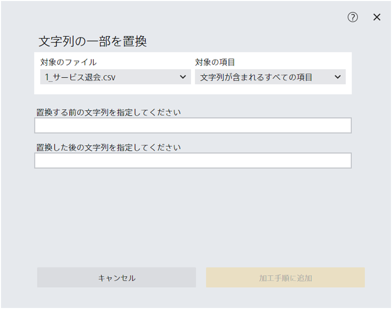

文字列の一部を置換できます。
完全一致による置換は「数値や文字列を置換」によって実行できます。


対象の項目として「文字列が含まれるすべての項目」を指定すると、ファイル中のすべての文字列型項目に対して置換を実行できます。


### 類似した文字列を統一
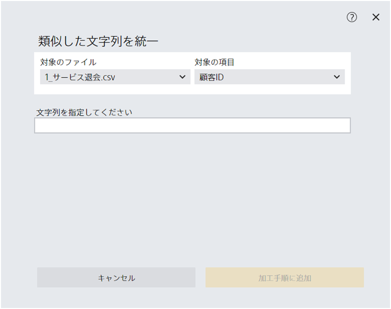

指定した文字列と共通する文字を含むかどうか判定し、共通する文字が多い場合は表記を統一します。
目安として7割以上の文字が共通している場合、表記を統一します。

- 「Prediction One」と指定した場合、「Prediction-One」「Prediction_One」は「Prediction One」へと置換されます
- 「プレディクションワン」と指定した場合、「Prediction-One」「Prediction_One」には「プレディクションワン」と共通する文字が無いため置換は実行されません

## 項目を追加
指定した項目に加工を実行し、その結果得られた項目を新しく追加します。

### 数値に指定した演算を適用
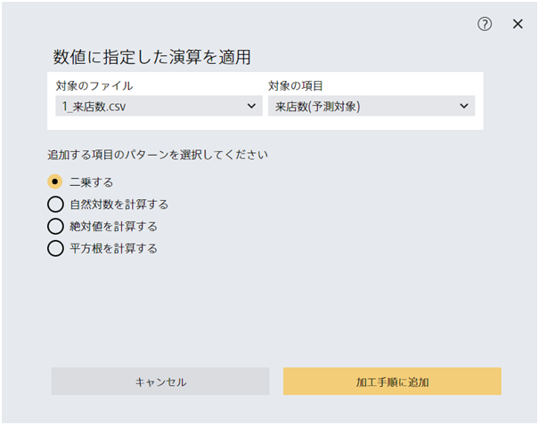

数値に指定した演算を適用します。平方根は0以上の数値のみ計算されます。
自然対数は0より大きい数値のみ計算されます。
範囲外の数値は欠損として処理されます。

### 文字列から数値を抽出
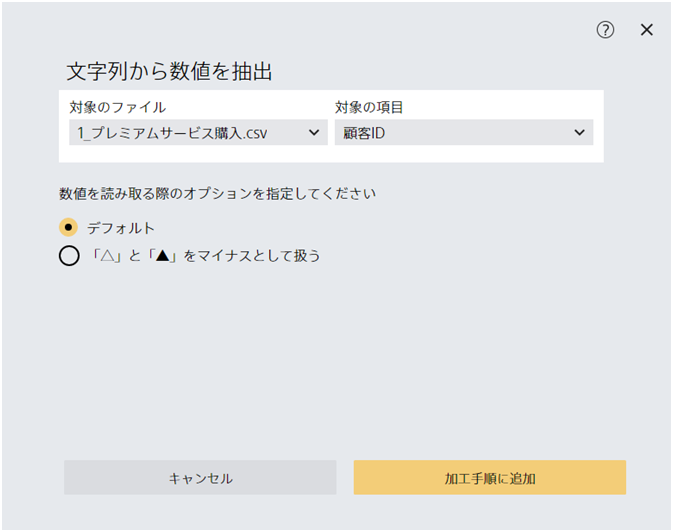
文字列・テキスト型の項目から数値を抽出します。

- **デフォルト**：文字列を先頭から順番に見て一番はじめに出現した数値を読み取ります。
  - 例：「1番地301号室」→「1」と読み取り
- **「△」と「▲」をマイナスとして扱う**：文字列中の△・▲の記号をマイナスとして読み取ります。
  - 例：「▲100.0千円」→「-100.0」と読み取り

### 文字列を分割
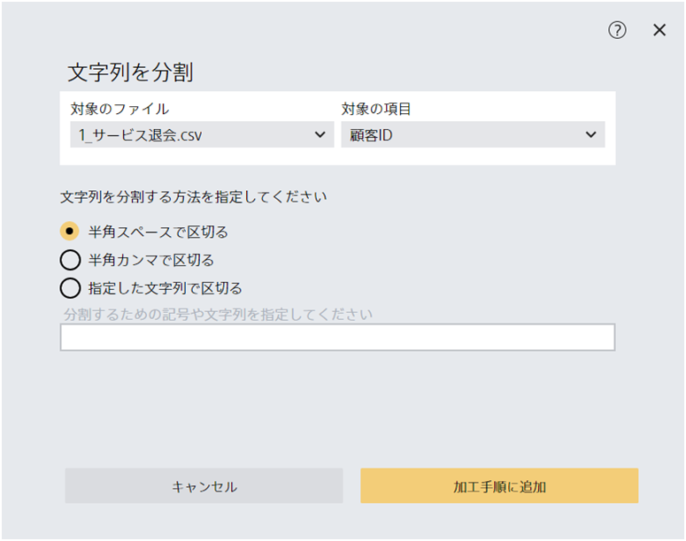

文字列を指定された記号・文字列で分割します。
該当する文字列が複数存在する場合、はじめに出現した文字列を基準にして分割します。

- 「A+B」を「+」で分割 → 「A」「B」に分割されます
- 「A+B+C」を「+」で分割 → 「A」「B+C」に分割されます

### 日時から項目を作成
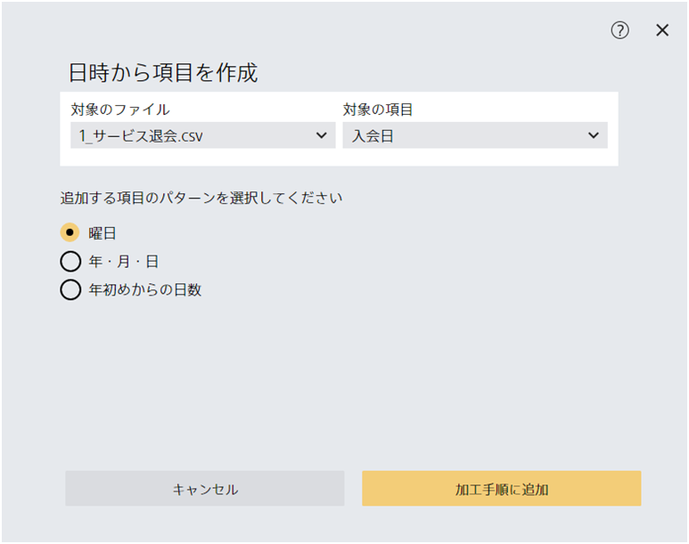

日時項目をもとに新しい項目を作成します。

- **曜日**：月～日の曜日を記録した項目を追加します。項目は文字列型として扱われます。
- **年・月・日**：日時項目から年・月・日を抽出します。項目はすべて数値型として扱われます。
- **年初からの日数**：年の1月1日からの日数を記録した項目を追加します。項目は数値型として扱われます。

### テキストから県市町村を抽出
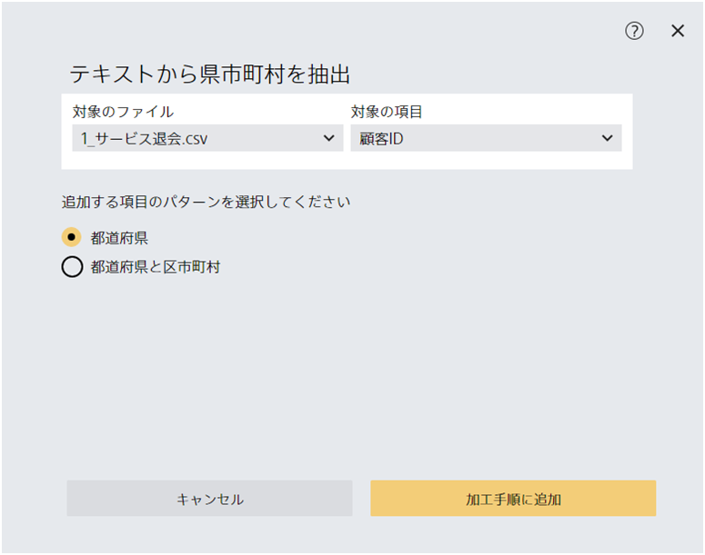

住所が記録されているテキスト型の項目から、都道県名・市町村名を抽出した項目を作成します。
テキストは必ず都道府県名で始まっている必要があります。また、５文字以上の市町村名や「市」・「町」・「村」が市町村の名前に含まれている場合は抽出に失敗する場合があります。

### 項目の差を計算
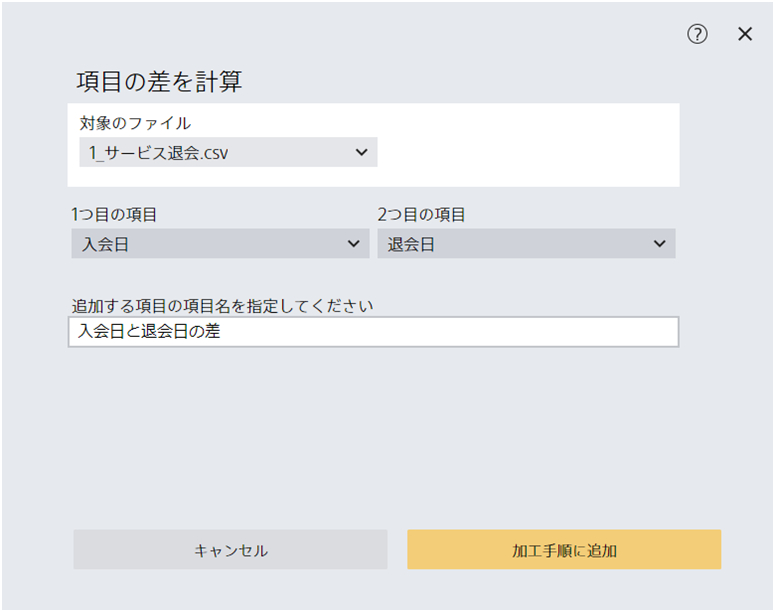

数値型・日時型の列の間の差を計算します。

- 数値型：２つの数値の差を計算し、新しい項目に結果を記録します
- 日時型：２つの日時の**日数差**を計算し、新しい項目に結果を記録します

指定された２つの項目のいずれかが欠損している・数値や日時に変換できない場合は結果は結果は欠損値になります。

### 項目をコピー
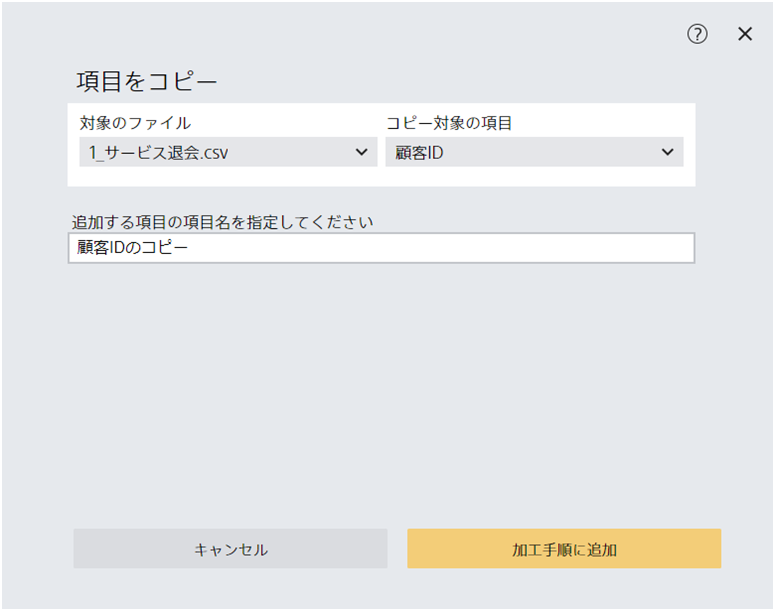

項目をコピーして追加します。

### 項目を結合
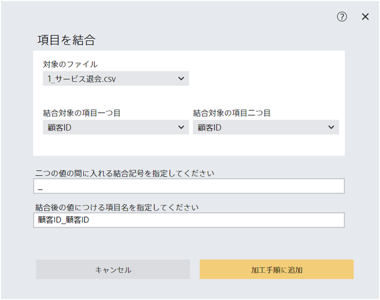

指定された二つの項目を結合し、あたらしく項目を追加します。

## 項目を削除
### 項目を削除
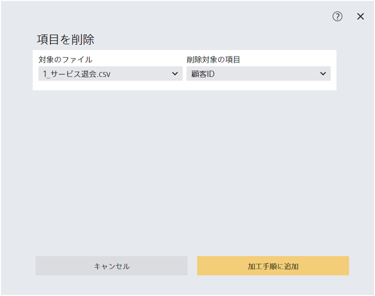

指定された項目を削除します。
削除した項目を再び加工に利用することはできません。

### 相関の低い項目を削除
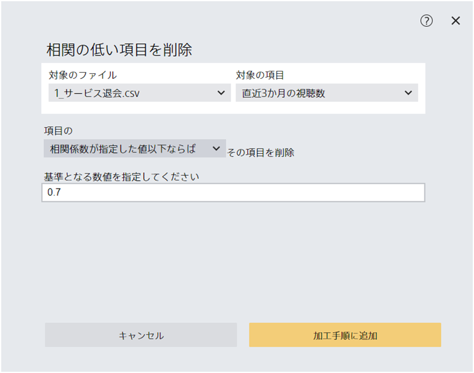

指定された数値型の項目との相関係数を計算し、相関係数が低い項目を削除します。
数値型でない項目は削除されません。

## 行を削除
### 条件に合う行を削除
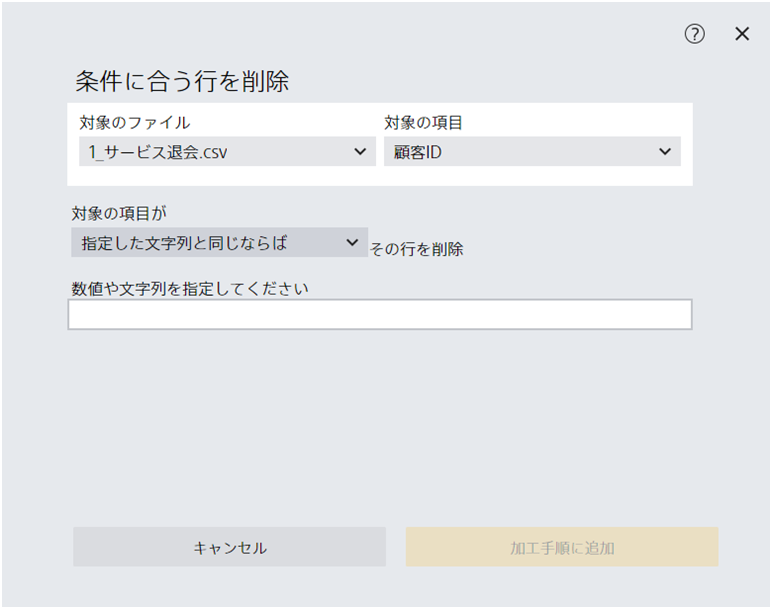

指定された条件にあてはまる行をファイルから削除します。
この加工処理は**評価用データ・予測用データには適用されません**。

### 欠損が含まれる行を削除
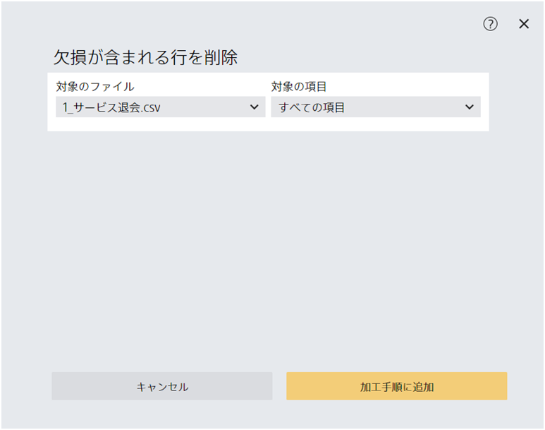

欠損が含まれる行をファイルから削除します。
この加工処理は**評価用データ・予測用データには適用されません**。

対象の項目として「すべての項目」が指定されている場合、行のいずれかにひとつでも欠損が存在するならばその行を削除します。

### 重複した行を削除
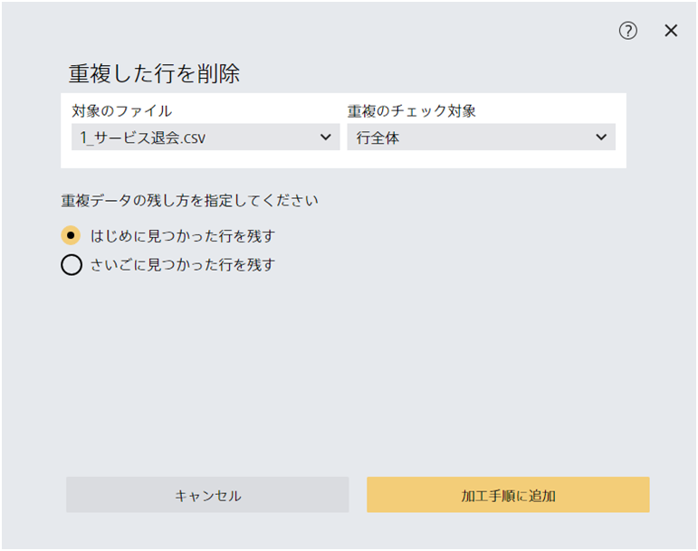

重複している行をひとつだけ残し、それ以外を削除します。項目を指定した場合、指定した項目に重複がある場合のみ削除されます。この加工処理は**評価用データ・予測用データには適用されません**。

対象の項目として「行全体」が指定されている場合、すべての項目が完全に一致している行が削除の対象になります。