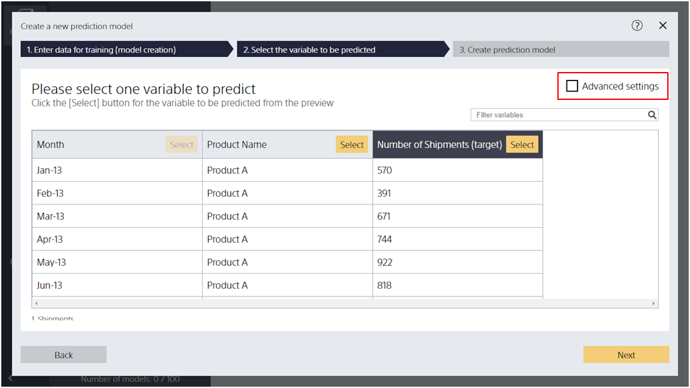
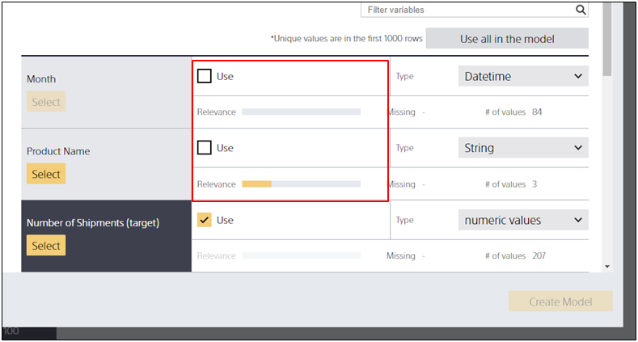
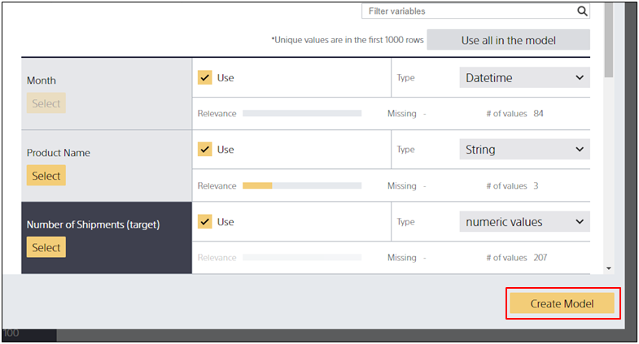

{}

If there is no variable checked for "Use for model" other than the variable you want to predict, you cannot create a prediction model.
When you click [Create Model], Prediction One creates a prediction model that predicts the value of the variable you want to predict based on a variety of information other than the variable you want to predict.
Therefore, a prediction model cannot be created when there is no information available other than the variables to be predicted.

You can click [Create Model] by following the steps below.

{}

{}

{}

