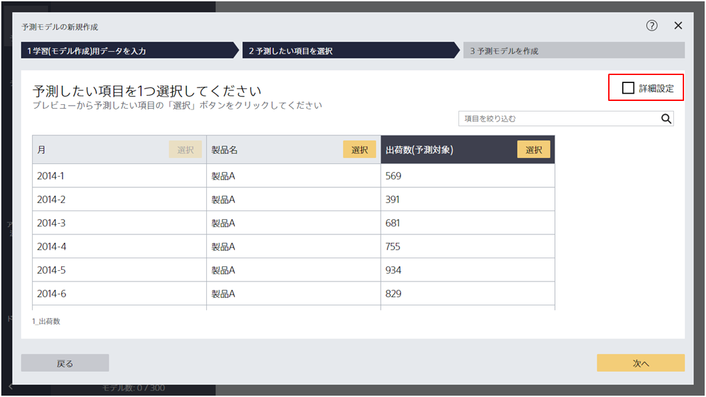
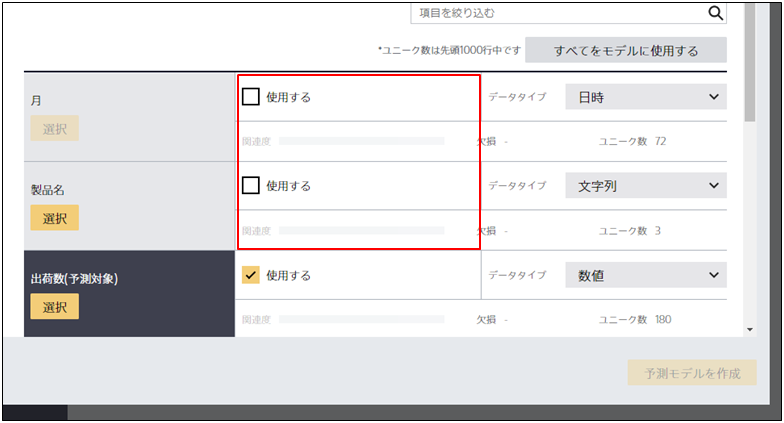
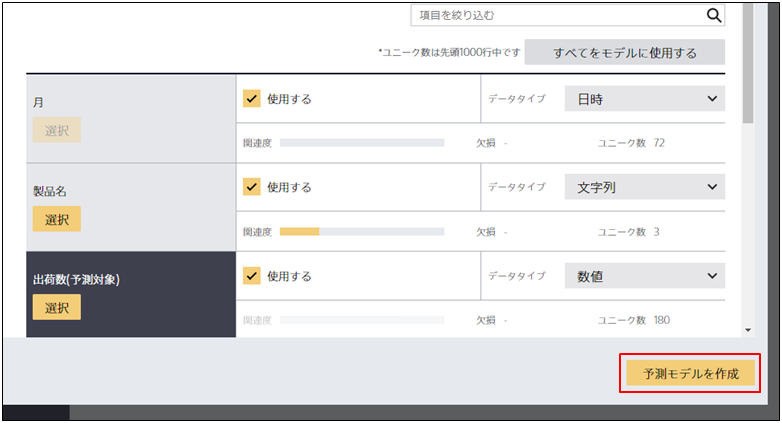

{}

予測したい項目以外に「モデルに使用する」チェックが入っている項目が一つも無い場合、予測モデルを作成することはできません。
「予測モデルを作成する」をクリックすると、Prediction One は予測したい項目以外のさまざまな情報から予測したい項目がどんな値になるかを予測する予測モデルを作成します。
そのため、予測したい項目以外に使用できる情報がひとつも無い状態では予測モデルを作成することはできません。

以下の手順を踏むことで、「予測モデルを作成する」をクリックできるようになります。

{}

{}

{}

