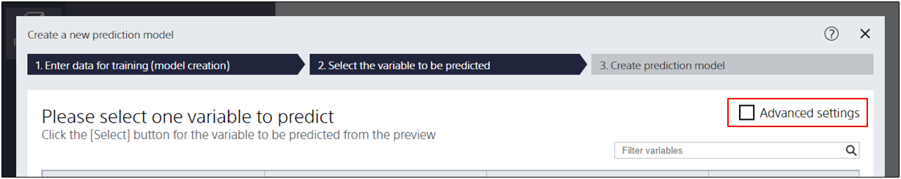

When no evaluation data is specified, Prediction One randomly selects samples contained in the prediction model creation (training) data (a single piece of data is called a sample. For example, in customer data, it refers to customers), to create the evaluation data.
If you are creating your own evaluation data, please follow the steps below to import your prediction model creation (training) data.

{}
Load prediction model creation (training) data.
{}

{}
Please check "Advanced Settings" on the prediction model creation screen.

{}

{}
Move to the lower left of the screen and click "Select a File" in "Set another file".

{}

{}
Specify the file you want to use as evaluation data in the "Specify a File" window.
{}
