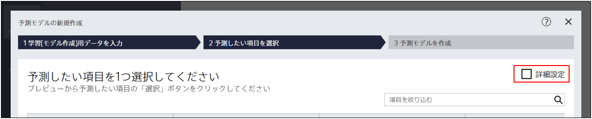
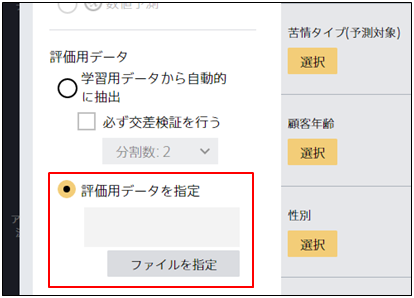

Prediction One は評価用データを特に指定しない場合、予測モデル作成(学習)用データに含まれるサンプル（１つのデータのことをサンプルと呼びます。たとえば、顧客データでは顧客のことです。）をランダムに選択して評価用データを作成します。
評価用データをご自身で作成する場合、以下の手順で予測モデル作成(学習)用データを読み込んでください。

{}
予測モデル作成(学習)用データを読み込ませてください
{}

{}
予測モデルの新規作成画面にて「詳細設定」にチェックを入れてください

{}

{}
画面左下に移動して「評価用データを指定」の欄の「ファイルを指定」をクリックしてください

{}

{}
「ファイルの変更」ウィンドウにて評価用データとして使用したいファイルを指定してください
{}
