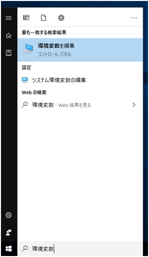
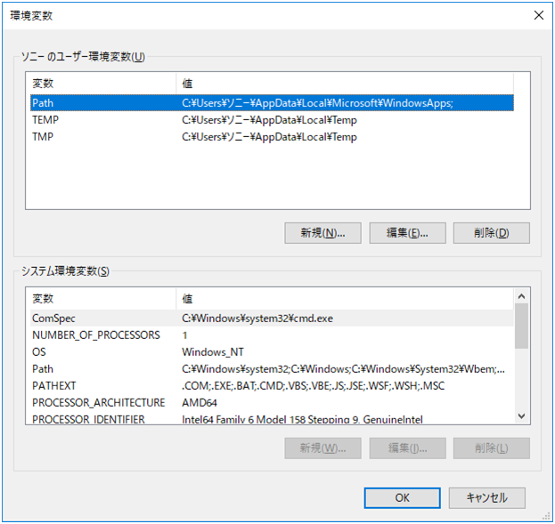
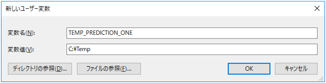
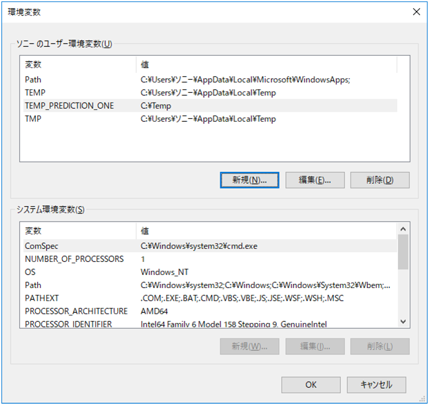

Prediction One can cause problems with the prediction model creation process if the temporary folder path contains non-ASCII characters (Kanji, hiragana, katakana, etc.). Follow the procedure below to change the temporary folder.

{}

On the Windows Start menu, search for "environment variable", and then click "Editing Environment Variables".

{}

Click "New" for the user environment variable.

{}

In the new user variable, name the variable "TEMP_PREDICTION_ONE" and specify the path to the new temporary folder as the variable value.
Specify a location where the temporary folder path consists of only ASCII characters, such as single-byte alphanumeric characters, and has write permissions.
Click "OK" after specifying.

The following is an example of the display after the setting. Click "OK".

After setting, restart Prediction One.
