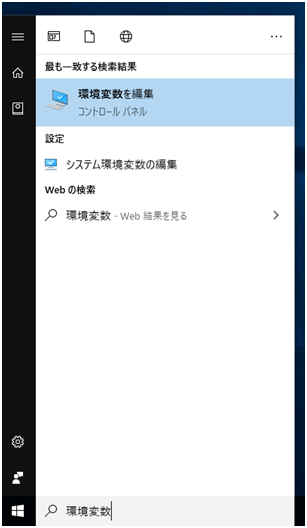
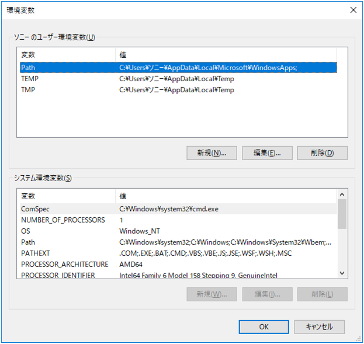
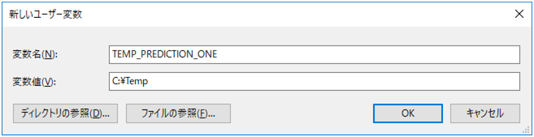
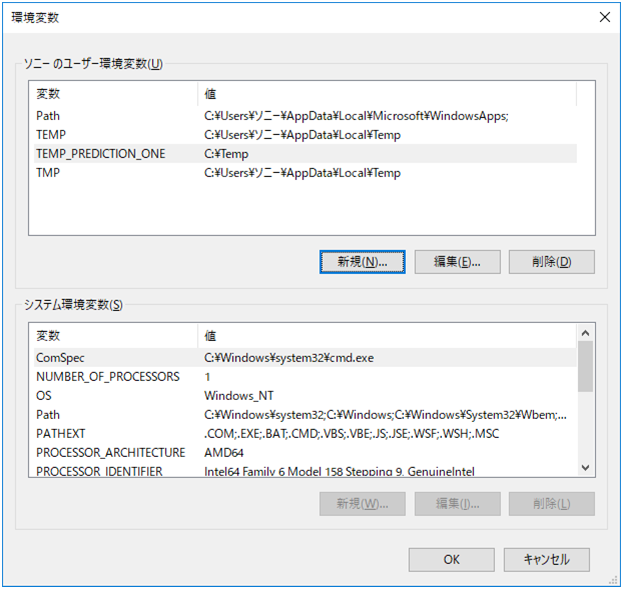

Prediction One は、一時フォルダーのパスに ASCII 以外の文字(漢字・平仮名・片仮名など)が含まれていると、予測モデルの作成処理に問題が発生する可能性があります。下記の手順で、一時フォルダーを変更してください。

{}

Windows のスタートメニューで「環境変数」と検索し、「環境変数の編集」をクリックします。

{}

ユーザー環境変数の「新規」をクリックします。

{}

新しいユーザ変数で、変数名を「TEMP_PREDICTION_ONE」、変数値として変更後の一時フォルダーのパスを指定してください。
一時フォルダーのパスは半角英数字などの ASCII 文字のみで構成されていて、書き込み権限がある場所を指定してください。
指定後「OK」をクリックしてください。

以下は設定後の表示例です。「OK」をクリックしてください。

設定完了後、Prediction One を再起動してください。
