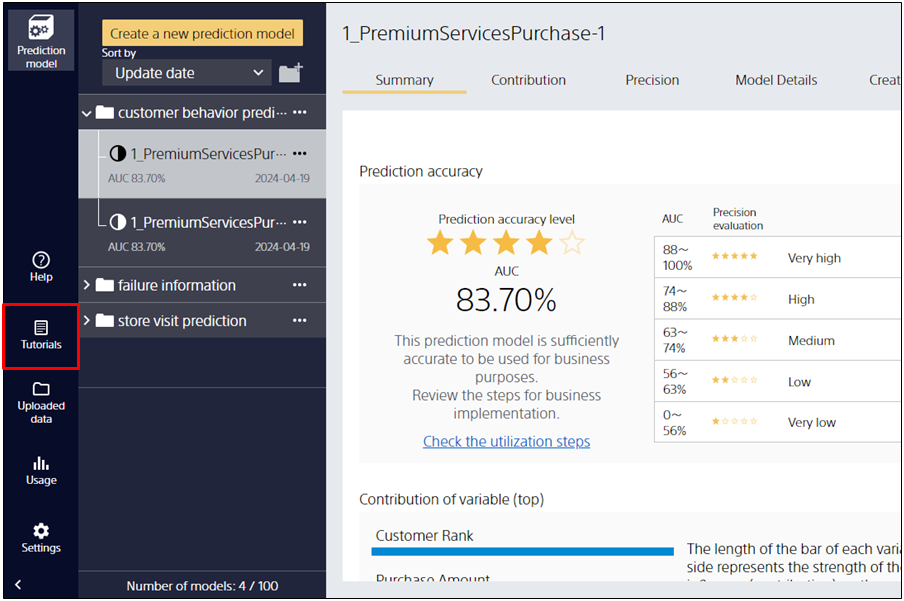
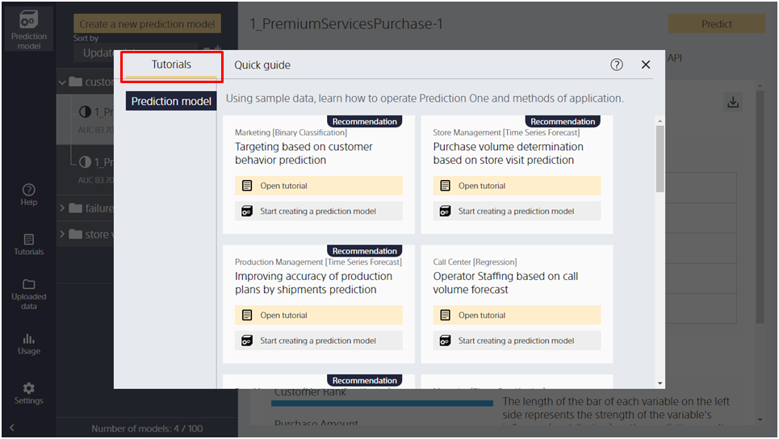
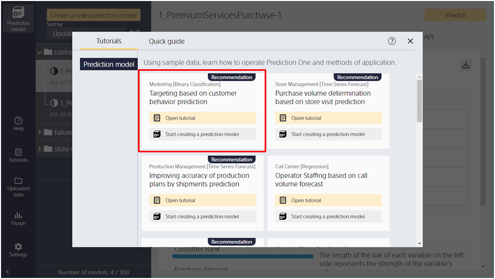

For the data used in the tutorial, refer to the sample data folder (`\en-US\doc\sample_dataset\use_case`) included with Prediction One. You can also open this folder by following these steps:

{}

{}

{}

As you make your selection, the folder containing the sample data and the tutorial description page open.
