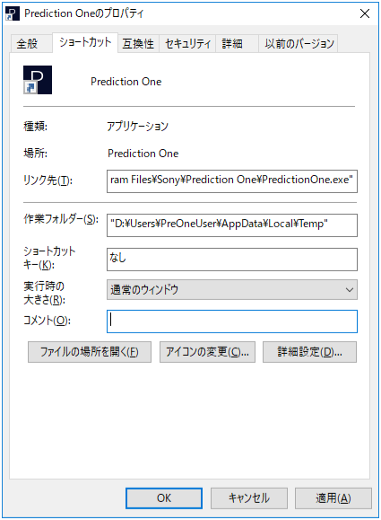

Prediction One cannot be started unless the working folder (current directory) and temporary folder are on the same drive. Depending on your environment, you may need to change the working folder.

{}

Start a command prompt, type  `echo %Temp%` , and press Enter to display the temporary folder path. The following is an example of the display.

> D:\Users\PreOneUser\AppData\Local\Temp

{}

Right-click the Prediction One shortcut and click "Properties".
Enter the path of the temporary folder confirmed in (1) in the column of the working folder, then click "OK". The following is an example of a change.

