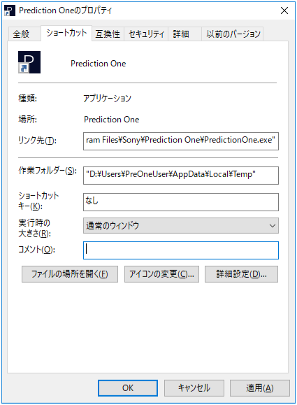

Prediction One は、作業フォルダー(カレントディレクトリ)と一時フォルダーが同じドライブでないと起動することができません。お使いの環境によっては、作業フォルダーの変更作業が必要となります。

{}

コマンドプロンプトを起動し `echo %Temp%` と入力し、Enter を押すと一時フォルダーのパスが表示されます。以下は表示例です。

> D:\Users\PreOneUser\AppData\Local\Temp

{}

Prediction One のショートカットを右クリックして「プロパティ」をクリックします。
作業フォルダーの欄に(1)で確認した一時フォルダーのパスを入力して「OK」をクリックしてください。以下は変更例です。

