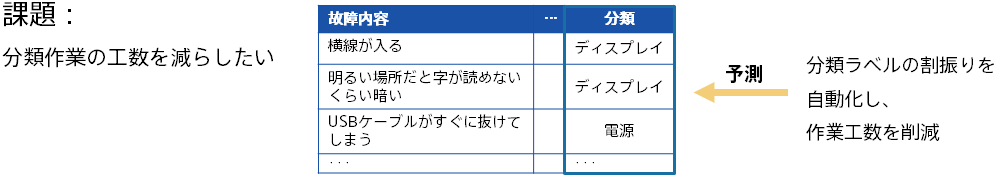

### Introduction: Automatic Classification of Defect Information

In various businesses, information may be accumulated, classified, and labeled to give a bird's-eye view of the situation.

- Collects product failure information and classifies it by failure type
- Collects information on problems in infrastructure operations and classifies them by type of problem
- Collects word-of-mouth information about your company and classifies it by type
- Gather bug information for software products and label types and occurrences

These classification tasks are often performed daily by personnel and can take a significant amount of time. Also, it may be problematic that the standard differs depending on the person in charge.
Predictive analytics can be leveraged to automate classification, making your work more efficient.

