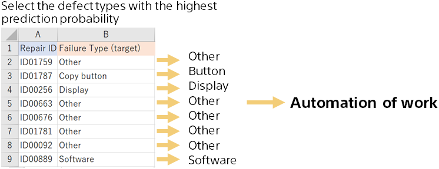

{}

By classifying the failure type with the highest probability from the predicted probability for all failure information, the failure type can be classified automatically.

Actually, the prediction accuracy is not 100%, so it may be mistaken. If the highest probability value is not high, the confidence in the prediction is low, so it may be better for a human to check such cases.
{}
