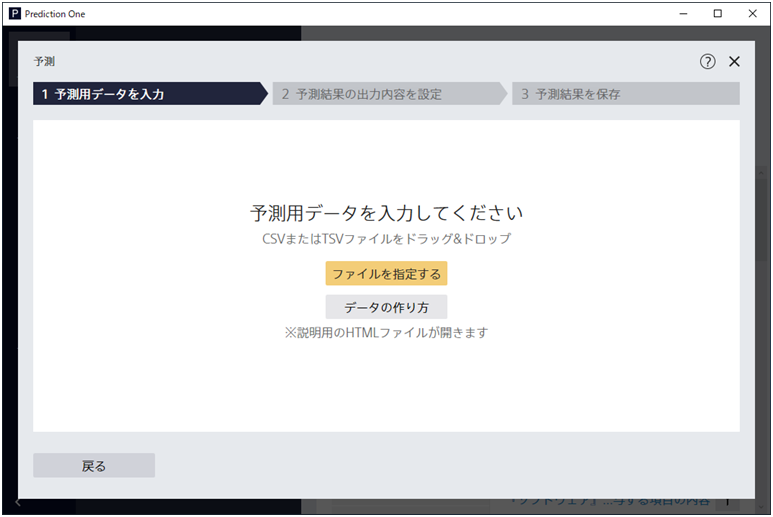
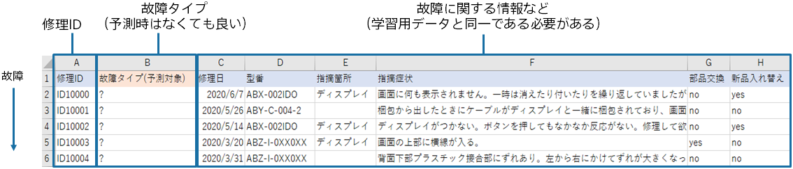
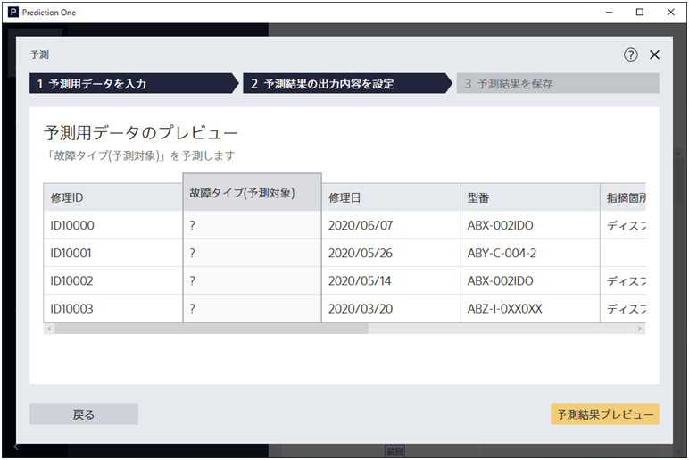
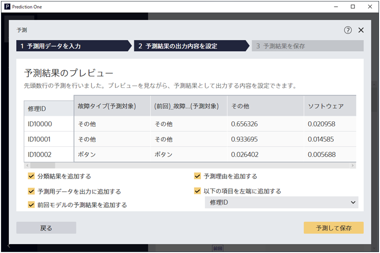
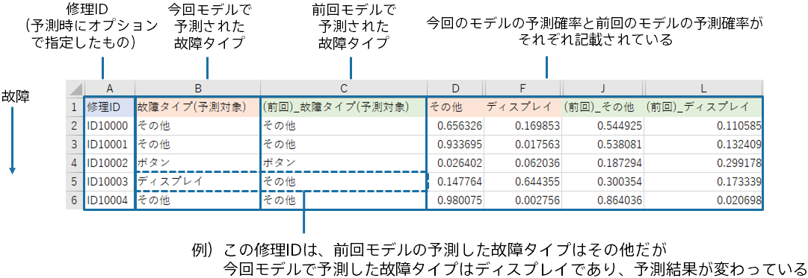

{}

この画面にて、予測用データを指定します。今回のチュートリアルのフォルダから予測用データをドラッグ＆ドロップで入力しましょう。
{}
{}

{}

ステップ1で入力した予測用ファイルの内容は上記のようなものです。
今回予測したい正解データである予測タイプについては存在しなくてもよく、
一方で学習に使用した項目である故障に関する情報については記入されている必要があります。

{}

{}

作成した予測モデルを利用して、まだ分類していない故障情報に対して、故障タイプを予測します。

{}

{}

予測結果のプレビュー画面では、出力する予測ファイルのオプションをいくつか指定できます。
たとえば「前回モデルの予測結果を追加する」を選択すると、出力される予測結果ファイルには
今回のモデルの予測値に加えて、前回のモデルの予測値も付与されます。

また「予測理由を追加する」オプションも選択することで、今回と前回のモデルの予測理由もそれぞれ出力することが可能です。

{}

{}

各故障情報に対する予測確率から、もっとも確率の高い故障タイプを割り当てることで、故障タイプの割り当てを自動的に行うことができます。
特に、今回のモデルは最近起きている故障の情報を踏まえた予測ができていることが特徴だと考えられます。

出力されたファイルを見ると、ID10003については予測タイプが前回のモデルと今回のモデルで異なるがわかります。
上図はその他とディスプレイに関する予測確率だけを抜粋していますが、実際には各予測確率と予測理由が今回と前回のモデルについて出力されています。

実際にデータを見ることで予測結果や傾向の変化を確認することも実際にビジネスで予測結果を使う際には重要だと考えられます。

{}

