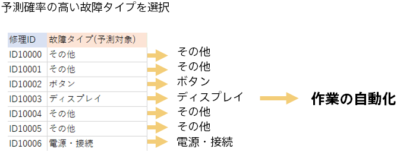

{}

各故障情報に対する予測確率から、もっとも確率の高い故障タイプを割り当てることで、故障タイプの割り当てを自動的に行うことができます。
特に、今回のモデルは最近起きている故障の情報を踏まえた予測ができていることが特徴だと考えられます。

これで最新のデータを反映した予測ができるようになりました！
故障の原因は時間の経過とともに変化することが想定されます。予測モデルを運用するときは実際にどのくらい予測が当たっているかを見直しながら
適宜モデルの更新を行うことを推奨します。
{}
