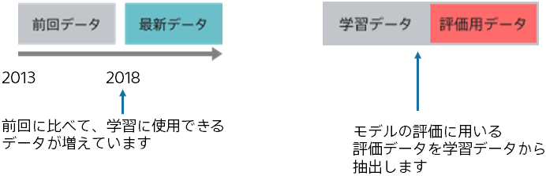
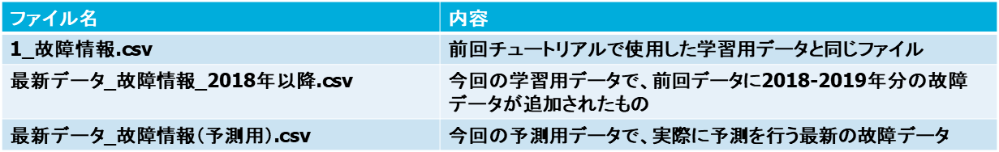

前回学習したときに比べて学習データが増えました。中でも今回のデータには新しい故障情報が含まれているようです。
最新のデータを用いてモデルを更新しましょう。

本チュートリアルでは、上述の{}で作成したモデルを使用します。
本チュートリアルに入る前に上記のチュートリアルでモデルを作成することを推奨します。

{}

今回の学習データは新しく2018年と2019年の故障情報が追加されており、前回の予測モデル作成(学習)用データに加えて最新データも含めて学習することで
精度の向上を目指します。

また評価用データとして、2019年1月以降のデータを学習データから抽出して使用します。
この評価用データを用いて前回学習済みのモデルと精度の比較を行います。

サンプルデータのファイル名と各ファイルの内容は以下の通りです。

以降のページでは、Prediction One の操作について説明します。
