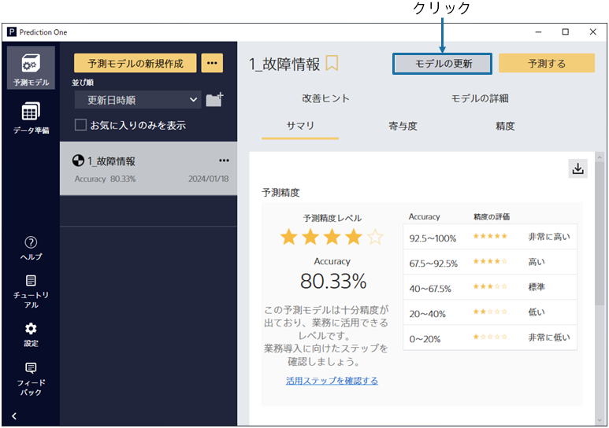
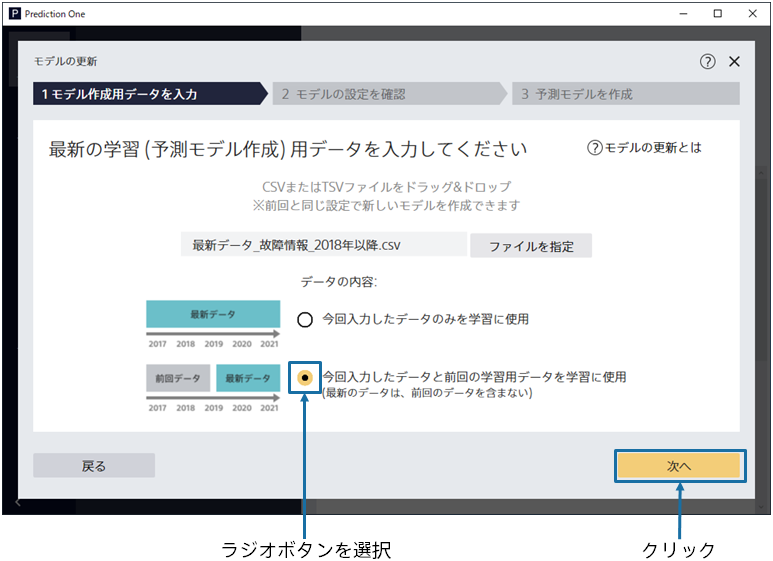
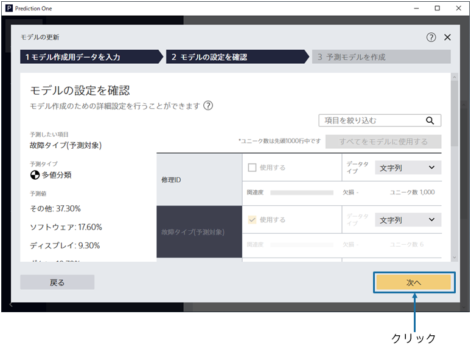
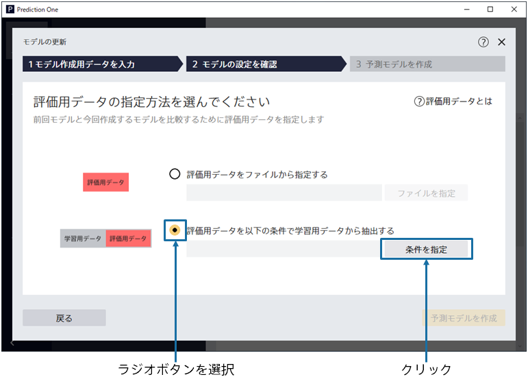
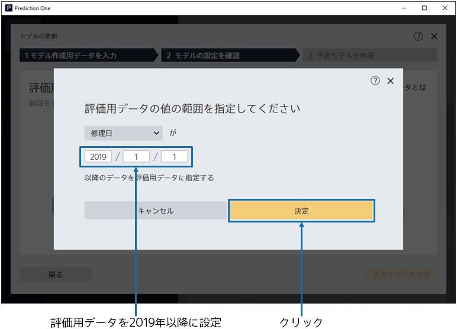
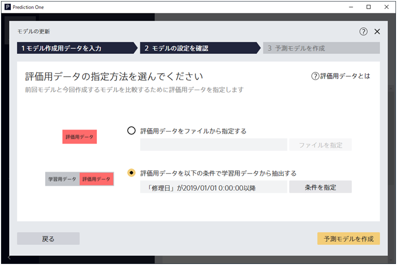

{}

今回更新を行いたいモデルに対し、「モデルの更新」ボタンをクリックすることで新しいモデルを作成することできます。
今回は {}  で作成したモデルに対してモデルの更新を行います。
{}

{}

「モデルの更新」を押下後、データの入力画面では
下記のフォルダに存在する`最新データ_故障情報_2018年以降.csv`を選択します。
{}
また、データの内容としては 「最新のデータは、前回のデータを含まない」を選択します。
この選択肢を選ぶことで前回学習時のデータと今回入力した最新データの両方を結合したものを今回の予測モデル作成(学習)用データとして用いることができます。

{}

{}

モデルの設定画面では、前回モデルの予測したい項目に関する設定や、項目に関する設定を確認できます。
「次へ」ボタンをクリックすることで次の画面に進むことができます。

{}

{}

次に評価用データを指定します。今回は、2019年以降の故障情報をどれだけ正しく予測できたかを正解として評価を行います。 

まず「評価用データを以下の条件で予測モデル作成(学習)用データから抽出する」を選択してください。これにより、指定した条件に基づいて
予測モデル作成(学習)用データと評価用データを分割することできます。これにより最新のデータで正しく評価を行うことを目指します。
{}

{}

評価用データの値の範囲を指定します。今回は修理日が2019年1月1日以降のデータに対して評価用データの指定を行います。 

これにより、2018年までのデータを予測モデル作成(学習)用データとして用いて、2019年以降のデータを評価用データとして用いることが可能になります。
このように時間軸も考慮した予測を行うことでより現実に即した問題設定で学習および評価を行うことが可能です。
{}

{}

最後に「予測モデルを作成」ボタンをクリックすることで、予測モデルを作成することが可能になります。
{}
