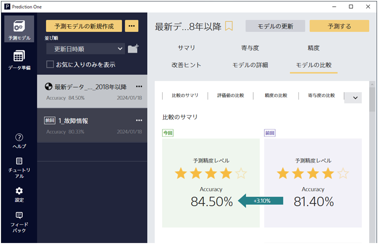
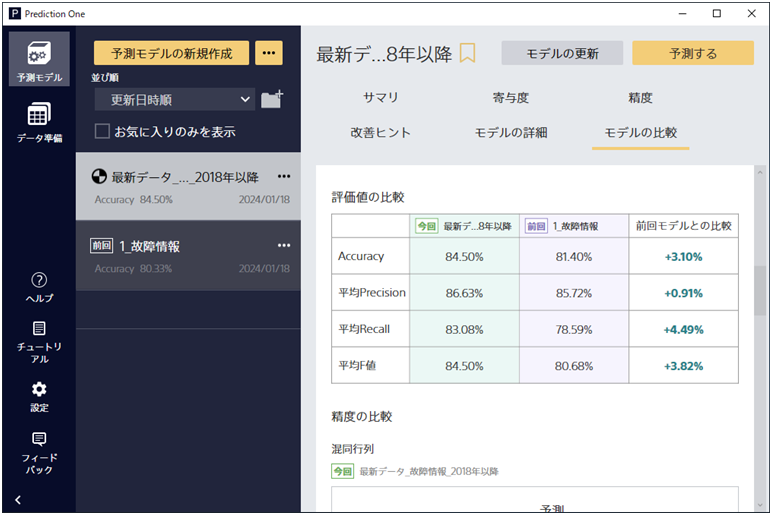
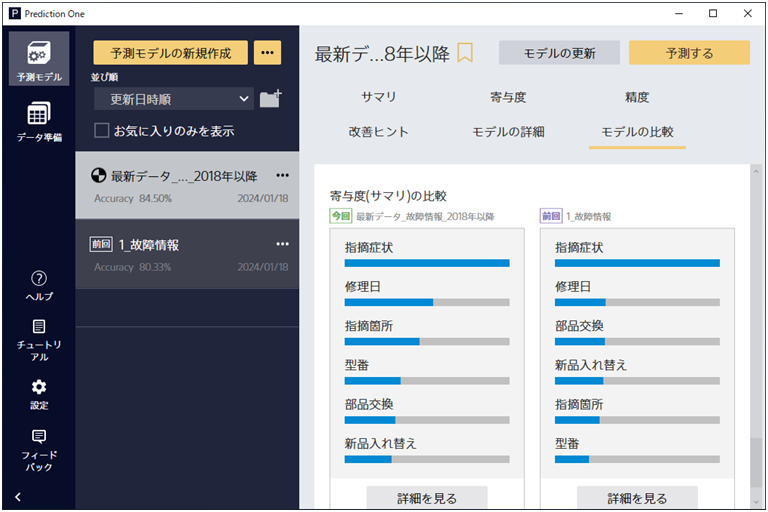
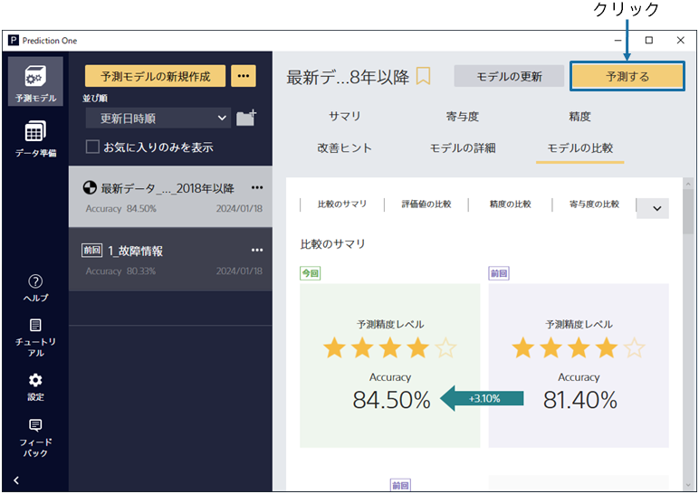

{}

予測モデルの学習後、予測精度の評価までを自動で行います。この画面ではモデルのサマリを確認できます。
比較のサマリでは、今回の予測精度と前回の予測精度のサマリを比較できます。
Accuracyの数値の変化を見ると、今回の予測モデルのほうが良い精度で故障タイプを予測できる事がわかりました！
{}

{}

評価値の比較の項目を見ると、さらに詳細な評価結果を比較できます。
各指標に対して、今回の予測精度と前回の予測精度の差分も表示されており、
これを見るとすべての指標で今回の結果のほうがよいことがわかります。
{}

{}

「モデルの比較」タブの一番下側のページでは、寄与度の比較を見ることができます。
左側が今回の予測寄与度、右側が前回の予測寄与度となっています。

これを見ると今回と前回共に「指摘症状」の項目が一番有効であることがわかり、
他の項目からも前回と概ね同様の項目を見て予測を判断していることがわかります。
{}

{}

今回のモデルのほうが良い結果であるということが分かったため、実際に予測したいデータに対して
故障タイプの分類予測を行ってみましょう。右上の「予測する」ボタンから予測を行うことができます。
{}
