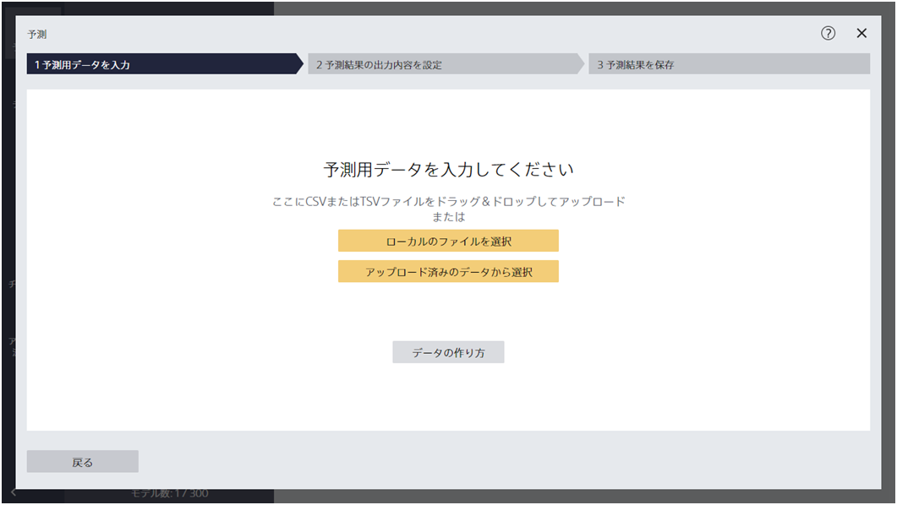
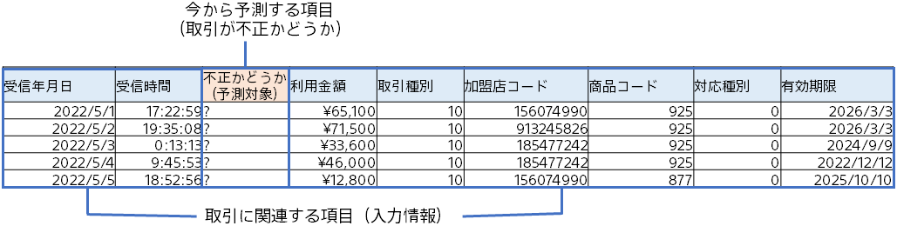
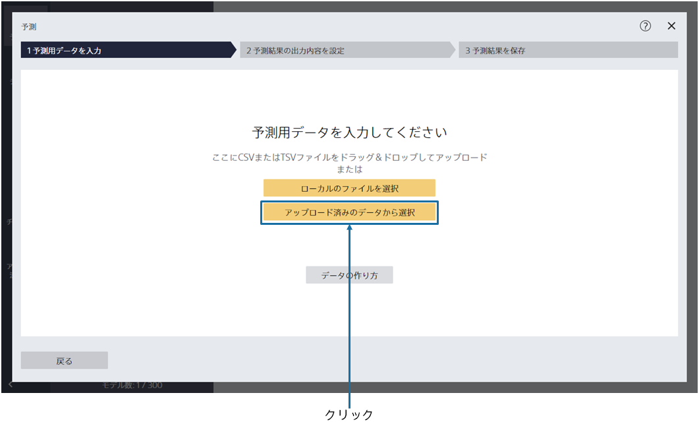
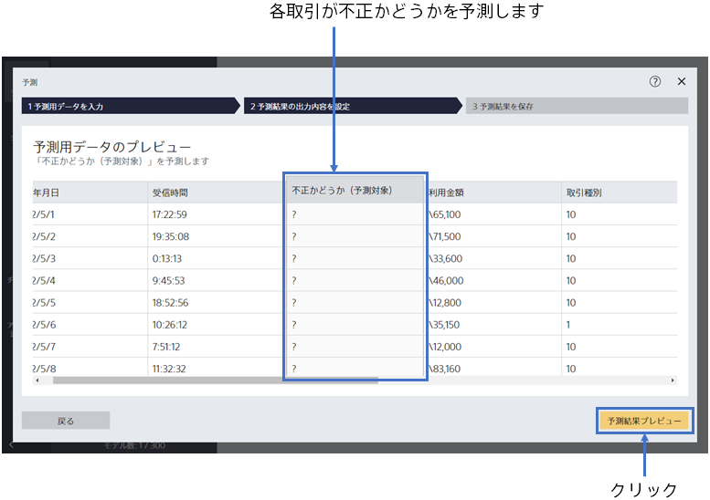
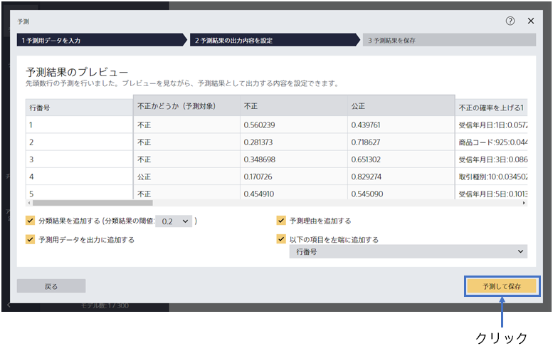
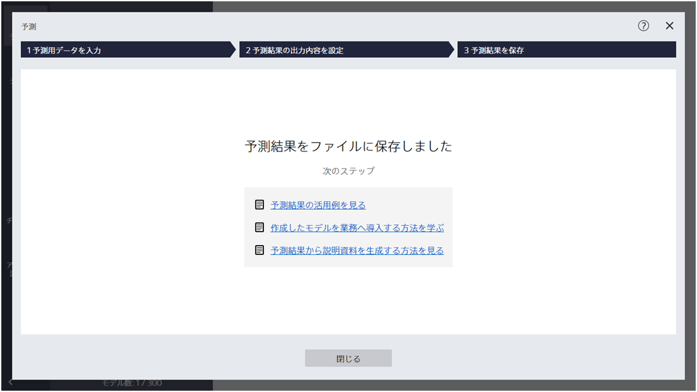
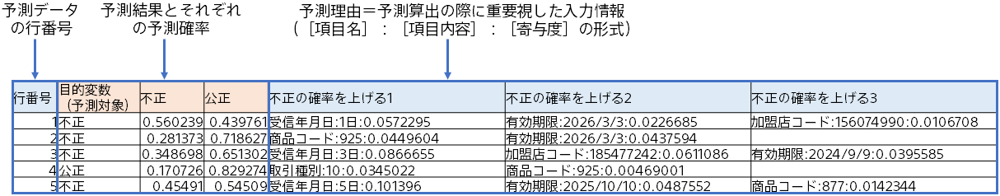

{}

この画面にて、予測用データを指定します。今回のチュートリアルで使用する予測用データの内容を確認しましょう。
{}

{}

作成した予測モデルを利用して、各取引に対して、不正確率を予測します。 
本チュートリアルでは、事前に準備した、予測用のサンプルデータを利用します。

{}
{}

{}

予測用データである`2_不正検知（予測用）.csv` を指定してください。 
{}
データはウィンドウへのドラッグ&ドロップか 「ファイルを指定する」で読み込むことができます。 
{}
{}
サンプルデータは、「アップロード済みのデータから選択」をクリックし、「サンプル」タブのデータ一覧から選択してください。
{}

{}
{}

{}

読み込んだ予測用データ`2_不正検知（予測用）.csv`をプレビューしています。

今から「？」となっている不正かどうか(予測対象)を予測します。

{}
「予測結果プレビュー」をクリックしてください。
{}
{}
「予測結果プレビュー」をクリックしてください。予測結果のプレビュー画面が表示されるまで、しばらくお待ちください。
{}

{}
「予測して保存」をクリックしてください。
各行ごとに予測を行い、その結果を保存します。

「予測して保存」をクリックした後、名前を付けて保存するダイアログが表示されます。
ファイル名を指定して予測結果を保存してください。
{}
{}
「予測結果を保存」をクリックし、「ファイル名」を入力し、「保存」をクリックしてください。
{}
{}

{}
予測が完了すると以下の画面が表示され、指定したファイルに予測結果が保存されています。

予測結果は以下のような形式で出力されます（オプション設定によっては違う形式になります）。各取引に対して、不正の予測確立が算出されています。

{}
