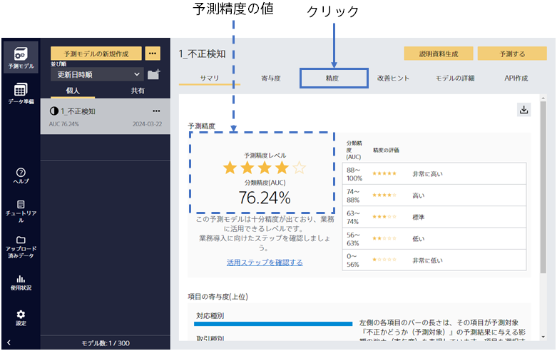
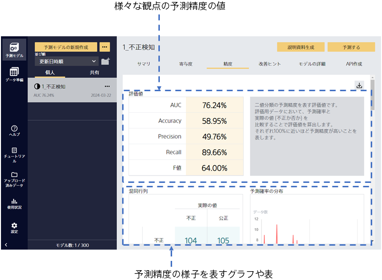
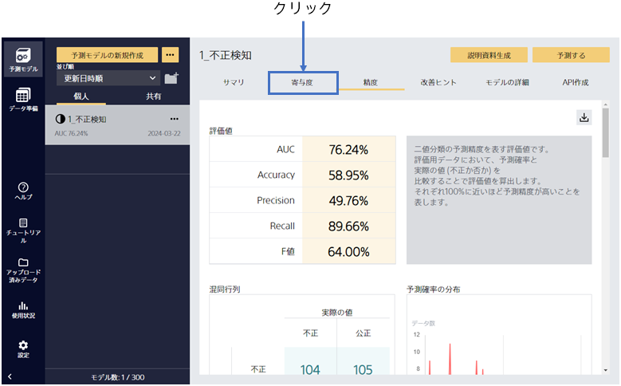
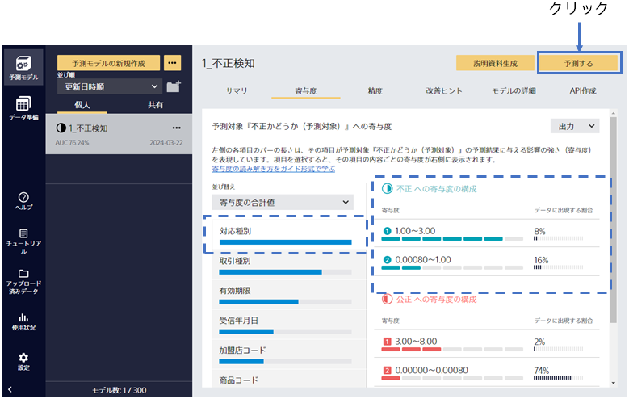

{}

予測モデルの学習後、予測精度の評価までを自動で行います。この画面ではモデルのサマリを確認できます。

予測精度は作成した予測モデルの予測結果と実際の結果を比較することで算出されます。
予測精度レベルの星の数から、良い精度で不正を予測できる事がわかりました！
{}

{}

「精度」を選択すると、さらに詳細な評価を見ることができます。
さまざまな観点での予測精度の評価値や、予測精度に関する表やグラフが生成されます。下にスクロールすることで、閲覧できます。
{}

{}

予測精度が高いことはわかりました。では、なぜ予測精度が高いのでしょうか。
「寄与度」をクリックしてください。
{}

{}

不正予測では、「対応種別」「取引種別」「有効期限」などが有効で、さらに右側の内容からそれぞれの項目がどの値、内容である場合に不正である確率が高まるかがわかります。分析した結果が自分の直感と合っているか確認できます。思いもよらない寄与が見つかれば、新しい発見にもなります。

次に「予測する」をクリックしてください。
{}
