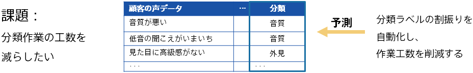

### Introduction

It is important to organize and understand customer feedback, such as complaints to call centers and reviews on the Internet. It is easier to understand the overall trend by categorizing the customers' feedback data. For example:

- Organize customer complaint data by complaint type
- Collect review data on SNS and organizes content into types

These types of classification tasks are often performed by personnel on a daily basis and can be time-consuming. Also, it may be problematic that the standard differs depending on the person in charge. Predictive analytics can be leveraged to automate classification, making your work more efficient.

