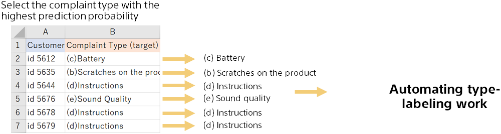

{}

From the prediction results file, the complaint type with the highest probability of prediction for each review statement is the complaint type for that review statement.

Actually, the prediction accuracy is not 100%, so it may be mistaken. If the highest probability value is not high, the confidence in the prediction is low, so it may be better for a human to check such cases.
{}
