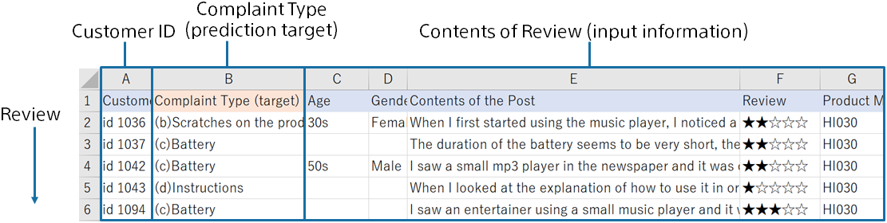

Predictive analytics creates a prediction model that predicts the types of review statements using data for creating a prediction model (training) that summarizes the review statements and the results of previous classification, as follows: The prediction model trains to learn how to label review statements from the data for creating a prediction model (training). This tutorial uses sample datasets that were prepared.

{}

The following pages describe how Prediction One operates.
