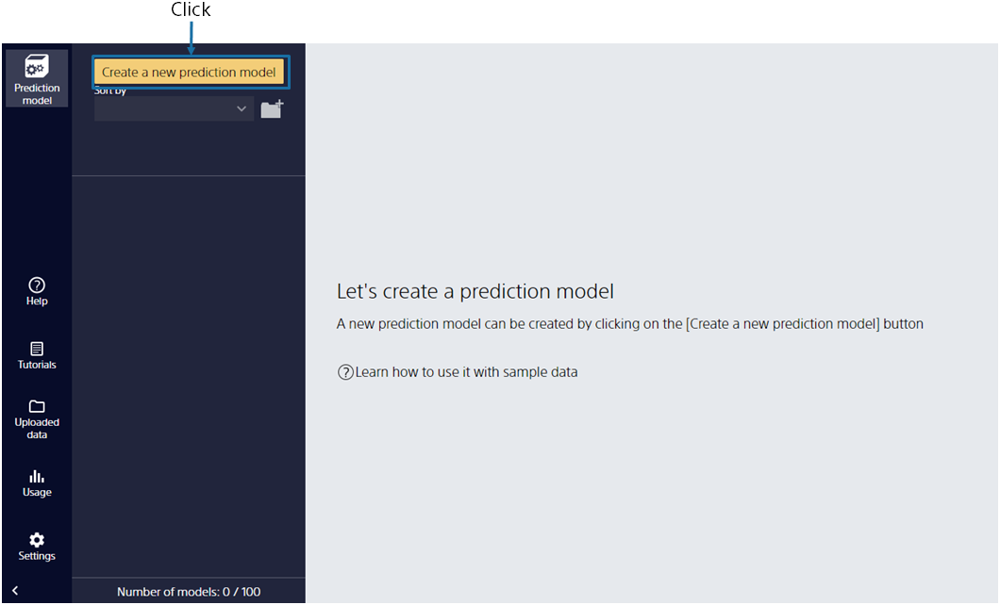
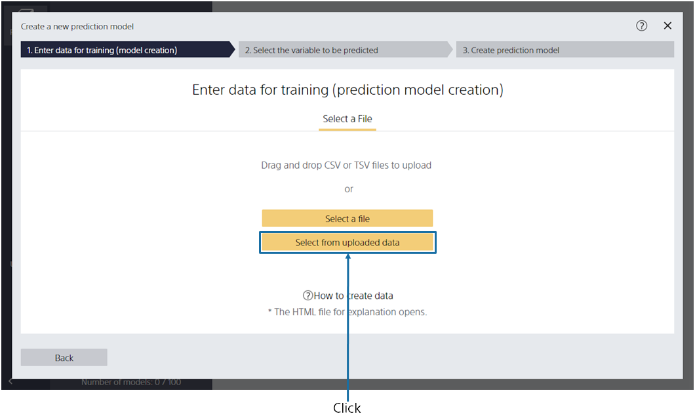
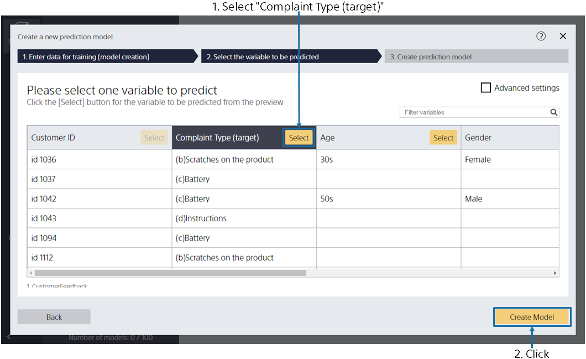
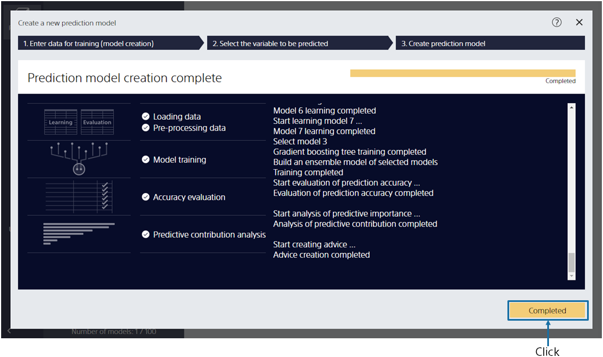

{}

The main screen appears, no prediction model has been created, so it is empty. Click [Create New Prediction Model].
{}

{}

Specify the data for creating a prediction model (training) `1_Customer feedback.csv` here. 
{}
You can import data by dragging and dropping it into the window or by [Select a File]. 
{}
{}
Click [Select from Uploaded Data] and select the sample data from the data list on the [Samples] tab.
{}
{}
{}

{}

This screen is displayed when data loading is completed. 
Please select one variable to predict. After selecting (for this tutorial, select the item "Complaint Type (Target)"), click the [Create Prediction Model] button. 
{}

{}

Please wait until the training begins. Four processes are executed: Preprocessing → Prediction Model Training → Accuracy Evaluation → Predictive Contribution Analysis. 
The estimated wait time is displayed at the top. The more data you have, the longer it takes. 
When you have completed your training, click the [Completed] button. 
{}
