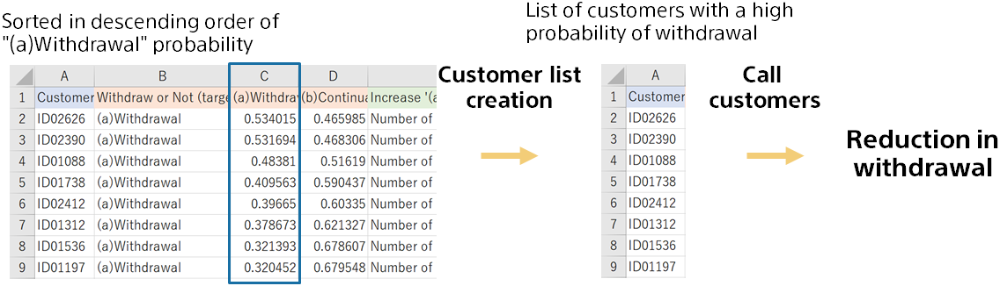

{}

Sorts the file of prediction results in order of the probability of withdrawal. After sorting, select the top 200 and make it a customer list with a high withdrawal rate. (Then provide it to the call center as a list.)

The different types of customers may be reflected in the prediction reasons. It may be reflected in the contents of the call.
{}
